# Agentic Knowledge Mapper

You define an **investigation** (keywords + free-text brief of what to
collect) and agents plan searches, analyze candidates, and map them into a
per-investigation **knowledge graph**. An **explainer** answers questions with
grounded, illustrated explanations (with source PDFs, decks, and reports
attached), and an **AI Security agent** assesses products used with sensitive
data. Every agent step, model call, and human action lands on a **hash-chained
audit ledger** with re-derivable proofs. All LLM reasoning goes through the
**fox-services gateway** (OpenAI-compatible `/v1/chat/completions`, local
Ollama or mesh peers — no external API keys).

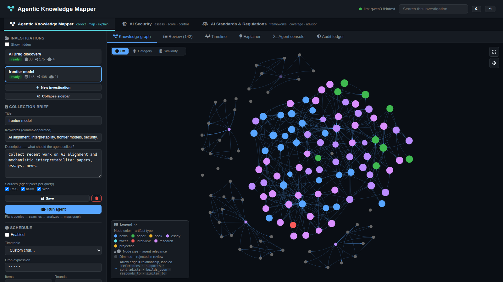

## Documentation (design, with diagrams)

**Start with [design/](design/README.md)** — the whole system drawn: context,
UML, data model, sequences, activity, state, UI interaction, privacy, and the
control catalogue.

| Doc | Contents |
|---|---|
| [**design/**](design/README.md) | Nine diagram documents: [context](design/01-system-context.md) · [UML](design/02-uml.md) · [data model](design/data-model.md) · [interaction](design/interaction.md) · [activity](design/activity.md) · [state](design/state.md) · [UI](design/ui-interaction.md) · [privacy](design/privacy.md) · [controls](design/controls.md) |
| [docs/architecture.md](docs/architecture.md) | System context, containers, UML component/class diagrams, runtime flows |
| [docs/agent-loop.md](docs/agent-loop.md) | Collection loop state machine, activity flow, stage protocol, guards |
| [docs/explainer.md](docs/explainer.md) | Q&A pipeline, graph-first routing, grounding, write guard, threads/quiz/watch |
| [docs/security-agent.md](docs/security-agent.md) | A2A envelope protocol, fifteen agent cards (catalog + three model paths), threat model, report structure |
| [docs/threatpack.md](docs/threatpack.md) | The versioned scoring catalog: 12 threats, 15 controls, exposure tiers, evalkit |
| [docs/agentic-manager.md](docs/agentic-manager.md) | Command parsing, fan-out, timeline, summary compilation, nesting |
| [docs/standards-coverage.md](docs/standards-coverage.md) | 34 frameworks × 10 pillars, score matrix, Findings grading, dashboard |
| [docs/data-model.md](docs/data-model.md) | ER diagram, tables, review lifecycle, migrations |
| [docs/ledger.md](docs/ledger.md) | The hash chain, mandates, approvals, proofs, sessions, offline verification |
| [docs/privacy.md](docs/privacy.md) | What is stored, what is hashed, what leaves — and what is *not* implemented |
| [docs/frontend.md](docs/frontend.md) | View map, tab flows, GUI conventions |
| [docs/operations.md](docs/operations.md) | Deploy, config, LLM failover, scheduler, recovery |

All diagrams are Mermaid (rendered by GitHub and by most markdown viewers).

## Agent loop

```
brief (keywords + description)
  → PLAN      LLM drafts ≤6 targeted queries, picking rss/arxiv/web per query
  → SEARCH    RSS feeds · arXiv API · DuckDuckGo HTML (dedupe by URL/title)
  → ANALYZE   LLM batches: relevance 0..1, keep/drop, tags, sentiment,
              projection, relates_to[] against already-collected artifacts
  → MAP       persist top artifacts + agent relationships (+ tag-overlap fallback)
  → REFINE    if yield is low, planner drafts follow-up queries (≤ max_rounds)
```

Progress streams as `AgentEvent`s; the GUI polls `GET /api/runs/{id}/events`.
Details: [agent-loop](docs/agent-loop.md).

## Architecture

```
┌──────────────┐     ┌──────────────────┐     ┌──────────────┐
│   Frontend   │────▶│   FastAPI (Python)│────▶│   SQLite DB  │
│  (vanilla JS)│◀────│   uvicorn :8204  │◀────│ (data/akm.db)│
└──────────────┘     └──────────────────┘     └──────────────┘
                        │ agents: collection · explainer · security (A2A)
                        │ LLM via fox-services gateway
                        ▼ (/v1/chat/completions)
                 ┌────────────────┐
                 │ local Ollama / │
                 │   mesh peers   │
                 └────────────────┘
```

Components, UML diagrams, and data flows: [architecture](docs/architecture.md)
and [design/01-system-context.md](design/01-system-context.md).

**Five apps in one page.** The app switcher opens *Mapper* (collect, map,
review, explain), *AI Security* (assess, score, control), *Agentic Manager*
(one command → N investigations + a summary), *AI Standards* (34
frameworks × 10 pillars), and *Design & Architecture* (the nine Mermaid design
documents, rendered live rather than screenshotted). Mapper has nine views;
Security has nine sub-tabs; long jobs run through a persisted, lease-based job
queue so a restart resumes rather than loses.

## GUI tour

### Investigations

Create/select investigations from the sidebar; each shows artifact,
relationship, and run counts. The collection brief editor sets title,
keywords, description, and per-query sources; cron timetables re-run the
agent on a schedule. Investigations can be **hidden** (eye icon) instead of
deleted — hidden ones leave the list but keep every run, artifact, and
history entry, and come back with “Show hidden”.

Two buttons in the sidebar close the loop the agent leaves open:

- **Executive summary** — a single overlay with the aggregate numbers, the top
  threats, the highest-value findings, and the supporting artifacts, each
  clickable back into the graph. The Mapper's Summary sub-tab shows the same
  material in place — query brief, review flags, an evidence diagram, answered
  questions with their supporting artifacts — with a Regenerate button that
  recomputes from the current flags.
- **Find open gaps** — reads which dimensions of the brief have *nothing at
  all*, and offers to launch a targeted run at each one. An answer that finds
  its own research.

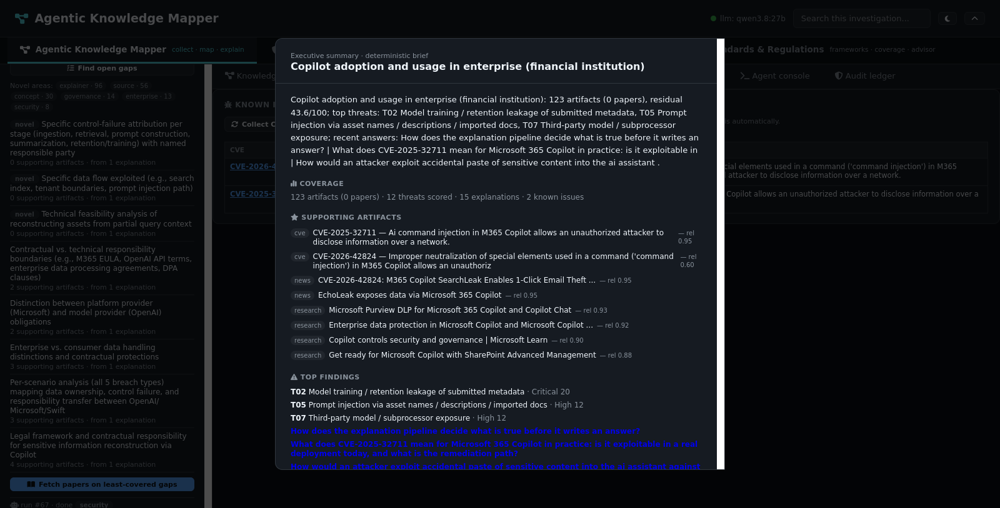

### Knowledge graph

vis-network graph over the investigation's artifacts. **Node color =
artifact type** (news/paper/book/essay/tweet/interview/research/projection),
**node size = agent relevance**, dimmed nodes were rejected in review, and
arrow edges carry the relationship type (`references · supports ·
contradicts · builds_upon · responds_to · similar_to`). A legend overlay
(bottom-left, collapsible) is rendered from the same color map as the nodes,
so it cannot drift out of sync. Category/similarity clustering, timeline
compare-highlight, and click-through to the artifact overlay are built in.


### Review queue

Pending/accepted/rejected triage with relevance ring, the agent's reason,
sentiment, tags, and source links. Accept/reject/delete per item; accepting
feeds the knowledge graph, rejecting dims the node.

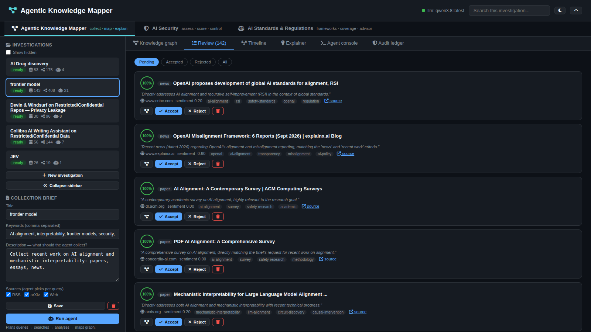

### Artifacts

The *collected* view, as opposed to the *triage* view: every artifact the
investigation holds, filterable by type, review state, source, and drift, with
the collection timeline, what each was collected for, and how the actors
divided the work. Artifacts flagged off-brief by drift detection stay here
with a **drift** pill — flagged, dimmed, never silently deleted.

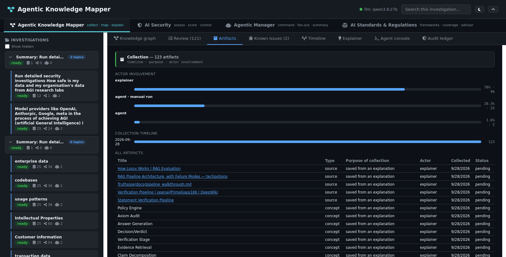

### Known issues

CVEs are first-class. Anything a kept artifact or a security report mentions
becomes a `CVE_FINDING` row, enriched from NVD with CIRCL as a fallback and
**`unknown` as an honest terminal state** when both fail — a guess would sit
beside a real enrichment looking identical. Each finding also becomes a light
artifact node in the graph, so the vulnerability is visible in the same place
as the research that mentions it.

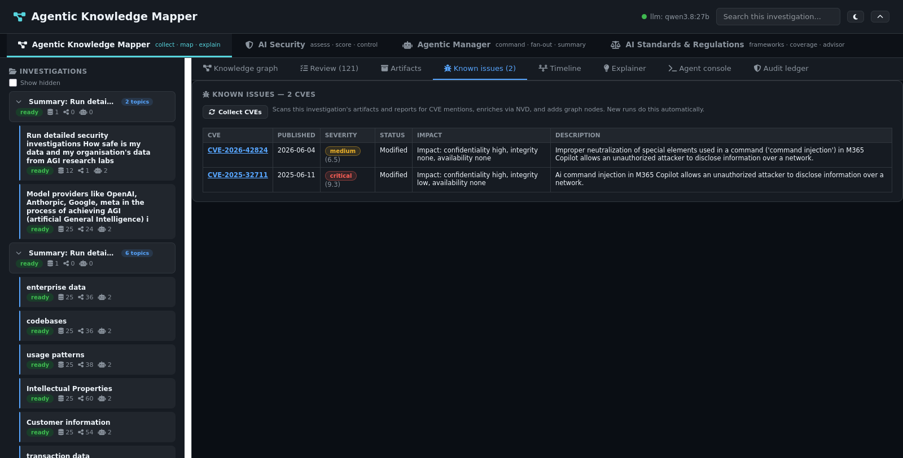

### Research gaps

The sidebar's **Find open gaps** button, and the gap list behind
`POST /api/explanations/{id}/investigate_gaps`. Coverage is computed from what
is actually in the graph; each gap can launch a focused run, which is how an
answer that admits it does not know everything goes and finds out.

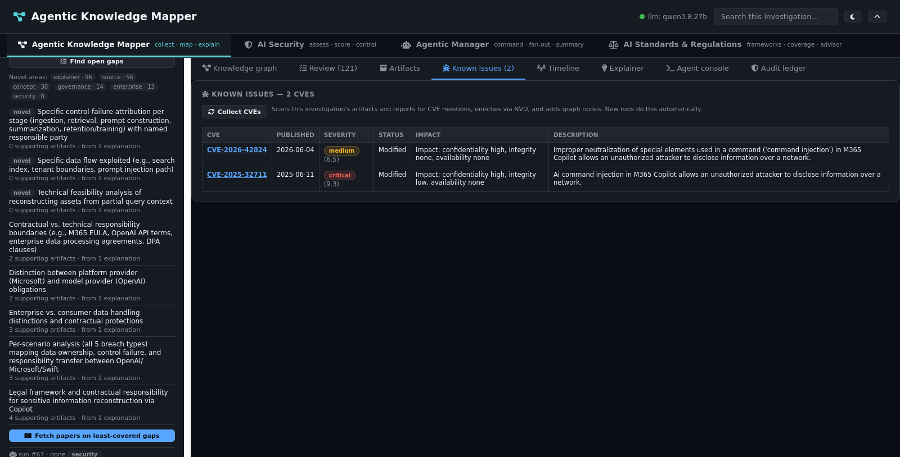

### Explainer

Ask anything over the investigation (or the web, or both): modes
(explain/deep-dive/compare/tutor/critique/tldr/glossary/api-ref), depths
(shallow/balanced/deep), audiences (beginner/intermediate/advanced).
Answers carry evidence drawers per claim, a self-critique pass with
SUPPORTED/UNCERTAIN verdicts, conflicting-views sections, roadmap, quizzes,
threads, bookmarks, drift watch, and gap-driven follow-up runs.

Research also attaches **source documents**: PDFs, decks, and reports found
during search are fetched (text-extracted where a parser exists), offered as
candidates, and attached after URL validation — alongside the investigation's
own most relevant artifacts, which open in the detail overlay.

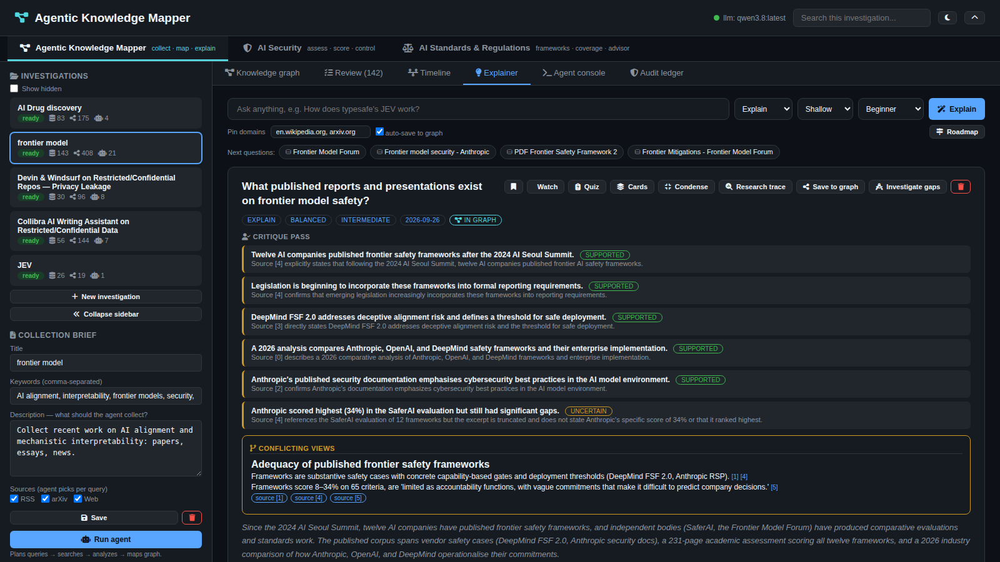

### Agent console

Live stage-colored event log, search plan, and run stats while the agent
works.

### Timeline

One hash-chained timeline per run over every actor (A2A hops, model calls,
human actions, claims), and the **Timeline** view interleaves every chain into
a single newest-first stream. Browser work is grouped into session sittings
with their own verification spine: violations, token use, activity, per-run
health, and failed runs. The browser sends `X-AKM-Session`; the ledger stays
out of the product's way, so audit outages cannot turn product calls into 500s.

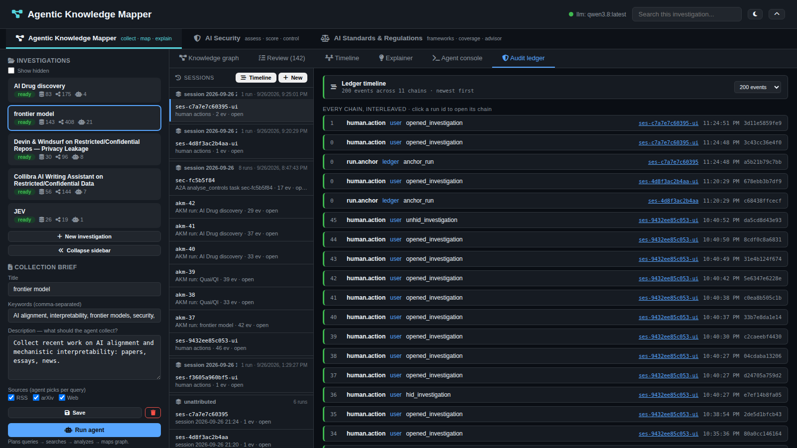

### Audit ledger

The audit view proper: pick a run, read the chain, verify it, inspect per-event
proofs, read claims and their grounding verdicts, trace a claim's blast radius,
and export a bundle that verifies offline with no database attached.

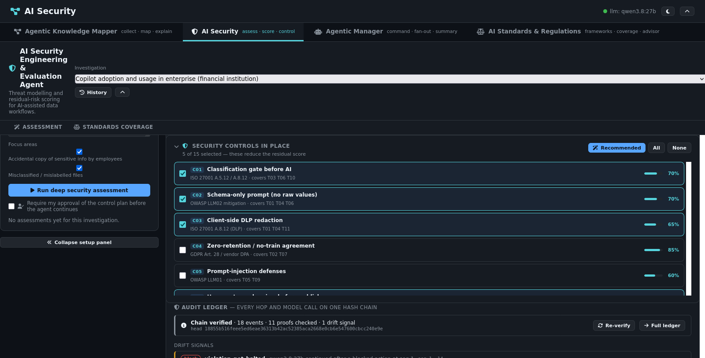

### AI Security

Scope a product + exposure setting to the investigation's graph: the agent
searches related research, maps known attacks, and writes a scored report
with executive summary, threat register, known exploits, A2A trail,
diagrams, and Markdown/PDF export. The inherent → residual severity mix is
clickable — each band opens an overlay listing exactly the findings behind
that count. What-if control toggles recompute the score instantly.

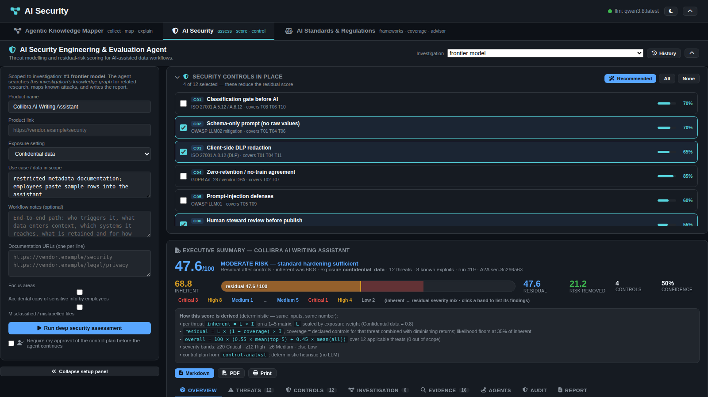

The Assessment pane has **nine sub-tabs**, and each answers a different
question about the same run:

| Sub-tab | What it is |
|---|---|
| Overview | the aggregates, posture string, severity distribution, perspectives |
| Threats | T01–T12 with inherent vs residual likelihood, impact, and severity band |
| Controls | C01–C15 with efficacy, applicability, and the plan the analyst proposes |
| Investigation | the collected evidence the control judgements were made against |
| Evidence | every claim with its sources, `matched_on`, and claim hash |
| Known issues | the CVEs found in the evidence, as graph nodes |
| Agents | the five A2A cards and exactly what each one returned |
| Audit chain | the one hash-chained ledger run behind this assessment |
| Report | the markdown, §§1–11 + appendix, with the generated diagrams |

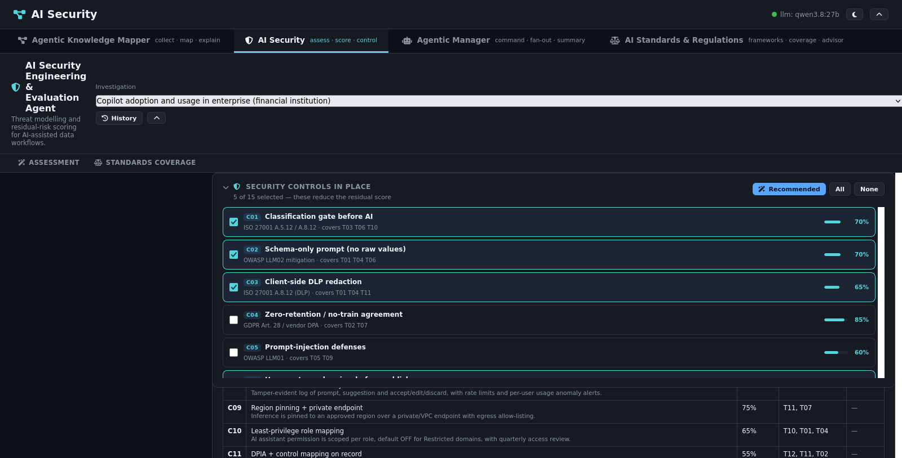

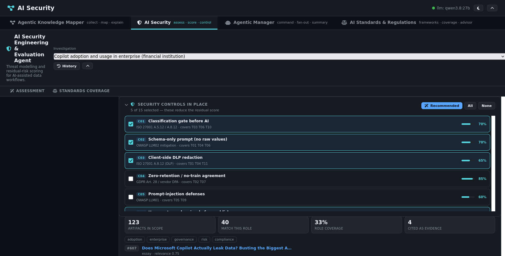

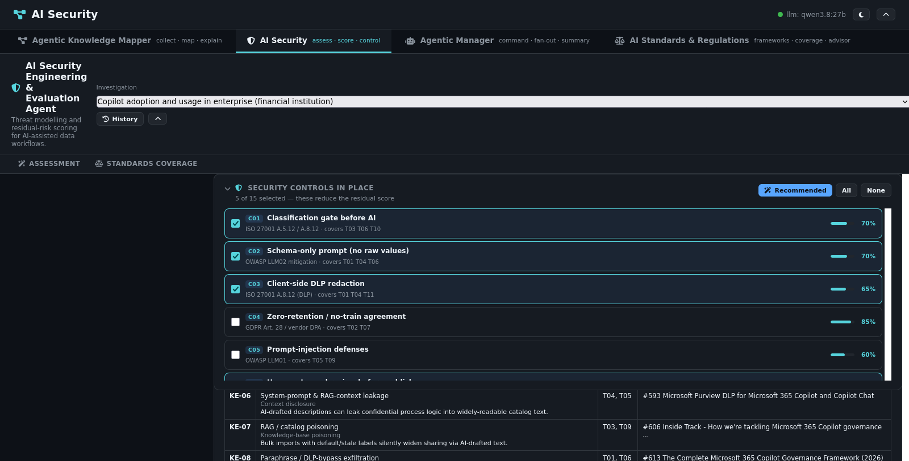

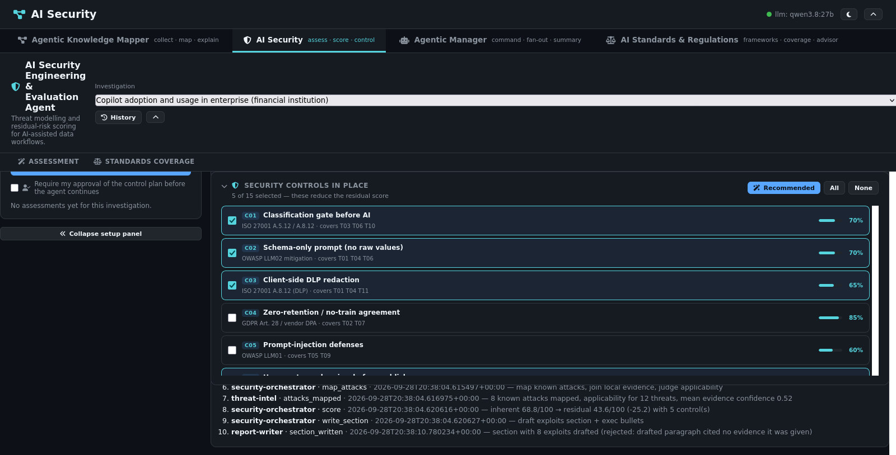

**Approvals.** Tick *require approval* and the run parks at
`awaiting_approval` before doing any work: an approval request lands on the
chain with a `hold` verdict, and a named person who is **not** the requester
grants or denies it. An empty identity fails closed, an identical
requester/approver is a `403`, and the decision itself is a chained event, so
it cannot be edited afterwards. Granting re-queues the same job under the same
key — uniqueness is over *live* jobs, so a parked run can be resumed.

The agent pane's **Standards coverage** sub-tab maps the run against the AI
Standards & Regulations taxonomy (34 frameworks × 10 control pillars):
a relevance-ranked score matrix, expandable framework detail, and a Findings
view that grades every threat Direct / Partial / Gap against up to three
selectable standards side by side. See [docs/standards-coverage.md](docs/standards-coverage.md).

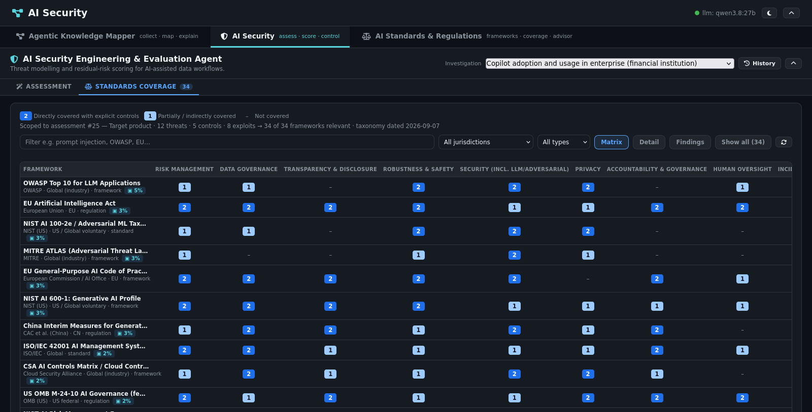

The **AI Standards** app is a separate service in an iframe, served on `:5173`,
reading the same database:

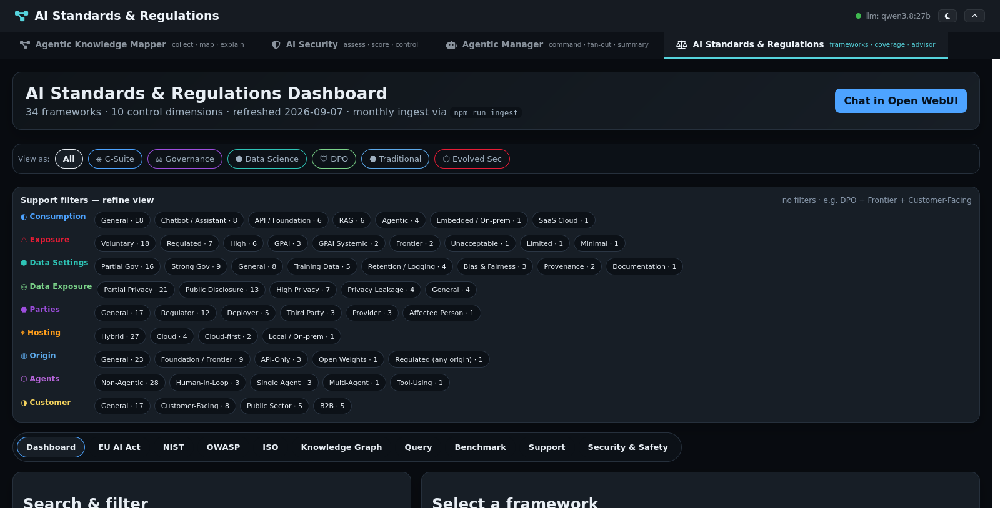

The scoring pack is versioned and fingerprinted, so a moved number is a CI
failure rather than a surprise — see [docs/threatpack.md](docs/threatpack.md).

### Agentic Manager

One command fans out to N investigations plus a summary: the Manager tab
understands "run detailed security investigations on AI agents in finance
domain, especially payments / trade / DeFi / crypto", creates one
investigation per topic with research and security assessment launched on
each, and compiles the finished children into a summary investigation on
demand. See [docs/agentic-manager.md](docs/agentic-manager.md).

**Understand** parses a command into a plan with *no side effects* — you can
parse as often as you like, uncheck a topic, set a per-topic exposure tier,
and toggle the launchers before anything is created. **Compile** is refused
with a `409` while any child is still running, and is idempotent once it has
run. The finished topics nest under the summary in the mapper sidebar.

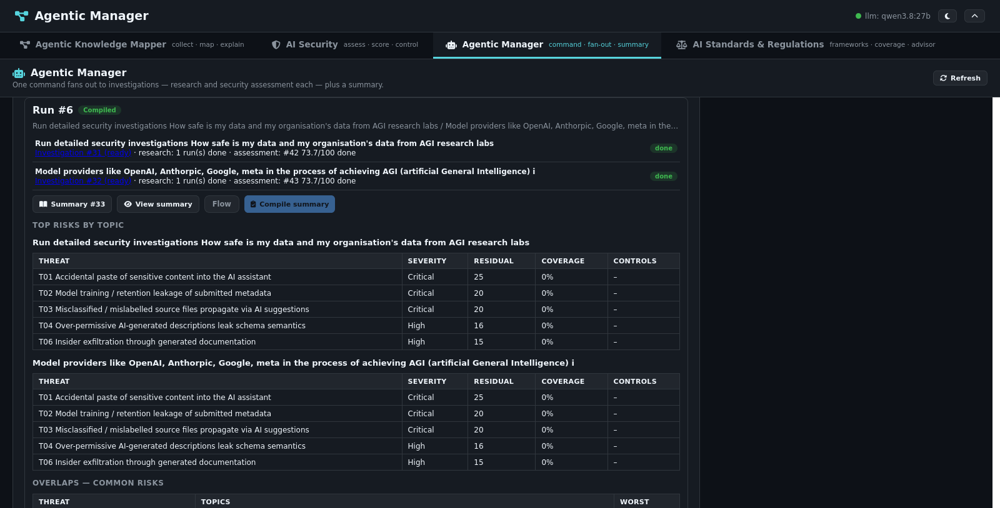

GUI map and flows: [frontend](docs/frontend.md), [design/ui-interaction.md](design/ui-interaction.md).

## Proofs

Proofs here are re-derived, never trusted. Concretely:

- **Hash-chained runs** (`app/ledger.py`): every event hashes a canonical
  core (run, seq, timestamp, actor, kind, intent, verdict, payload,
  previous hash). `verify` recomputes the whole chain and reports the exact
  break; one tampered payload fails its run without implicating the rest.
- **Per-event proof artifacts**: content hashes over prompt/output digests,
  claim hashes over text + citations, and input references that must still
  resolve — checked by `verify_proof`, for one step or a whole run.
- **Session spines**: each browser sitting anchors its runs in order on its
  own chain, so cross-run order is provable while every run still verifies
  independently.
- **Claim grounding** (`verify_grounding`): quotes must appear verbatim
  (12+ chars) in the cited source text, else the citation is dropped and
  counted. Confidence follows distinct-source corroboration.
- **Blast-radius tracing**: `contamination/{ref}` answers “what consumed
  this claim?” across runs.
- **Self-verifying exports**: `export_run` bundles events, claims, and
  approvals with an offline verification report — hand it to an auditor with
  no database attached.
- **Gateway content proofs** (fox-services): every served inference stores
  prompt/output digests plus a proof hash binding service, models, tokens,
  and ledger linkage — without storing prompts or completions. Look any
  request up by its `X-Fox-Request-Id`, verify the envelope server-side, and
  compare digests against your own copy. The Services → Content Proofs card
  does this in one click.

## Controls

Policy is data, hashed at run creation, so the rules in force at the time of
an action are provable afterwards:

- **Mandates**: `allowed_actors` (names *or* roles — a model call passes as
  the `llm` role), `allowed_intents` (hard boundary → deny), `planned_intents`
  (soft shape → drift flag), `allowed_tools`, `allowed_domains`,
  `max_events` / `max_llm_calls` budgets, and `human_gates` that hold kinds
  for sign-off. Every refusal also emits a `gate.check` event, so violations
  are impossible to scroll past.
- **Approvals queue**: cross-run human sign-off with allow/deny decisions on
  the chain.
- **Gateway controls** (fox-services): per-model concurrency slots (loaded
  models parallel, large cold loads serialized), Fox-Managed cost routing
  with explainable decisions in response headers, pairing-gated peer
  proxying, and an opt-in admin token guarding state-changing endpoints.

## Hallucinations: how the app fights them

- **Grounded composition**: the explainer may only cite provided sources;
  every quote is verified verbatim post-hoc and invented citations are
  dropped with counts, not silently kept.
- **Evidence on display**: each claim carries its sources one click away;
  thumbs up/down feedback feeds back into the record.
- **Tolerant but contained parsing**: model JSON is repaired leniently
  (control characters, trailing commas, prose wrappers, envelope-shape
  variants) — but the result must still validate (known sources, known
  image/document URLs, known artifact ids) before it renders.
- **Relevance gates, not model taste**: section images survive only if they
  share vocabulary with the section; otherwise the section gets no image
  rather than a random stock photo.
- **Drift watch + threads**: re-ask watched questions over time and diff the
  answers; follow-ups and gap runs stay linked to their parent explanation.
- **Conservative by default**: PII detectors prefer missing to false alarms;
  redaction keeps hashes (evidence) while masking credentials.

## Security by design

**This app**
- Credentials are redacted *before* anything reaches immutable storage;
  prompts/outputs are stored hashed by default, never durably copied.
- Auditing is **fail-open**: a ledger or gateway outage degrades to
  unaudited product calls, never 500s.
- No secrets in chains, exports, logs, or the browser — digests travel,
  content does not.
- Local container logs stay clear for the operator; anything crossing a
  peer boundary is secret-redacted, with unredacted peer views an explicit,
  labeled trust decision.

**fox-services** (sibling service, `:8210`)

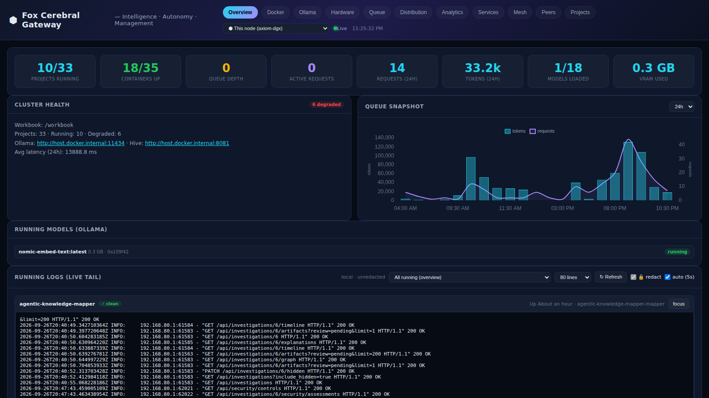

- One-way secret masking on every log handler, gateway body/header, and DB
  write; credential verification returns only the mask.
- PII is replaced at rest by deterministic, type-preserving synthetic twins
  (same value → same twin, unrecoverable); only aggregate counts persist.
- Peer log views are redacted + PII-syntheticized by default, scrubbed
  upstream before transfer and again locally; local views stay clear.
- Peer proxy is path-whitelisted (no open SSRF), pairing-gated, admin-token
  guarded; usage/proof APIs expose digests and metadata, never prompts.

## API (selection)

96 paths; `GET /openapi.json` lists them all.

| Method | Path | Description |
|---|---|---|
| GET | `/api/health` | Health + LLM gateway status |
| GET/POST | `/api/investigations` | List / create (`?include_hidden=true` to see hidden) |
| GET/PUT/DELETE | `/api/investigations/{id}` | Detail (with recent runs) / update brief / delete |
| PATCH | `/api/investigations/{id}/hidden` | Hide from / restore to the list |
| POST | `/api/investigations/{id}/run` | Start agent run `{max_items, max_rounds}` |
| GET | `/api/runs?investigation_id=` | Run history |
| GET | `/api/runs/{id}` | Run + full event log |
| GET | `/api/runs/{id}/events?after_id=` | Poll new events |
| GET | `/api/investigations/{id}/graph` | Nodes + edges |
| GET | `/api/investigations/{id}/graph/clusters?mode=` | category \| similarity centroids |
| GET | `/api/investigations/{id}/summary` | Executive summary overlay data |
| POST | `/api/investigations/{id}/summary/regenerate` | Recompute the summary from current review flags |
| GET | `/api/investigations/{id}/artifacts?review=&search=` | Review queue |
| GET | `/api/investigations/{id}/artifacts/overview` | Collection: timeline, purpose, actor involvement shares |
| GET | `/api/investigations/{id}/recommendations` | Coverage gaps, control leverage, stale brief, query yields |
| POST | `/api/investigations/{id}/detect-drift` | Flag off-brief artifacts (kept, never deleted) |
| GET | `/api/investigations/{id}/cves` | Known issues: list |
| POST | `/api/investigations/{id}/cves/collect` | Collect + enrich (NVD → CIRCL → honest `unknown`) |
| GET/POST | `/api/investigations/{id}/explain`, `/api/investigations/{id}/explanations` | Ask / history |
| GET | `/api/explanations/{id}`, `…/thread`, `…/suggestions` | Detail / thread / follow-up ideas |
| POST | `/api/explanations/{id}/followup`, `…/quiz`, `…/bookmark`, `…/watch`, `…/feedback`, `…/save_to_graph`, `…/investigate_gaps` | Threads, quiz, curation, watch, gap runs |
| POST | `/api/investigations/{id}/security/assess` | Start a security assessment run (`assessment_mode`: `target` / `adversarial` / `hypothesis` / auto) |
| POST | `/api/security/classify-subject` | Is this a model subject, and which question does the wording imply? (drives the mode selector) |
| GET | `/api/investigations/{id}/security/assessments` | Assessment history |
| GET | `/api/security/assessments/{id}`, `…/markdown`, `…/pdf` | Report / exports |
| POST | `/api/security/runs/{id}/approval` | Grant or deny a parked run (≠ the requester) |
| GET | `/api/agents/cards`, `/.well-known/agents` | A2A agent registry (fifteen cards) |
| GET | `/api/standards/score-matrix?assessment_id=` | Relevance-ranked framework matrix for an assessment |
| GET | `/api/design/docs`, `/api/design/docs/{id}` | The design set: index with diagram counts / one document as Markdown |
| POST | `/api/manager/parse`, `/api/manager/run` | Understand a command (no side effects) / fan out |
| GET | `/api/manager/runs`, `/api/manager/runs/{id}` | Run status list / one run |
| POST | `/api/manager/runs/{id}/compile` | Synthesise the summary (409 while a child runs) |
| GET | `/api/manager/runs/{id}/timeline`, `/api/manager/links` | Six-step strip + per-lane actions / sidebar nesting |
| PATCH/DELETE | `/api/artifacts/{id}` | Review state / delete |
| POST | `/api/relationships` | Manual edge |
| GET | `/api/ledger/timeline` | Whole ledger as one newest-first stream |
| GET | `/api/ledger/runs`, `/api/ledger/approvals/pending` | Audited runs / cross-run approval queue |
| GET/POST | `/api/ledger/sessions`, `/api/ledger/sessions/{id}` | Browser session sittings / session detail |
| GET | `/api/ledger/sessions/{id}/timeline`, `…/verify`, `…/insights` | Merged session timeline, spine verification, and enriched session aggregates |
| GET | `/api/ledger/runs/{id}/timeline`, `…/timeline.csv`, `…/violations` | The chain, as JSON or CSV, and anything that tripped a gate |
| GET | `/api/ledger/runs/{id}/verify`, `…/drift`, `…/proofs`, `…/events/{seq}/proof` | Re-derive integrity, compare plan vs. actual, inspect proofs |
| GET | `/api/ledger/runs/{id}/claims`, `…/contamination/{ref}` | Claim grounding / blast radius of one claim |
| GET/POST | `/api/ledger/runs/{id}/export`, `/api/ledger/verify-export` | Self-contained bundle + offline verification |
| POST | `/api/ledger/runs/{id}/actions`, `…/approvals`, `/api/ledger/approvals/{id}/decide` | Land an MCP / human / peer action on the chain; decide a gate |
| GET | `/api/ledger/audit-drops` | What the chain failed to write (fail-open, but never silent) |

## Setup

Prerequisites: Docker with compose, NVIDIA drivers (for GPU Ollama hosts),
and the sibling `fox-services` checkout (the LLM gateway; lives at
`../fox-services` relative to this repo).

```bash
# 1. Start the LLM gateway first (port 8210: OpenAI-compat /v1, Ollama proxy,
#    usage/proof logging, mesh discovery)
cd ../fox-services && docker compose up -d --build

# 2. Start this app (port 8204)
cd ../agentic-knowledge-mapper && docker compose up -d --build

# 3. Verify
curl http://localhost:8210/health   # gateway + model inventory
curl http://localhost:8204/api/health  # app + which LLM backend is active
# GUI at http://localhost:8204 — pick the "frontier model" investigation
# to see a populated graph immediately
```

Config via env: `LLM_BASE_URL`, `LLM_FALLBACK_URL`, `LLM_MODEL`,
`LLM_FALLBACK_MODEL`, `LLM_TIMEOUT_S` (default 180), optional `FOX_TELEMETRY_URL`
for digest-only gateway proof linkage on direct-backend calls. Local dev
(without Docker):

```bash
pip install -r requirements.txt
LLM_BASE_URL=http://localhost:8210/v1 python -m uvicorn app.main:app --port 8204 --reload
```

Operations (deploy, scheduler, failover, recovery): [operations](docs/operations.md).

## Local compute

This app is built to run **solely on local hardware — no cloud GPUs, no
external model APIs, no API keys anywhere**:

- **NVIDIA DGX Spark** (GB10 Grace Blackwell Superchip, 128 GB unified
  memory, `linux aarch64`) — primary development and serving host.
- **2× RTX 5080 16 GB** mesh peer (`axiom-1`) — Ollama inference over the
  Fox mesh; the app's default `LLM_BASE_URL` points at this peer, with the
  local fox-services gateway as automatic fallback.
- **Model routing, not model lock-in**: fox-services prefers VRAM-resident
  models, rewrites to loaded equivalents when cheaper, and reports every
  decision in response headers (`X-Served-Model`, `X-Original-Model`,
  `X-Served-Node`, `X-Routing-Reason`). The audit record always names the
  model that *actually* served the call.
- Every LLM call, token count, latency, and proof digest is logged per
  service/model in the gateway's usage DB and visible in the fox-services
  dashboard (Services → Content Proofs), so local compute is metered like a
  cloud bill — without the cloud.

## Privacy from the ground up

Privacy is architectural here, not a toggle:

- **Local-first**: prompts, artifacts, reports, and the ledger never leave
  your machines. There is no external API to leak to — inference runs on
  the DGX Spark / RTX 5080 mesh behind your own network.
- **Nothing sensitive at rest**: credentials are redacted *before* anything
  reaches immutable storage; prompts persist only as hashes (AKM) or as
  one-way synthetic twins that preserve shape but not values (fox-services);
  PII survives only as aggregate counts.
- **Digests travel, content does not**: proof hashes, request IDs, and token
  counts cross service and peer boundaries — prompts and completions never
  do. Peer log views are redacted + PII-syntheticized by default while local
  operator views stay clear, each explicitly labeled.
- **Fail-open auditing**: if the ledger or gateway goes down, the product
  keeps working unaudited instead of failing closed and blocking you.
- **Your data is not the repo**: investigations, artifacts, reports, and
  chains live in SQLite (local `data/akm.db`, Docker `akm_data` volume) and
  are git-ignored — `git status` stays clean of runtime state by construction.
- **Pairing + least privilege**: mesh peer proxying is path-whitelisted and
  pairing-gated; state-changing gateway endpoints sit behind an opt-in admin
  token; security reports render from stored Markdown with no report files
  written to disk.

The full privacy picture — including what is **not** implemented (no auth, no
encryption at rest, no TLS, no retention schedule) — is in
[docs/privacy.md](docs/privacy.md) and [design/privacy.md](design/privacy.md).
Stating the gaps is what stops the rest from being read as more than it is.

Runtime data (investigations, artifacts, reports, ledger chains) lives in
SQLite — `data/akm.db` for local dev, a persistent `akm_data` Docker volume
for the container — and is never committed to git. Security reports persist
as rows (Markdown included); PDFs render on demand.

## Screenshots

| # | Screen | # | Screen |
|---|---|---|---|
| 01 | [Knowledge graph](docs/screenshots/01-knowledge-graph.png) | 13 | [Manager nesting](docs/screenshots/13-manager-nest.png) |
| 02 | [Review queue](docs/screenshots/02-review-queue.png) | 14 | [Collected artifacts](docs/screenshots/14-artifacts-collection.png) |
| 03 | [Explainer answer](docs/screenshots/03-explainer.png) | 15 | [Known issues (CVEs)](docs/screenshots/15-known-issues.png) |
| 04 | [Audit timeline](docs/screenshots/04-audit-timeline.png) | 16 | [Research gaps](docs/screenshots/16-research-gaps.png) |
| 05 | [Security report](docs/screenshots/05-security-report.png) | 17 | [Executive summary](docs/screenshots/17-executive-summary.png) |
| 06 | [fox-services gateway](docs/screenshots/06-fox-services.png) | 18 | [Manager summary](docs/screenshots/18-manager-summary.png) |
| 07 | [Security sub-tabs](docs/screenshots/07-security-subtabs.png) | 19 | [Security controls](docs/screenshots/19-security-controls.png) |
| 08 | [Standards matrix](docs/screenshots/08-standards-matrix.png) | 20 | [Threat assessment](docs/screenshots/20-security-investigation-summary.png) |
| 09 | [Standards detail](docs/screenshots/09-standards-detail.png) | 21 | [Security evidence](docs/screenshots/21-security-evidence.png) |
| 10 | [Findings, single](docs/screenshots/10-findings-single.png) | 22 | [Security agents](docs/screenshots/22-security-agents.png) |
| 11 | [Findings, compare](docs/screenshots/11-findings-compare.png) | 23 | [Security audit chain](docs/screenshots/23-security-audit-chain.png) |
| 12 | [Manager flow](docs/screenshots/12-manager-flow.png) | 24 | [Standards dashboard](docs/screenshots/24-standards-dashboard.png) |
| | | 25 | [Design & Architecture](docs/screenshots/25-design-architecture.png) |
| | | 26 | [Design viewer, zoomed](docs/screenshots/26-design-viewer.png) |
| | | 27 | [Executive summary sub-tab](docs/screenshots/27-summary-tab.png) |

## Structure

```
agentic-knowledge-mapper/
├── app/
│   ├── main.py            # FastAPI routes
│   ├── agent.py           # plan→search→analyze→map loop (background thread)
│   ├── explainer.py       # Q&A pipeline: research→compose→ground→critique→diagram
│   ├── security_agent.py  # security runs (job queue, approval gate, A2A dispatch)
│   ├── agents.py          # A2A envelope protocol + fifteen agent cards (catalog + 3 model paths)
│   ├── security.py        # threat/control catalog, scoring, report engine
│   ├── threatpack.py      # version, fingerprint, CVSS mapping
│   ├── evalkit.py         # pinned scoring cases + invariants (CI gate)
│   ├── manager.py         # command parsing, fan-out, summary compilation
│   ├── standards_matrix.py # relevance-ranked framework score matrix
│   ├── cve.py             # CVE collection and enrichment (NVD → CIRCL → unknown)
│   ├── recommend.py       # coverage gaps, control leverage, stale brief, yields
│   ├── drift.py           # deterministic prefilter + LLM judge
│   ├── yield_.py          # cumulative per-query-shape yield
│   ├── writeguard.py      # audit → repair → strip → drift gate
│   ├── grounding.py       # verbatim citation checks (stdlib only)
│   ├── jobqueue.py        # row-before-thread queue with leases
│   ├── approvals.py       # requester ≠ approver, fail closed
│   ├── openshell.py       # sandboxed fetch, egress policy, broker fallback
│   ├── obs.py             # traces and contextvars
│   ├── scheduler.py       # cron timetables + watch/drift re-answers
│   ├── search.py          # RSS / arXiv / DuckDuckGo providers
│   ├── llm.py             # fox-services gateway client (OpenAI-compat + fallback)
│   ├── ledger.py          # hash-chained audit ledger: chains, mandates, proofs,
│   │                      #   grounding, sessions, insights, exports, redaction
│   ├── ledger_api.py      # audit HTTP surface (runs, sessions, timeline, verify)
│   ├── ledger_models.py   # LedgerRun / LedgerEvent / LedgerClaim /
│   │                      #   LedgerApproval / LedgerAuditDrop
│   ├── models.py          # Investigation, Artifact, Relationship, AgentRun,
│   │                      #   AgentEvent, Explanation, CorpusPage,
│   │                      #   SecurityAssessment, CveFinding, QueryShapeYield,
│   │                      #   ManagerRun, Job
│   └── database.py        # SQLite WAL engine + additive migrations
├── design/                # nine diagram documents (see design/README.md)
├── docs/                  # written documentation with Mermaid diagrams
│   └── screenshots/       # 24 GUI captures used above
├── static/index.html      # GUI (all CSS/JS inline, ~5.9k lines, no build step)
├── tests/                 # 26 pytest suites (ledger, proofs, approvals, jobs,
│                          #   security, explainer, writeguard, standards, …)
├── docker-compose.yml     # port 8204
├── Dockerfile
└── requirements.txt
```
