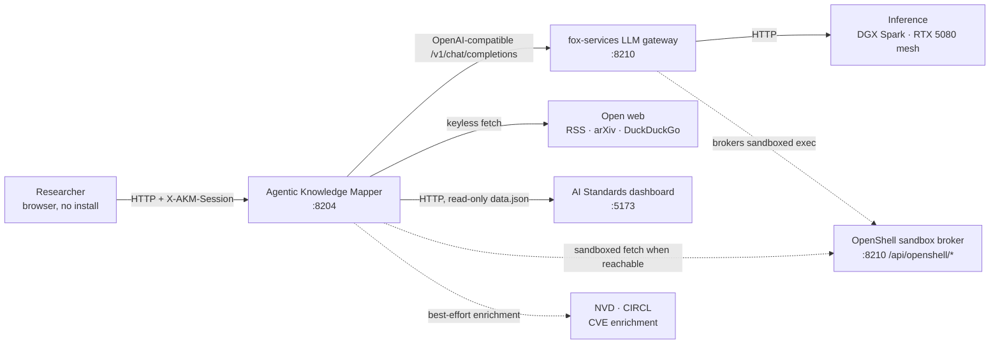
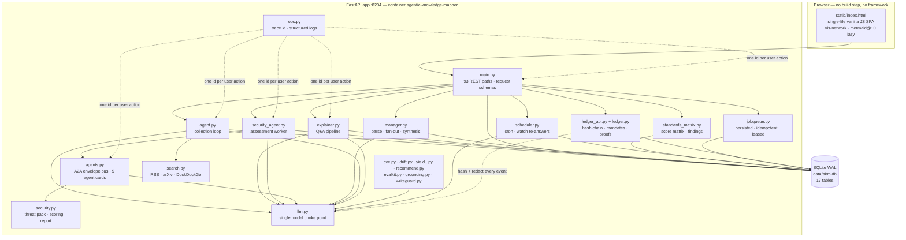
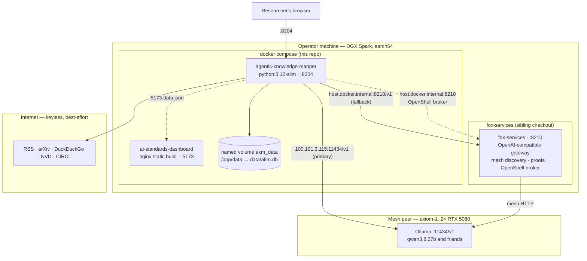
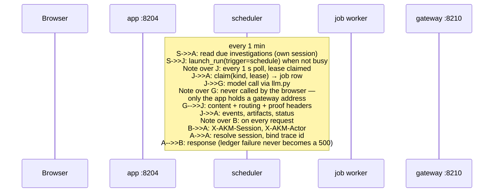
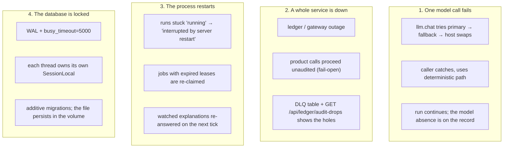

# 01 — System context, containers, deployment

How the system fits together: what is inside the trust boundary, what is
outside it, and what runs where.

Related: [uml.md](02-uml.md) · [interaction.md](interaction.md) ·
[privacy.md](privacy.md) · [../docs/architecture.md](../docs/architecture.md)

## System context (C4 level 1)

The person uses a browser. The app is the only service that stores anything.
Everything else is a dependency the app can work without:

| Dependency | If it is down | Why it is safe to lose |
|---|---|---|
| LLM gateway / mesh | Agents fall back to deterministic behaviour (keyword pre-rank, template prose, split-topic fallback) | Every model call is wrapped; no run depends on a model answering |
| Open web | Fewer candidates; runs still complete | Search providers are keyless and best-effort |
| OpenShell broker | Fetches go direct, and each page records `sandbox: false` | The report states the protection instead of assuming it |
| Standards dashboard | Standards sub-tab returns 503 with the reason; the rest of the app is untouched | One cache-backed route |
| NVD / CIRCL | CVE row stored as `unknown` | An id with no metadata beats no id |

## Containers (C4 level 2)

### Who owns what

| Module | Responsibility | Notable failure behaviour |
|---|---|---|
| `main.py` | Routes, request schemas, JSON shaping | 404/503 carry the reason, never a silent empty list |
| `agent.py` | plan → search → analyze → map → refine | 429 guard when a run is already going |
| `explainer.py` | research → compose → ground → critique → save | Bounded phases; corpus cache makes repeats free |
| `security_agent.py` | Assessment orchestration + approval gate | Parks on `awaiting_approval` rather than proceeding |
| `agents.py` | A2A `a2a/1.0` envelopes, 5 agent cards | Every hop appended to the trace and the chain |
| `security.py` | Threat pack 2.1.0, deterministic scoring, report | Pure function; pinned by `evalkit.py` |
| `manager.py` | Command parse, fan-out, synthesis | No background watcher — statuses derive live |
| `standards_matrix.py` | 34 frameworks × 10 pillars, relevance ranking | Cached; `no-store` per assessment |
| `scheduler.py` | 1-min cron tick, 10-min watch tick | Missed windows are skipped, never backfilled |
| `jobqueue.py` | Row-before-thread, idempotency key, lease | Lease expiry recovers dead workers, not slow ones |
| `ledger.py` / `ledger_api.py` | Chains, mandates, approvals, proofs, export | **Fail-open**: an outage degrades to unaudited, never 500 |
| `llm.py` | The one place a model is called | Failover chain, then deterministic fallback by callers |
| `writeguard.py` | Write-verify-repair over composed prose | Can only remove text, never add it |
| `grounding.py` | One shared verbatim-quote gate | Invalid citations are dropped and counted |
| `obs.py` | Trace id, structured logging | Never raises into a request |

## Deployment (C4 level 3)

`docker compose up -d --build` brings up two services here: the mapper and the
vendored standards dashboard. `fox-services` is started from its own checkout
first, because the mapper treats it as a dependency, not as part of itself.

## Runtime topology — who talks to whom, and when

## Failure domains

## Configuration surface

Everything the app reads from the environment, in one place. See
[../docs/operations.md](../docs/operations.md) for how to set them.

| Variable | Default | Effect |
|---|---|---|
| `LLM_BASE_URL` | compose: mesh peer `http://100.101.3.115:11434/v1` | primary OpenAI-compatible backend |
| `LLM_FALLBACK_URL` | `http://host.docker.internal:8210/v1` | second backend, tried on error |
| `LLM_MODEL` / `LLM_FALLBACK_MODEL` | `qwen3.8:27b` | the model actually asked for, per backend |
| `LLM_TIMEOUT_S` | `180` | per-request timeout |
| `FOX_TELEMETRY_URL` | *(unset)* | digest-only gateway proof linkage on direct backends |
| `LEDGER_CAPTURE_PAYLOADS` | `0` | `1` stores prompts and args verbatim; off means hashed + redacted |
| `AKM_SESSION_IDLE_S` | `1800` | a browser sitting closes after this idle |
| `AKM_LOG_FORMAT` | `text` | `json` for one object per line |
| `AKM_LOG_LEVEL` | `info` | `debug`/`info`/`warn`/`error` |
| `AKM_IMAGE_PROBE` | `1` | section-image vocabulary relevance gate |
| `AKM_WRITEGUARD` / `_REPAIRS` / `_JUDGE` | `1` | write-verify-repair, repairs, drift judge |
| `OPENSHELL_ENABLED` | `1` | `0` forces direct fetches |
| `OPENSHELL_BROKER_URL` | `http://host.docker.internal:8210` | OpenShell broker |
| `OPENSHELL_TIMEOUT_S` | `25` | sandbox exec timeout |
| `STANDARDS_BASE_URL` | `http://standards` | in-compose dashboard host |
| `STANDARDS_TIMEOUT_S` / `STANDARDS_CACHE_TTL_S` | `10` / `900` | score-matrix fetch budget and cache |

## Related

- Component and class detail: [uml.md](02-uml.md)
- Storage detail: [data-model.md](data-model.md)
- What crosses a boundary, and what must not: [privacy.md](privacy.md)
