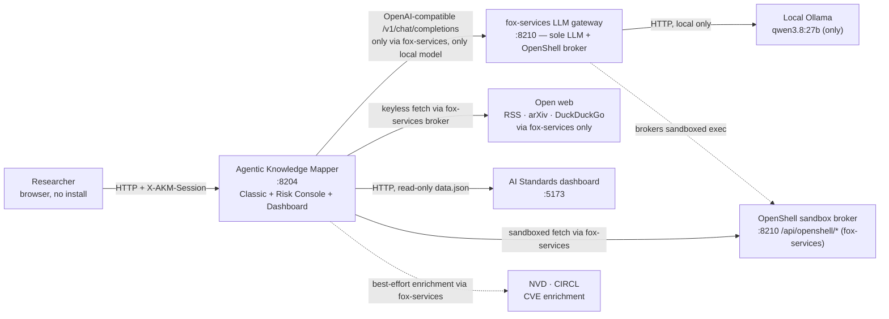
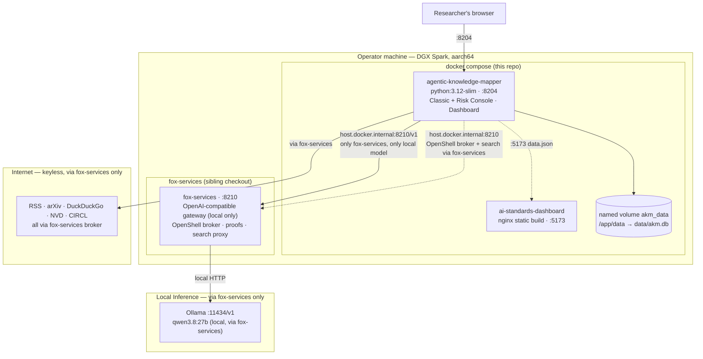
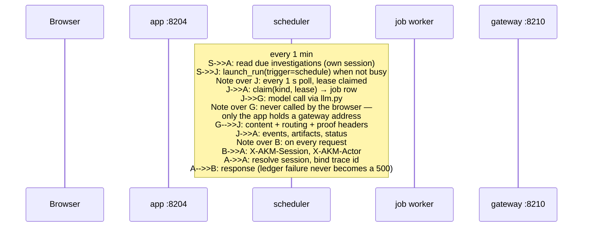
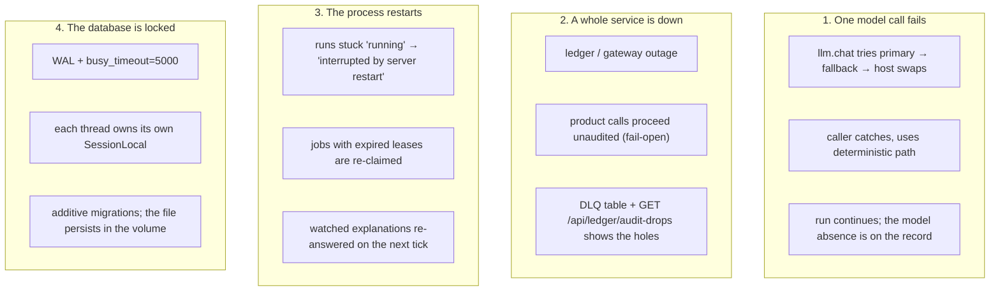

# 01 — System context, containers, deployment

How the system fits together: what is inside the trust boundary, what is
outside it, and what runs where.

Related: [uml.md](02-uml.md) · [interaction.md](interaction.md) ·
[privacy.md](privacy.md) · [../docs/architecture.md](../docs/architecture.md)

## System context (C4 level 1)

The person uses a browser. The app is the only service that stores anything.
Everything else is a dependency the app can work without:

| Dependency | If it is down | Why it is safe to lose |
|---|---|---|
| LLM gateway / mesh | Agents fall back to deterministic behaviour (keyword pre-rank, template prose, split-topic fallback) | Every model call is wrapped; no run depends on a model answering |
| Open web | Fewer candidates; runs still complete | Search providers are keyless and best-effort |
| OpenShell broker | Fetches go direct, and each page records `sandbox: false` | The report states the protection instead of assuming it |
| Standards dashboard | Standards sub-tab returns 503 with the reason; the rest of the app is untouched | One cache-backed route |
| NVD / CIRCL | CVE row stored as `unknown` | An id with no metadata beats no id |

## Containers (C4 level 2)

```mermaid
flowchart TB
    subgraph BROWSER["Browser — no build step, vanilla JS"]
        SPA["static/index.html<br/>Classic Mapper + Security<br/>Leadership Dashboard pane"]
        RC["static/console/index.html<br/>Risk Console shell<br/>persona presets · Risk Cards · charts · graphs"]
    end
    subgraph APP["FastAPI app :8204 — container agentic-knowledge-mapper"]
        API["main.py<br/>~110 REST paths · /console + /api/console/* + /api/search"]
        LED["ledger_api.py + ledger.py<br/>hash chain · mandates · proofs"]
        AG["agent.py<br/>collection loop + RLHF/memorization query packs"]
        EX["explainer.py<br/>Q&A pipeline"]
        SA["security_agent.py<br/>assessment worker"]
        A2A["agents.py<br/>A2A envelope bus · 14 agent cards inc. mitigation-advisor"]
        EN["security.py<br/>threat pack · scoring · report"]
        EVAL["model_eval.py<br/>W1/W2/W3 · memorization + alignment_data_leakage + subtypes"]
        MGR["manager.py<br/>parse (provider template) · fan-out · synthesis (provider compare)"]
        STD["standards_matrix.py<br/>score matrix · findings"]
        SCH["scheduler.py<br/>cron · watch · dashboard_snapshots hourly"]
        JQ["jobqueue.py<br/>persisted · idempotent · leased"]
        SUP["cve.py · drift.py · yield_.py · recommend.py<br/>evalkit.py · grounding.py · writeguard.py"]
        SRCH["search.py<br/>RSS · arXiv · DuckDuckGo"]
        KBS["kb_search.py<br/>FTS5 → LIKE fallback KB search"]
        CONS["console.py<br/>BFF aggregators (home/risks/brief)"]
        PORT["portfolio.py<br/>Initiative · unified register · LP01-08 / PB01-07"]
        EXEC["executive.py<br/>availability · distribution · robustness"]
        PP["provider_posture.py<br/>PDP01-10 · SAF01-06 · RLHF01-08"]
        MEM["memorization.py<br/>RM01-06 · preference memorization"]
        LEAK["leakage.py<br/>pathways + playbooks"]
        LLM["llm.py<br/>single model choke point"]
        OBS["obs.py<br/>trace id · structured logs"]
    end
    DB[("SQLite WAL<br/>data/akm.db<br/>20+ tables<br/>initiatives · risk_entries · snapshots")]
    SPA & RC --> API
    API --> LED
    API --> AG & EX & SA & MGR & STD & SCH & JQ & CONS & KBS & PORT & EXEC & PP & MEM
    AG --> SRCH
    AG & EX & SA & A2A & MGR --> LLM
    SA --> A2A --> EN & EVAL
    AG & EX & SUP & SCH --> LLM
    API & AG & EX & SA & MGR & STD & SCH & JQ & LED & PORT & EXEC --> DB
    LED -.->|"hash + redact every event"| LLM
    OBS -.->|"one id per user action"| API & AG & EX & SA & A2A

```

### Who owns what

| Module | Responsibility | Notable failure behaviour |
|---|---|---|
| `main.py` | Routes (~110 paths), schemas, `/console` + `/api/console/*` + `/api/search` (KB FTS) | 404/503 carry reason; `RISK_CONSOLE_ENABLED=0` hides console |
| `agent.py` | plan → search → analyze → map → refine; provider/RLHF/memorization query packs | 429 guard when busy; provider detection before generic parse |
| `explainer.py` | research → compose → ground → critique → save; `manager_synthesis` carried in summary | Bounded phases; corpus cache; summary carries compiled synthesis |
| `security_agent.py` | Assessment orchestration + approval gate + PDP/SAF/RLHF/RM hooks | Parks on `awaiting_approval`; posture hooks fail-open |
| `agents.py` | A2A `a2a/1.0` envelopes, 14 agent cards (5 catalog + 4 model + 5 new incl. `mitigation-advisor` + RM) | Every hop on trace + chain |
| `security.py` | Threat pack 2.1.0, deterministic scoring, report | Pure function; pinned by `evalkit.py` |
| `model_eval.py` | Model-engineering core: attack taxonomy `memorization`/`alignment_data_leakage` + subtypes, `method_general` 0.25, `preference_data_exposure`, MM01-16, fingerprints 2.0.0/1.1.0 | No LLM; evalkit-pinned |
| `manager.py` | Command parse (provider template per lab), fan-out, synthesis (provider compare + RLHF + RM + safety dual matrix) | No watcher; statuses derive live |
| `portfolio.py` | Unified register (product/model/privacy/supply_chain + RM* `preference_feedback`/`rlhf_memorization`), initiatives, `stated_situation`, leakage `LP01-08`/`PB01-07` | `register_with_state` read-only for dashboard |
| `leakage.py` | Pathways + process `PR01-05` + playbooks `PB01-07` (incl. RLHF), fingerprints 1.1.0 | Reads situation tags only |
| `provider_posture.py` | `provider_data_posture_v1` PDP01-10 + `SAF01-06` + `RLHF01-08`, contribution map, guard, `assess_posture` envelope | Safety firewalled from PDP; deterministic partial |
| `memorization.py` | `akm-rlhf-memorization` RM01-06, query pack, `PB07`, `rm05_situational`, `guard_memorization` | Null if no evidence; high/low exposure never invented |
| `executive.py` | Dashboard: availability (initiative/model/product/PDP/safety) + distribution (`by_provider`, top RM*) + robustness + attention + snapshots | Read-only aggregates, no composite score |
| `console.py` | BFF aggregators `home`/`risks`/`brief` (persona-aware, read-only) | Composes portfolio + executive |
| `kb_search.py` | FTS5 → LIKE fallback KB search over risks/artifacts/assets/decisions, suggest, highlights, facets | Accepted-only default for DPO/Legal |
| `standards_matrix.py` | 34 frameworks × 10 pillars, relevance ranking | Cached; `no-store` per assessment |
| `scheduler.py` | 1-min cron, 10-min watch, hourly `dashboard_snapshots` | Missed windows skipped |
| `jobqueue.py` | Row-before-thread, idempotency key, lease | Lease expiry recovers dead workers |
| `ledger.py` / `ledger_api.py` | Chains, mandates, approvals, proofs, export | **Fail-open**; outage → unaudited |
| `llm.py` | Single gateway choke point | Failover chain, then deterministic fallback |
| `writeguard.py` | Write-verify-repair; provider+memorization tier-gated phrases | Can only remove |
| `grounding.py` | Verbatim-quote gate | Drops invalid citations |
| `obs.py` | Trace id, structured logs | Never raises |

## Deployment (C4 level 3)

`docker compose up -d --build` brings up two services here: the mapper and the
vendored standards dashboard. `fox-services` is started from its own checkout
first, because the mapper treats it as a dependency, not as part of itself.

## Runtime topology — who talks to whom, and when

## Failure domains

## Configuration surface

Everything the app reads from the environment, in one place. See
[../docs/operations.md](../docs/operations.md) for how to set them.

| Variable | Default | Effect |
|---|---|---|
| `LLM_BASE_URL` | compose: fox-services `http://host.docker.internal:8210/v1` (only) | sole OpenAI-compatible backend — all agentic LLM calls via fox-services |
| `LLM_FALLBACK_URL` | *(empty)* | no mesh peer fallback; local model only (was `http://host.docker.internal:8210/v1`) |
| `LLM_MODEL` / `LLM_FALLBACK_MODEL` | `qwen3.8:27b` | local model via fox-services (mesh `qwen3.8:27b` no longer used) |
| `LLM_TIMEOUT_S` | `180` | per-request timeout |
| `RISK_CONSOLE_ENABLED` | `1` | `0` hides `/console` and Classic header pill |
| `FOX_TELEMETRY_URL` | *(unset)* | digest-only gateway proof linkage on direct backends |
| `LEDGER_CAPTURE_PAYLOADS` | `0` | `1` stores prompts and args verbatim; off means hashed + redacted |
| `AKM_SESSION_IDLE_S` | `1800` | a browser sitting closes after this idle |
| `AKM_LOG_FORMAT` | `text` | `json` for one object per line |
| `AKM_LOG_LEVEL` | `info` | `debug`/`info`/`warn`/`error` |
| `AKM_IMAGE_PROBE` | `1` | section-image vocabulary relevance gate |
| `AKM_WRITEGUARD` / `_REPAIRS` / `_JUDGE` | `1` | write-verify-repair, repairs, drift judge |
| `OPENSHELL_ENABLED` | `1` | `0` forces direct fetches |
| `OPENSHELL_BROKER_URL` | `http://host.docker.internal:8210` | OpenShell broker |
| `OPENSHELL_TIMEOUT_S` | `25` | sandbox exec timeout |
| `STANDARDS_BASE_URL` | `http://standards` | in-compose dashboard host |
| `STANDARDS_TIMEOUT_S` / `STANDARDS_CACHE_TTL_S` | `10` / `900` | score-matrix fetch budget and cache |

## Related

- Component and class detail: [uml.md](02-uml.md)
- Storage detail: [data-model.md](data-model.md)
- What crosses a boundary, and what must not: [privacy.md](privacy.md)
