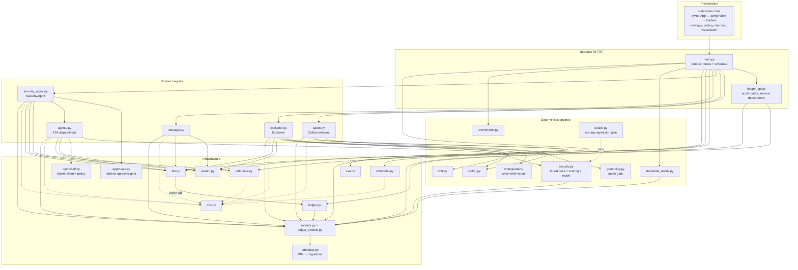
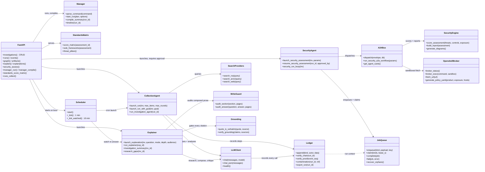
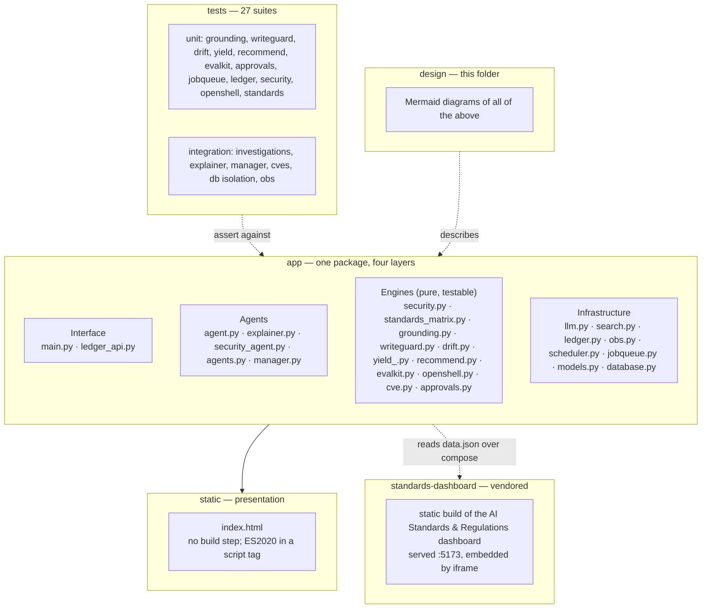
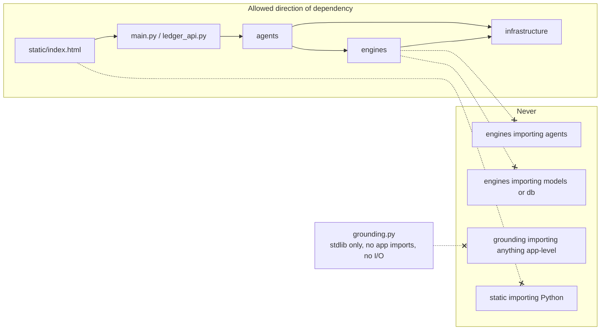
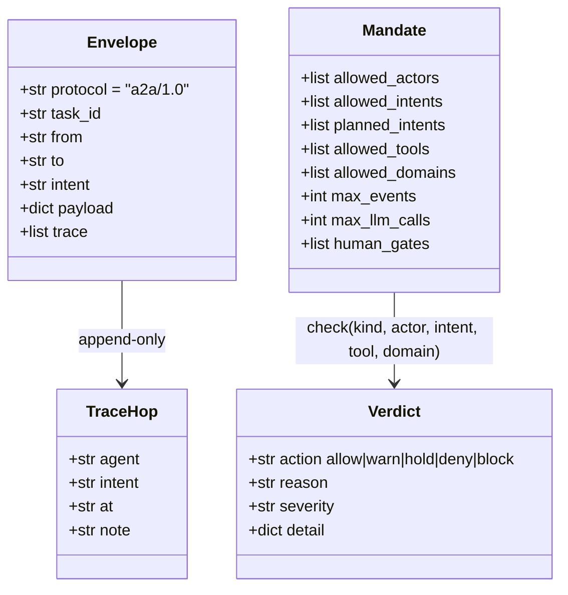

# 02 — UML structure

Component, class, and package views of the codebase: which module owns which
responsibility, and what depends on what.

Related: [01-system-context.md](01-system-context.md) · [data-model.md](data-model.md) ·
[interaction.md](interaction.md) · [../docs/architecture.md](../docs/architecture.md)

## Component diagram (internal)



## Key classes (UML)



## Package diagram



## Layering rules the code actually follows



Two of these rules were learned the hard way and are worth stating, because
their violation is a real bug rather than a style note:

- **`grounding.py` must stay a leaf.** The verbatim-quote rule used to be
  implemented twice — `ledger.quote_is_verbatim` and `explainer._quote_valid` —
  and kept in sync by hand. The ledger kept its own copy because importing the
  explainer would drag `bs4`/`feedparser` in through `llm`. The fix was to make
  the rule a stdlib-only leaf and delete the copy, not to document the copy.
- **LLM calls funnel through `llm.py`.** That module is the only place a model
  is called, which is what makes "every model call is on the chain" a property
  of the system rather than a promise in a docstring.

## The A2A envelope protocol



Envelope shape, verbatim, as `agents.new_envelope` builds it:

```json
{
  "protocol": "a2a/1.0",
  "task_id": "sec-a1b2c3d4",
  "from": "security-orchestrator",
  "to": "research-collector",
  "intent": "collect_research",
  "payload": {"product_name": "…", "investigation_id": 9, "threat_titles": ["…"]},
  "trace": [{"agent": "security-orchestrator", "intent": "plan_assessment",
             "at": "2026-09-28T20:37:52Z", "note": "task sec-76f215f7: …"}]
}
```

The five agent cards discoverable at `GET /api/agents/cards` and
`GET /.well-known/agents`:

| Agent | Skills | Envelope intents it answers |
|---|---|---|
| `security-orchestrator` | `plan_assessment`, `delegate_collection`, `assemble_report` | `plan_assessment`, `assemble_report` |
| `control-analyst` | `analyse_controls`, `judge_applicability`, `propose_control_plan` | `analyse_controls`, `judge_applicability` |
| `research-collector` | `agentic_search`, `rank_evidence` | `collect_research` |
| `threat-intel` | `map_attacks`, `cite_evidence`, `score_evidence_confidence` | `map_attacks` |
| `report-writer` | `write_exploits_section`, `write_exec_bullets` | `write_section` |

## Related

- Storage: [data-model.md](data-model.md)
- Exact call order: [interaction.md](interaction.md)
- Every control, with the file that enforces it: [controls.md](controls.md)
