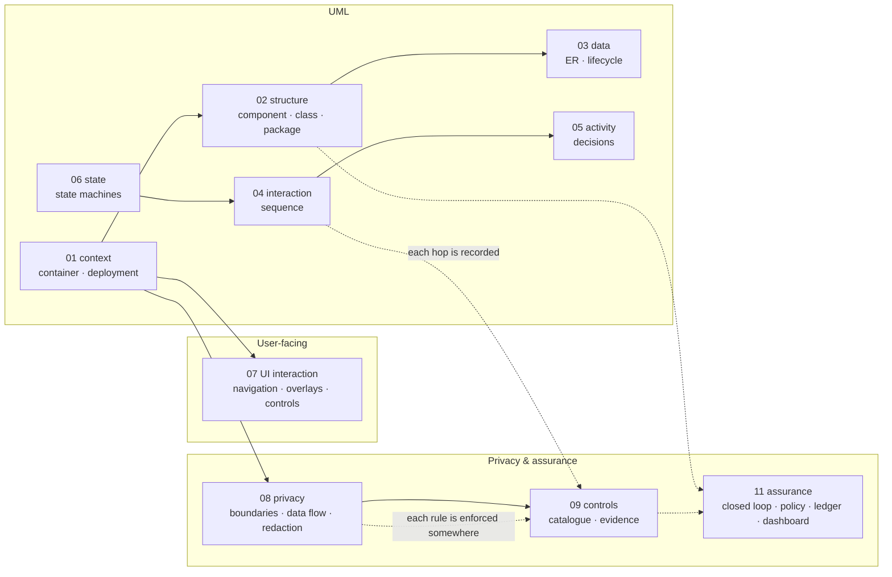
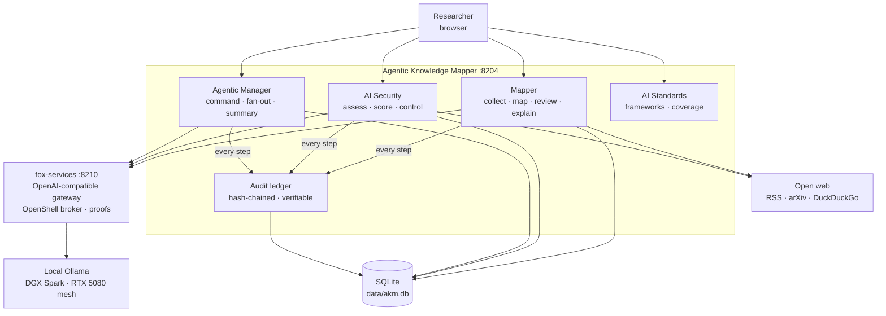

# Design diagrams

The whole system, drawn. Every diagram is [Mermaid](https://mermaid.js.org),
so it renders on GitHub, in VS Code, and in any markdown viewer — no image
build step, and the diagrams live next to the code they describe.

These are **design** documents: they explain *what the system is and how it
behaves*, not how to run it (see [`../docs/operations.md`](../docs/operations.md))
and not what each table holds (see [`../docs/data-model.md`](../docs/data-model.md)).

**Read them in the app.** The *Design & Architecture* tab in the running mapper
renders this set live, with a rail grouped in reading order, an outline, and a
source toggle — `#design/privacy` is a link to any one of them. It reads the
files over `GET /api/design/docs`, so what is on screen is what is in the
repository; a screenshot of a diagram that has since changed would not be.

| # | File | Diagram kind | What it answers |
|---|---|---|---|
| 01 | [01-system-context.md](01-system-context.md) | context, container, deployment, environment | What is in the box, what is outside it, what runs where |
| 02 | [02-uml.md](02-uml.md) | UML component, class, package | Which module owns which responsibility, and how they depend |
| 03 | [data-model.md](data-model.md) | UML ER, lifecycle | What is stored, how it relates, how records move through states |
| 04 | [interaction.md](interaction.md) | UML sequence | What calls what, in what order, on every major flow |
| 05 | [activity.md](activity.md) | UML activity | What decisions an agent makes while it works |
| 06 | [state.md](state.md) | UML state | How each long-lived object moves through its states |
| 07 | [ui-interaction.md](ui-interaction.md) | UI navigation + interaction | How a person moves through the app, and what each control does |
| 08 | [privacy.md](privacy.md) | privacy: trust boundaries, data flow, redaction | What data exists, where it can go, and what provably cannot leave |
| 09 | [controls.md](controls.md) | control catalogue | Every governance, integrity, and privacy control, with where it is enforced |
| 10 | [risk-console.md](risk-console.md) | alternative GUI · personas · risk-first | How the parallel Risk Console presents the same backend for researchers to CISOs |
| 11 | [assurance.md](assurance.md) | closed-loop: swarm → ledger → dashboard → decision | How residual risk becomes an organisational decision, not a research output |
| 12 | [security-scoring.md](security-scoring.md) | scoring: catalog + model paths · aggregation · assurance overlay | How AKM computes inherent / residual / verified scores, and what makes them honest |

## Diagram kind → file

## Reading the system in one pass

1. **Context** — [01](01-system-context.md): the browser, this app, the LLM
   gateway, the mesh, the open web, and the standards dashboard.
2. **What a person can do** — [07](ui-interaction.md): five top-level apps,
   their sub-tabs, and the overlays that sit on top.
3. **What happens when they do it** — [04](interaction.md) for the exact
   call order, [05](activity.md) for the decisions inside the agent, and
   [06](state.md) for the life of a run, an assessment, and a job.
4. **Why it is trustworthy** — [02](02-uml.md) and [03](data-model.md) for
   structure and storage, then [08](privacy.md) and [09](controls.md) for
   privacy and the control catalogue.

## The app in one diagram

## Conventions used in these files

| Convention | Meaning |
|---|---|
| **Solid arrow** | a call, a query, or a data write that always happens |
| **Dotted arrow** | best-effort: may be skipped, may fail open, may degrade |
| **Double border** | a trust boundary — crossing it changes what may be seen |
| **`#` in a label** | a port, route, or exact identifier you can grep |
| **Quoted label** | literal text that must not be reworded (an error string, a verdict) |
| **`T01`–`T12`, `C01`–`C15`, `KE-01`–`KE-08`** | threat, control, and known-exploit ids from the versioned threat pack (`akm-threat-pack` 2.1.0) |

## Source of truth

Diagrams are documentation, not configuration — but they are kept honest:

- Every route in a sequence diagram exists in `app/main.py` or `app/ledger_api.py`
  (96 paths as of this writing; `GET /openapi.json` lists them all).
- Every control in [controls.md](controls.md) names the file that enforces it, and
  the test that would fail if it stopped working.
- Every table in [data-model.md](data-model.md) is created by `create_all()` in
  `app/database.py` and upgraded additively by `ensure_columns()`.

If a diagram and the code disagree, the code is right — fix the diagram in the
same commit that changed the code.
