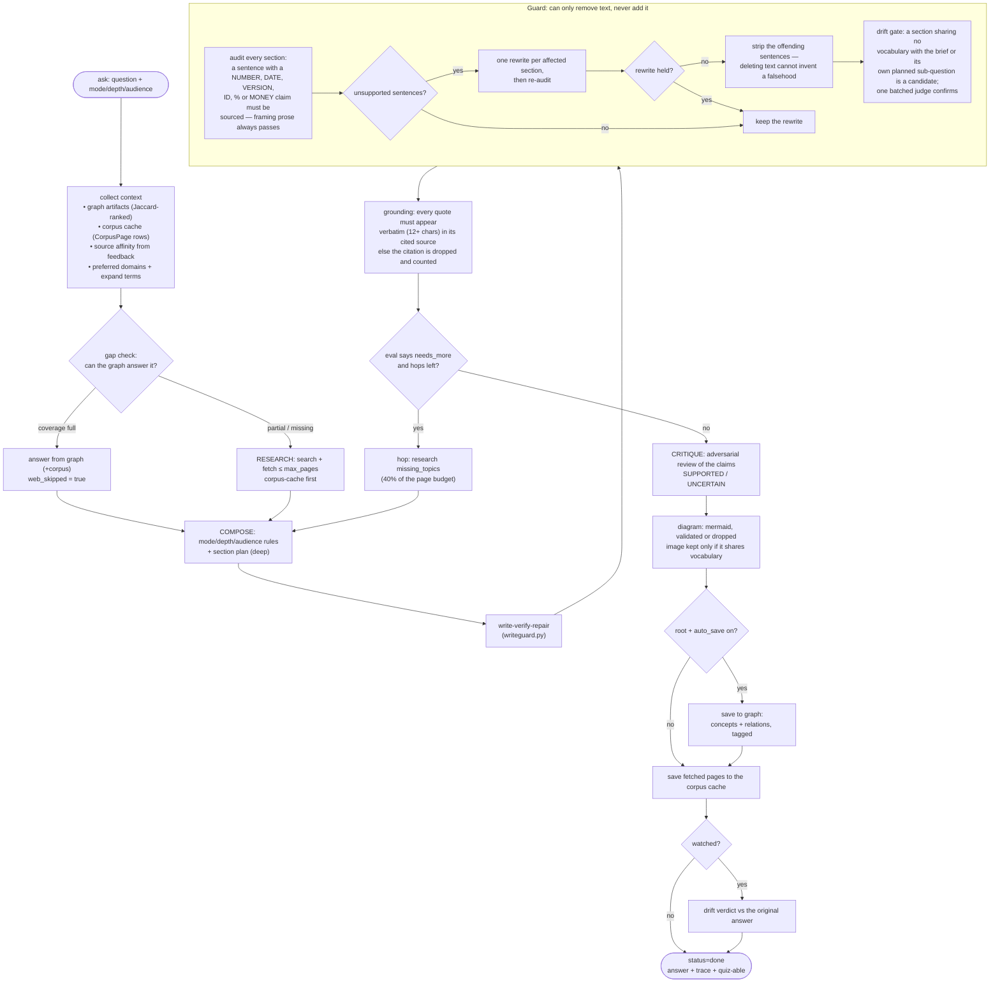
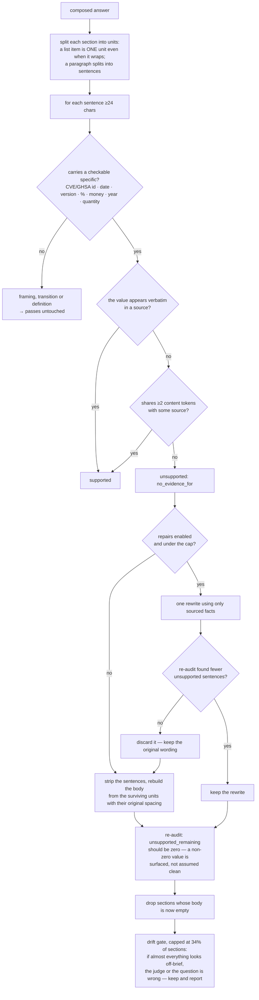
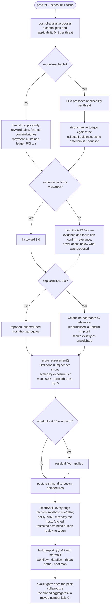
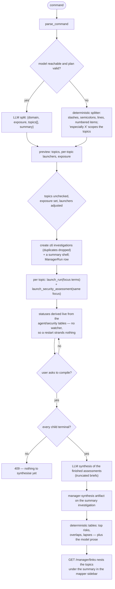
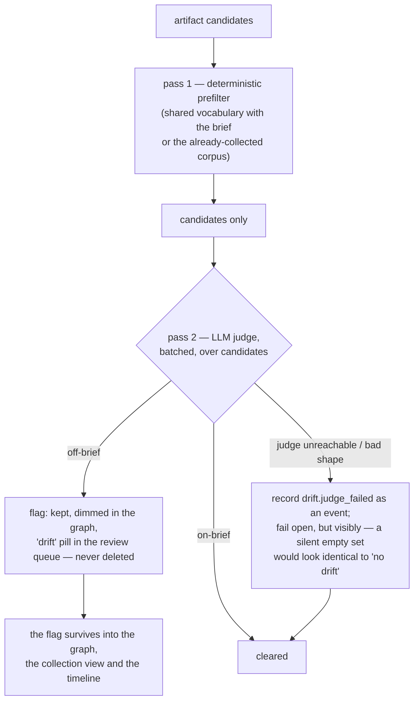
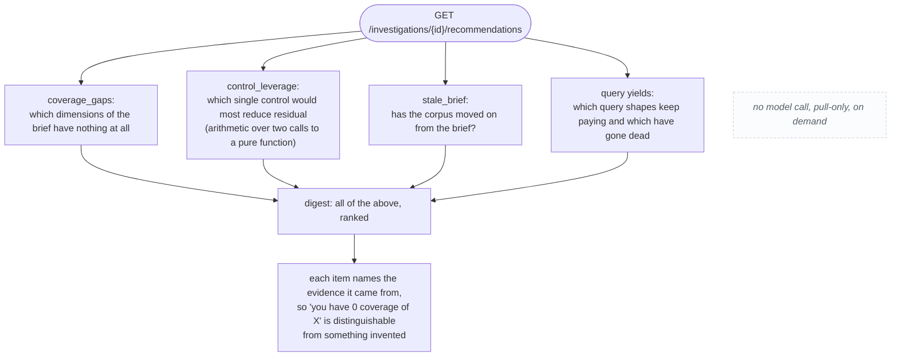
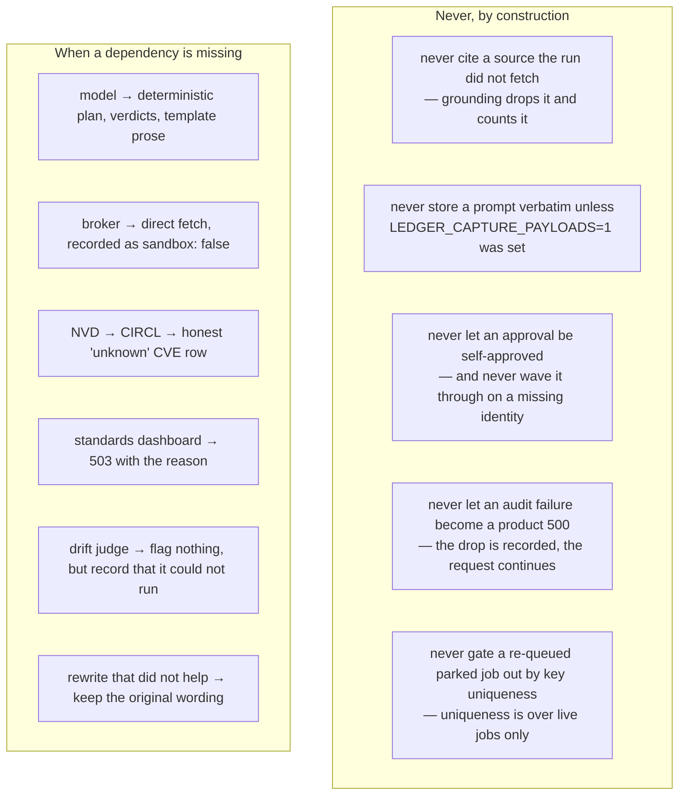

# 05 — Activity (UML activity)

The decisions an agent makes while it works: what it tries, what it gives up
on, and what it falls back to. These are the flows where the interesting
behaviour lives, because every one of them has a branch for "the model said no
useful thing" and a branch for "the model is not there".

Related: [interaction.md](interaction.md) (call order) · [state.md](state.md)
(object lifetimes) · [../docs/agent-loop.md](../docs/agent-loop.md)

## Collection: plan → search → analyze → map → refine

```mermaid
flowchart TB
    S(["launch_run(inv, max_items, max_rounds)"]) --> R["AgentRun(status=running)<br/>inv.status=running<br/>run.start on the chain"]
    R --> Y["rank planned query shapes by<br/>observed yield (cumulative)"]
    Y --> P["PLAN: llm.chat_json<br/>≤6 queries × sources<br/>(rss / arxiv / web ∩ enabled)"]
    P --> PFALL{"planner LLM failed?"}
    PFALL -- yes --> PD["deterministic plan:<br/>keywords + title, ≤3 queries"]
    PFALL -- no --> SEEN
    PD --> SEEN["seen = existing urls + titles<br/>(dedupe across runs)"]
    SEEN --> LOOP{"round ≤ max_rounds<br/>and kept < max_items?"}
    LOOP -- no --> DONE
    LOOP -- yes --> F["SEARCH: ThreadPool fan-out<br/>(min(8, queries × sources))"]
    F --> FALL{"providers unavailable?"}
    FALL -- yes --> FEMPTY["fewer candidates —<br/>never a run failure"]
    FALL -- no --> PRE
    FEMPTY --> PRE
    PRE{"found > 3 × max_items?"}
    PRE -- yes --> PR["cheap keyword pre-rank<br/>(title×2 + desc×1)"]
    PRE -- no --> AN
    PR --> AN["ANALYZE: batches of 5<br/>relevance 0..1, keep/drop, tags,<br/>sentiment, projection, relates_to[]"]
    AN --> AFALL{"analyze LLM failed?"}
    AFALL -- yes --> ADEF["deterministic verdicts:<br/>relevance from token overlap,<br/>keep at ≥0.4"]
    AFALL -- no --> KEEP
    ADEF --> KEEP{"anything kept?"}
    KEEP -- no --> DONE
    KEEP -- yes --> MAP["MAP: persist artifacts<br/>(origin=agent, review=pending)<br/>+ relationships ≤60<br/>+ tag-overlap fallback edges"]
    MAP --> CVE["collect CVEs mentioned<br/>by this run (idempotent)"]
    CVE --> QY["query_shape_yields +=<br/>found / kept / llm_calls"]
    QY --> CAP{"kept ≥ max_items<br/>or rounds exhausted?"}
    CAP -- yes --> DONE
    CAP -- no --> FUP["planner: ≤3 follow-up queries<br/>aimed at what is missing"]
    FUP --> F2{"any follow-ups?"}
    F2 -- yes --> F
    F2 -- no --> DONE
    DONE(["run.status=done | error<br/>inv.status=ready<br/>run.end + summary event"])

```

## Explainer: can the graph answer it, and does the prose hold up

## The write-verify-repair guard, in full

## Security assessment: applicability, scoring, and the report

## Manager: understand → serve → synthesise

## Drift: cheap first, expensive second, silent never

## Recommendations: computed from numbers already paid for

## Ask: five things the app refuses to do silently

## Related

- [interaction.md](interaction.md) — the same flows as call sequences
- [state.md](state.md) — how runs, jobs and approvals move through states
- [controls.md](controls.md) — the control behind each "never"
