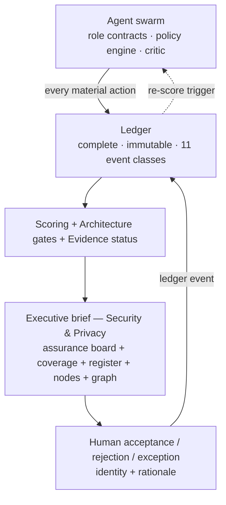

# Assurance: swarm → ledger → dashboard → decision

The security evaluation is a closed loop, not three workstreams. The swarm
produces the work under policy, the ledger records every material action
immutably, the dashboard renders the risk position for the humans who own it,
and their decision is itself a ledger event feeding the next cycle.

Related: [architecture.md](../docs/architecture.md) ·
[risk-scoring.md](risk-scoring.md) · [data-model.md](data-model.md) ·
[02-uml.md](02-uml.md)

## Three modules, one contract

| Module | Role | Load-bearing contract |
|---|---|---|
| `app/swarm.py` | Governed collective | role contracts, policy engine, topology, resume, critic, scope/budget |
| `app/assurance_ledger.py` | Tamper-evident record | hash chain + 11 mandatory event classes + absence alerts |
| `app/leadership.py` | Decision-grade view | residual always beside confidence and gate status; coverage of investigations + experiments |
| `app/fox_nodes.py` | Compute-estate view | declared trust boundary + hardware, live-probed status (down = data, unprobed = not guessed) |
| `static/index.html` | The surface that renders it | four labelled sub-tabs — Assurance board, Portfolio register, Fox services nodes, Knowledge graph — never one blended view |

## The Executive brief: four labelled surfaces

The dashboard is a brief, not a dump: each sub-tab answers a different question
about the same stored rows.

- **Assurance board** — risk position by tier, the decision queue (verified
  residual beside confidence, gate status and blast radius, age vs the SLA),
  alerts, assurance health, exposure, system integrity, exceptions and the
  change log, layered by persona lens (a lens changes emphasis, never the
  underlying number). A **Global · all investigations** toggle reads the whole
  portfolio.
- **Coverage** (on the board) — of the investigations in scope, how many have
  an assessment (unassessed named, not counted away); of the latest model
  assessments, how many carry an experiment plan and how much of the
  open-falsifier space those plans target. A **distribution** cuts the same
  coverage by keywords, data exposure, use case (objective), focus / settings /
  context, and model class; the registers list every investigation and every
  experiment plan, folded by default.
- **Portfolio register** — the older `/api/dashboard/*` risk register.
- **Fox services nodes** — a trust-boundary map (dashed data-governance
  perimeter with managed nodes inside, local/dev outside), each node's declared
  hardware and max data tier, and a live status probe.
- **Knowledge graph** — every artifact and relationship across every
  investigation with investigation hub nodes; category/similarity clustering,
  elastic-like search with filter-to-matches, explicit zoom, an edge-labels
  toggle, and a hover/click overlay (hover = transient panel, click = modal with
  the full record and navigable neighbours).

## Swarm: a governed graph, not a loose pipeline

Every agent has a typed contract (inputs, outputs, failure mode) and only the
orchestrator and human-reviewer may advance past a gate. Before the scorer may
emit a residual, `policy_engine()` evaluates the whole policy surface:

- **scoring gates** — architecture completeness, evidence threshold, forensics
  readiness, threat-pack currency, evidence-confidence floor;
- **research scope** — source allow-lists per investigation;
- **budget** — queries / tokens / wall-clock.

A failing rule is a reason, never an exception: no downstream agent can skip
the check by calling the scorer directly. Missing hops are integrity alerts,
not warnings — the §13.5 rule that a hop trace not recorded is a finding.

Interruption is recoverable: `resume_state()` rebuilds a run from its ledger
events alone, so a worker restart resumes from the last committed event
instead of re-planning and re-running roles that already committed outputs.

A `critic` role (with its own contract) samples the run's own record after the
swarm closes, flagging contradictions, unsupported claims and missing hops.

## Ledger: completeness and absence are first-class

The base ledger (`app/ledger.py`) gives the hash chain, redaction and export.
`app/assurance_ledger.py` records the assurance event classes and — critically
— turns **absence** into a queryable result:

- 11 mandatory event classes; a real run records all 11.
- Every §8.5 failure mode has a named alert: `SWARM-HOP-DROPPED`,
  `SCORE-AFTER-FAILED-GATE`, `REDUCTION-WITHOUT-ATTESTATION`,
  `ACCEPTANCE-BELOW-CONFIDENCE`, `MODEL-VERSION-CHANGE`,
  `FABRIC-INTEGRITY-EVENT`.
- A blocked architecture gate is **not** a fabric failure: the distinction
  between "the gate refused" and "the fabric broke" is what keeps leadership
  trusting the most honest run in the set.
- `monitor_integrity()` re-verifies every recent chain continuously.
- `export_siem_events()` streams runs to the organisation's detection fabric.
- `re_score_triggers()` flags a residual whose evidence or architecture basis
  changed after it was written; a re-score is a superseding run, never an edit.

## Dashboard: decision-first, confidence-aware, system-health inclusive

| View | What it answers |
|---|---|
| Risk position | current residual by data tier, each with its confidence and verified-vs-declared share |
| Decision queue | which investigations await a human acceptance, with gate status + blast radius |
| Assurance health | controls verified vs declared, forensics, ledger status, stalled runs, time-to-close |
| Exposure lens | restricted/confidential assets, privileged users, materiality |
| System integrity | swarm health, pack currency, ledger completeness, interrupted runs |
| Alerts | gate failures, ledger alerts, overdue evidence, stalled investigations |
| Exceptions | time-bounded exceptions with expiry → re-evaluation |

The `board(persona=…)` endpoint serves the same underlying data with different
emphasis for Executive, CISO, DPO, Legal, Audit and Security Engineering, so
two personas can never quote different residuals for the same assessment.

Every human decision (accept / accept-with-mandatory-guardrails / reject /
exception) is recorded with identity and rationale and becomes a ledger event.
An exception is always time-bounded; expiry drops the row back to open and
triggers re-evaluation, so an override cannot quietly become permanent.

## Failure semantics the loop guarantees

| Condition | Behaviour |
|---|---|
| Architecture gate fails (restricted data) | scorer blocked; residual stays inherent; dashboard shows Blocked |
| Evidence below threshold | reduction capped; confidence lowered; items queued for review |
| Critical agent failure | orchestrator retries with backoff or escalates; never silently skips |
| Ledger write failure | run reports it; no scoring continues on a missing record |
| Model or tool version change | recorded; confidence penalised or affected stages re-run |
| Human exception expires | automatic re-evaluation triggered |

## Anti-patterns the design refuses

- Residual without confidence or gate status.
- Snapshots detached from the live ledger.
- Hiding swarm or ledger health from leadership.
- Threat-level detail overwhelming the executive's primary screen.
- Residual acceptance without a corresponding ledger event.