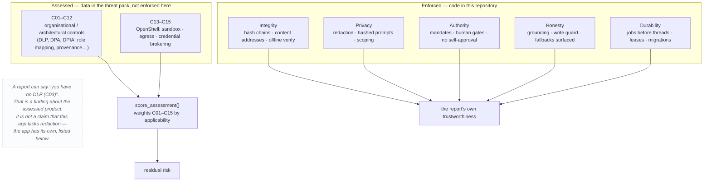
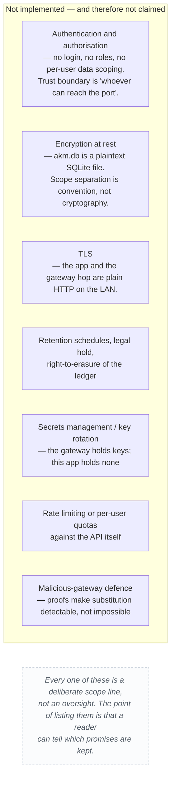
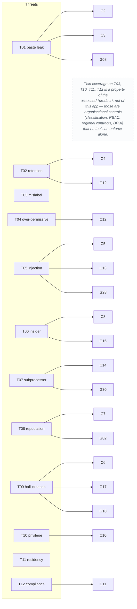
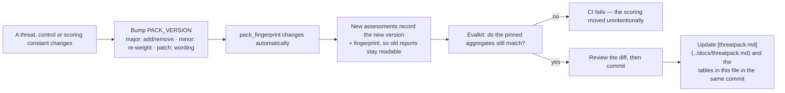

# 09 — Controls

Every governance, integrity and privacy control the system has, where it is
enforced, and — for the ones the app enforces itself — what would fail if it
stopped working.

Two catalogues are in play and they are **different things**:

- **C01–C15** are the *assessed* controls: entries in a versioned threat pack
  that a security assessment weighs when scoring a product. They are data, not
  code. The app does not implement C01 or C09.
- **The governance controls below** are *enforced* by this codebase: real
  checks in real files, with real failure modes.

Conflating the two is the most common misreading of a security report produced
by this app, so the split is drawn explicitly at the top of each section.

Related: [privacy.md](privacy.md) · [../docs/security-agent.md](../docs/security-agent.md)

## The split, in one picture

## Part 1 — the assessed control catalogue (C01–C15)

From `akm-threat-pack` 2.1.0 (`_CONTROL_CATALOG` in `app/security.py`).
Efficacy is the fraction of a threat's likelihood a control removes; coverage
compounds as `1 − Π(1 − efficacy)`, so stacking helps but never reaches
certainty.

| # | Control | Efficacy | Standard | Mitigates | Enforced by this app? |
|---|---|---|---|---|---|
| C01 | Classification gate before AI | 0.70 | ISO 27001 A.5.12 / A.8.12 | T03, T06, T10 | no — assessed |
| C02 | Schema-only prompt (no raw values) | 0.70 | OWASP LLM02 | T01, T04, T06 | no — assessed |
| C03 | Client-side DLP redaction | 0.65 | ISO 27001 A.8.12 | T01, T04, T11 | **partly** — server-side `_redact` exists; see G-02 |
| C04 | Zero-retention / no-train agreement | 0.85 | GDPR Art. 28 / vendor DPA | T02, T07 | no — a contractual control |
| C05 | Prompt-injection defenses | 0.60 | OWASP LLM01 | T05, T09 | **partly** — see G-11, G-12 |
| C06 | Human steward review before publish | 0.55 | HITL | T03, T04, T09, T06 | **yes, in spirit** — see G-08 |
| C07 | AI provenance stamping | 0.70 | EU AI Act Art. 12 / ISO A.8.32 | T08, T09 | **yes** — see G-01, G-07 |
| C08 | Immutable audit + anomaly detection | 0.60 | ISO A.8.15 / A.8.16 | T06, T08, T10 | **yes** — see G-03, G-04, G-05 |
| C09 | Region pinning + private endpoint | 0.75 | GDPR Ch. V | T11, T07 | no — assessed |
| C10 | Least-privilege role mapping | 0.65 | ISO A.5.15 / A.5.18 | T10, T01, T04 | no — no auth in this app |
| C11 | DPIA + control mapping on record | 0.55 | GDPR Art. 35 | T12, T11, T02 | no — assessed |
| C12 | Output review + downstream ACL sync | 0.50 | ISO A.5.18 | T04, T09 | no — assessed |
| C13 | OpenShell sandbox for tool calls | 0.70 | OpenShell policy | T05, T06, T10 | **yes** — see G-13 |
| C14 | Declarative egress allowlist | 0.75 | OpenShell network policy | T06, T07, T01, T02 | **yes** — see G-13 |
| C15 | Credential brokering | 0.70 | OpenShell providers | T07, T06 | **yes** — see G-14 |

The threat list they mitigate (T01–T12) is the 12-row catalog in
`app/security.py`, with OWASP LLM Top 10 (2025) and STRIDE mappings and a
likelihood × impact score at the Confidential baseline.

## Part 2 — controls this app actually enforces

Each of these names the file that implements it and the failure that would
expose it.

### Integrity

| ID | Control | Enforced in | Fails if |
|---|---|---|---|
| G-01 | **Content-addressed claims** — `claim_hash = sha256(text + citations)`, so two agents asserting the same thing produce the same address | `app/ledger.py` `LedgerClaim` | Two agents could parrot each other with no shared address; contamination analysis would have nothing to pivot on |
| G-02 | **Hash chain per run** — every event's hash covers `run_id, seq, ts, actor_type, actor, kind, intent, verdict, severity, data, prev_hash`; `(run_id, seq)` is unique | `app/ledger.py` `append`, `verify_chain` | Insertion, deletion or reordering would go unnoticed |
| G-03 | **Anchored session spine** — a session run carries one `run.anchor` per adopted task, so each task verifies alone *and* the order they happened in is independently provable | `app/ledger.py` `scope`, `resolve_session` | A sitting would prove what happened but not in what order |
| G-04 | **Offline verifiability** — `GET /ledger/runs/{id}/export` + `POST /ledger/verify-export` verify a bundle with no database attached | `app/ledger_api.py` | Trust would depend on trusting the server that made the claim |
| G-05 | **Threat-pack fingerprinting** — `pack_fingerprint` hashes ids, titles, likelihoods, impacts, efficacies, coverages and scoring constants; assessments record the pack version and fingerprint | `app/threatpack.py` | A likelihood nudged 4→5, or a control's efficacy trimmed, would silently change every score with no test failing |
| G-06 | **Evalkit gate** — a pinned case set asserts the aggregates the pack produces; a moved number fails CI | `app/evalkit.py` | Scoring regressions would ship as "the model got different" |
| G-07 | **Content-addressed gateway proofs** — `x-fox-proof` and `x-fox-request-id` recorded per model call | `app/llm.py` | A substituted response would be indistinguishable from an honest one |

### Privacy

| ID | Control | Enforced in | Fails if |
|---|---|---|---|
| G-08 | **Recursive redaction before immutable storage** — key-name rules, value-pattern rules, hex-digest exemption; numbers survive | `app/ledger.py` `_redact` | Credentials would land in a log that has no delete |
| G-09 | **Prompts hashed by default** — `prompt_hash` + `prompt_chars`; verbatim capture needs `LEDGER_CAPTURE_PAYLOADS` | `app/ledger.py` `CAPTURE_PAYLOADS` | Every prompt a person pasted would become permanent by default |
| G-10 | **Per-investigation scoping and cascade delete** — every content table is keyed by `investigation_id` with `ondelete="CASCADE"` | `app/models.py`, `app/database.py` | "This graph only contained what you collected for that brief" would be unverifiable |
| G-11 | **The ledger outlives deletion, deliberately** — no cascade from an investigation to audit records | `app/ledger_models.py` | An audit record that vanished with the work would prove nothing. *This is a trade, not a free win — see [privacy.md](privacy.md).* |
| G-12 | **No third-party model client** — model access goes through the local gateway only | whole codebase; `app/llm.py` | The "your data never leaves the machine" claim would become a claim about a vendor's DPA instead |

### Authority

| ID | Control | Enforced in | Fails if |
|---|---|---|---|
| G-13 | **Mandates, hashed at creation** — allowed actors, intents, tools, domains, budgets; hard failures deny, soft signals flag | `app/ledger.py` `Mandate.check` | A run could do anything its plan implied, with nothing checking the plan |
| G-14 | **Human gates fail closed** — `same_actor` rejects an empty identity; `requester ≠ approver` is a 403 | `app/approvals.py` | An approval could be granted by nobody, or by the person requesting it |
| G-15 | **Audit-trail events are never gated** — `INTERNAL_KINDS` always pass the mandate | `app/ledger.py` | The audit trail could refuse to record the thing it exists to record |
| G-16 | **Audit is fail-open but never silent** — a failed chain write is recorded in `ledger_audit_drops` and counted, not swallowed | `app/ledger.py` audit helpers | Evidence would be lost to stderr, where nobody reads it |

### Honesty about output

| ID | Control | Enforced in | Fails if |
|---|---|---|---|
| G-17 | **Grounding** — every citation's quote must appear verbatim in the source it names; failures are dropped *and counted* | `app/grounding.py` | A model could cite a source it never read |
| G-18 | **The write guard** — unsourced specifics are repaired once, then stripped; a list item is one unit even when it wraps | `app/writeguard.py` | A fluent, confident, unsourced sentence would be indistinguishable from a sourced one |
| G-19 | **The drift gate** — a section sharing no vocabulary with the brief is confirmed by a judge before being removed, capped at 34% of sections | `app/writeguard.py` | A good answer could be stripped to nothing by an over-eager filter |
| G-20 | **Drift flags, never deletions** — off-brief artifacts are kept, dimmed, and labelled | `app/drift.py`, `app/agent.py` | The app would hide what it collected without saying so |
| G-21 | **Deterministic fallbacks are named** — planner, analyzer, report writer, OpenShell fetch, CVE enrichment and drift all degrade to a stated path | `app/agent.py`, `app/openshell.py`, `app/cve.py` | "The model produced this" would be true of template prose |
| G-22 | **Honest CVE records** — an unknown status stays `unknown`; NVD → CIRCL → `unknown` | `app/cve.py` | A guess would be stored beside a real enrichment and look identical |

### Durability

| ID | Control | Enforced in | Fails if |
|---|---|---|---|
| G-23 | **Row before thread** — a job exists in SQLite before any worker starts | `app/jobqueue.py` `enqueue` | A crash between enqueue and start would lose work with no trace |
| G-24 | **Lease-based recovery** — only expired leases are re-queued; workers heartbeat | `app/jobqueue.py` `recover_orphans` | A slow job would be duplicated by a second worker |
| G-25 | **Live-key uniqueness, not key uniqueness** — `UNIQUE(key) WHERE status IN (pending, retry, running)`, so a parked job can be re-queued under its own key | `app/models.py` `Job` | A run parked at an approval gate could never be resumed |
| G-26 | **Additive migrations only** — `ensure_columns()` adds missing columns; nothing is dropped | `app/database.py` | Rebuilding the container would lose the `akm_data` volume's contents |
| G-27 | **Idempotent collection** — `UNIQUE(investigation_id, cve_id)` and `UNIQUE(investigation_id, url)` mean a repeat run adds nothing new | `app/models.py` | Re-running would duplicate the corpus and inflate the counts |

### Isolation

| ID | Control | Enforced in | Fails if |
|---|---|---|---|
| G-28 | **OpenShell sandboxed fetch** — product/doc fetches run through the broker; the report records `sandbox: true/false` per page rather than assuming protection | `app/openshell.py` | Injected page content could reach host files or credentials, and the report would not say whether it was isolated |
| G-29 | **Egress allowlist, exactly the hosts fetched** — the policy YAML is generated from the actual fetch set, and widening a restricted tier needs a human | `app/openshell.py` | A permissive default would make the allowlist decorative |
| G-30 | **Credentials never enter agent context** — providers inject them only for approved endpoints; the app holds no model keys | `app/openshell.py`, and the app has no LLM key of its own | A leaked context would leak something usable |

## Part 3 — controls the app does *not* have

Stated so the catalogue above is not read as a security certification.

## Coverage map: which control answers which threat

## Keeping the catalogue honest

The version, the fingerprint, and the evalkit exist because a scoring catalog is
deterministic — and deterministic means a one-character edit changes every
number forever with nothing raising. Three independent mechanisms (version,
fingerprint, eval) close that hole, and all three are asserted in tests.

## Related

- Where each privacy claim is enforced: [privacy.md](privacy.md)
- The full assessed catalogue: [../docs/threatpack.md](../docs/threatpack.md)
- The agent workflow that consumes it: [02-uml.md](02-uml.md)
