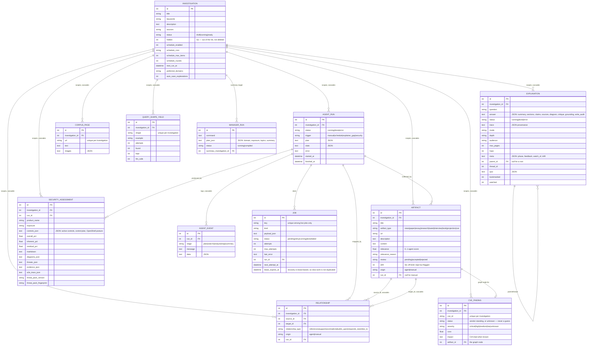
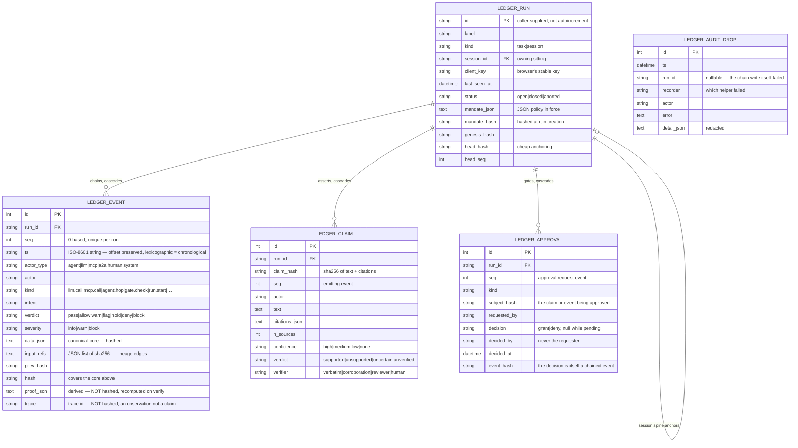
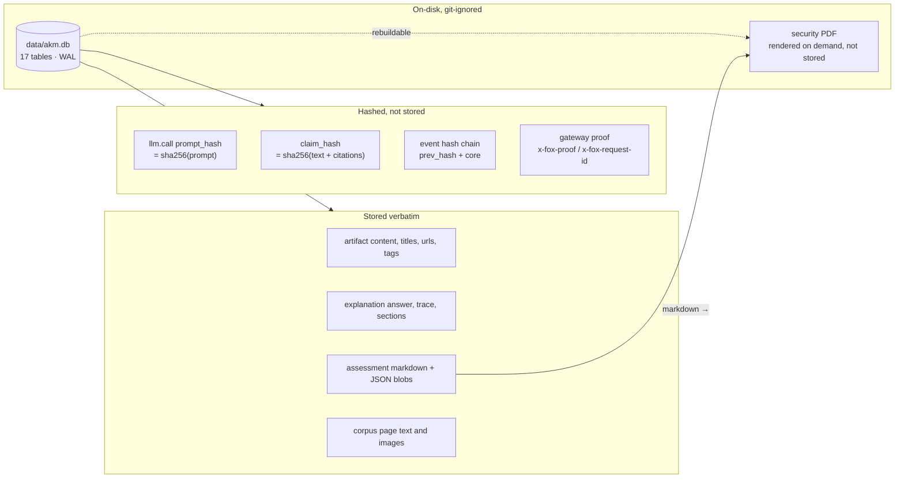
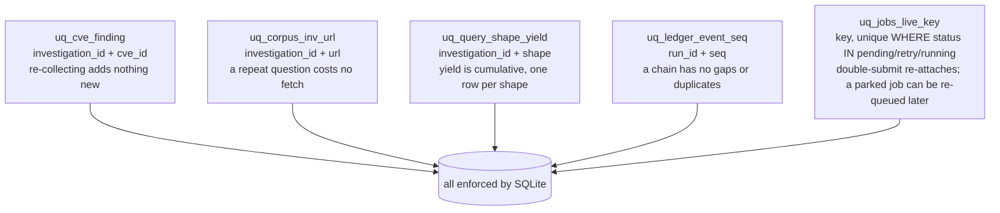
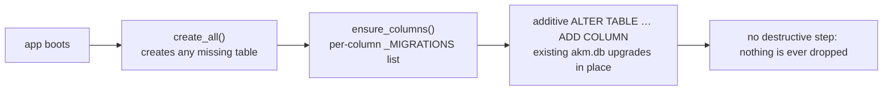

# 03 — Data model

Every table, how they relate, and what is stored where. All 17 tables live in
one SQLite file (`data/akm.db`, WAL mode; the `akm_data` Docker volume in the
container) and are created by `create_all()`, upgraded additively by
`ensure_columns()`.

Related: [../docs/data-model.md](../docs/data-model.md) · [uml.md](02-uml.md) ·
[privacy.md](privacy.md)

## The scoping rule

Everything is scoped by `investigation_id`, and deleting an investigation
cascades to everything it produced. That is the single most important
structural fact in the schema: it is what makes a privacy promise like "this
graph only ever contained what you collected for that brief" checkable rather
than aspirational.

## The audit ledger — a second, separate graph

The ledger is deliberately *not* part of the investigation cascade. An audit
record outlives the thing it records, which is the entire point: a deleted
investigation must not delete the evidence that it was worked on.

Three deliberate design decisions are visible in that schema and are worth
stating, because each one looks like a mistake until you know why:

1. **`proof_json` and `trace` are outside the hashed core.** `proof_json` is
   derived state — verification recomputes it and reports drift rather than
   trusting the stored copy. `trace` says *when* and *under which request* a
   record was written, not what the record claims. Folding either into
   `data_json` would change every event hash and break verification of every
   run already on disk.
2. **`ts` is a string, not a datetime.** Audit needs the exact authored
   timestamp with its offset preserved, and lexicographic order must equal
   chronological order.
3. **`ledger_audit_drops` is not in the chain.** A row usually exists *because*
   the chain write failed. It is where an operator looks to answer "did we lose
   anything?" — `GET /api/ledger/audit-drops`.

## What is stored where — the data inventory

| Data | Stored as | Retention / control |
|---|---|---|
| Prompts sent to a model | `sha256` + `prompt_chars` in `llm.call.data_json` | `LEDGER_CAPTURE_PAYLOADS=1` stores them verbatim; off by default |
| Model completions | verbatim in `llm.call.data_json` | evidence that cannot be re-derived, so it is kept; credentials inside are redacted first |
| Credentials anywhere in a payload | `[redacted]` before storage | `ledger._redact` runs on the way in; numbers survive, because redacting a token count would destroy evidence while protecting nothing |
| Collected article text | `artifacts.content`, `corpus_pages.text` | the substance of the investigation; git-ignored, cascade-deleted with the investigation |
| Security report | `security_assessments.markdown` + JSON | no report files written to disk; PDF is rendered per request |
| Ledger events | full canonical core + hashes | append-only by convention; `verify_chain` detects tampering after the fact |
| Gateway proofs | request id, proof hash, token counts, served model | digests and metadata cross the service boundary; prompt/completion never do |

## Uniqueness and idempotency constraints

`uq_jobs_live_key` deserves a note: uniqueness is over *live* jobs, not over
the key itself. A key names a unit of work, and the same key legitimately
comes back later — a run parked at an approval gate is re-queued under its
original key once approved. A plain `UNIQUE(key)` would refuse that second
enqueue forever.

## Migrations

`_MIGRATIONS` in `app/database.py` holds one `ALTER TABLE … ADD COLUMN` per
missing column. There is no destructive step, so a rebuild of the container
never loses the `akm_data` volume's contents.

## Related

- Field-by-field tables: [../docs/data-model.md](../docs/data-model.md)
- Who may see what: [privacy.md](privacy.md)
