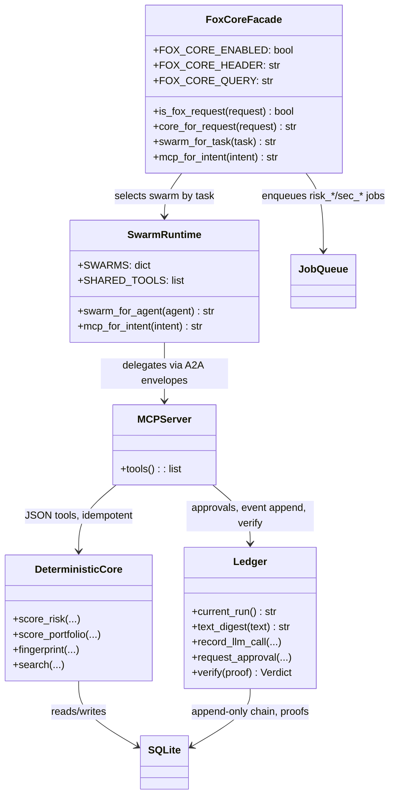
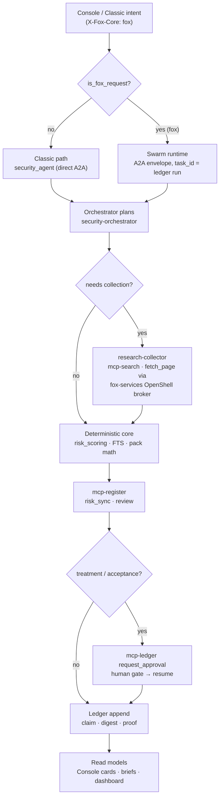
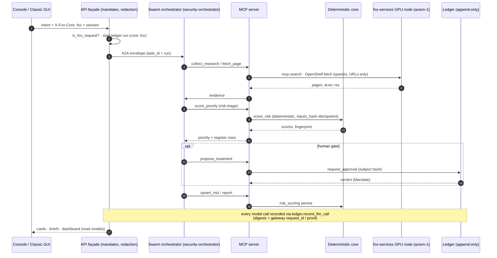
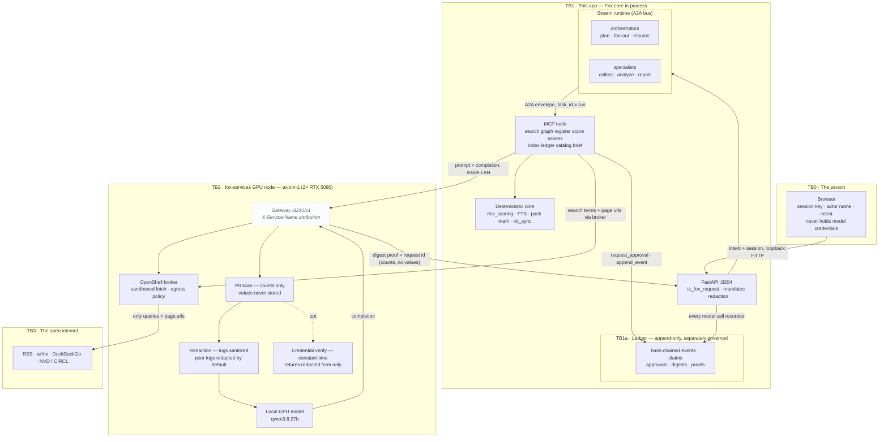

# Fox Security Research Core — Switchable Core

Optimized core that pairs with the Risk Console GUI, covering collection,
assessment, model/provider/RLHF risk, landscape, scoring, and risk management
via MCP tools, A2A, and a structured swarm (not unbounded chat).

Related: [01-system-context.md](01-system-context.md) ·
[02-uml.md](02-uml.md) · [risk-console.md](risk-console.md) ·
[risk-management.md](risk-management.md) · [risk-scoring.md](risk-scoring.md) ·
[privacy.md](privacy.md)

## Design thesis

| Principle | Choice |
|---|---|
| GUI is a projection | Risk Console + Classic only call APIs; no agent logic in browser |
| Swarm is role-stable | Few long-lived types; many short-lived tasks — not N personalities |
| A2A = coordination | Typed envelopes, `task_id` = ledger run id |
| MCP = capabilities | Tools: search, fetch, graph, register, score, index, ledger |
| Deterministic core | Scoring, pack math, FTS, priority = code; LLM only plans/judges/drafts |
| One risk spine | Unified register + `risk_scoring` feeds Console, briefs, agents |
| Local-only inference | LLM calls leave the app only to the GPU node via fox-services, never a mesh peer |

## Research core architecture

The core is a **facade over four swarms**, not a new engine. The Classic
`security_agent` path remains the default; `app/fox_security_research_core.py`
selects the swarm+MCP orchestration when a request opts in. Everything below
the facade is shared with Classic where possible, so the two cores converge on
the same deterministic spine (register, scoring, ledger, KB) and differ only
in *how the LLM is orchestrated*.

```text
                     Risk Console / Classic GUI
                                  │ REST
                     API façade (auth, mandates, redaction)
        ┌─────────────────────────┼─────────────────────────┐
        │                         │                         │
   Job queue                 read models                ledger
  (risk_* / sec_*)          (search, dashboard)   (append-only, proofs)
        │                         │                         │
        └─────────┬───────────────┘─────────────────────────┘
                  ▼
        ┌──────────────────────────────────────────────────┐
        │ Swarm runtime  (app/swarm.py — A2A bus)          │
        │  Knowledge · Assessment · Risk · Portfolio        │
        └──────────────────────┬───────────────────────────┘
                               ▼
        ┌──────────────────────────────────────────────────┐
        │ MCP tool layer  (app/mcp/* — 9 servers)           │
        │ search graph register score assess index ledger   │
        │ catalog brief                                     │
        └──────────────────────┬───────────────────────────┘
                               ▼
        ┌──────────────────────────────────────────────────┐
        │ Deterministic core  (never reimplemented)        │
        │ risk_scoring · threatpack/model_eval · jobqueue  │
        │ ledger · search_index (FTS5) · kb_sync · writeguard
        └──────────────────────────────────────────────────┘
                               ▼
                         SQLite / ledger / KB
```

**Component (UML class) view** — the wiring between the switchable facade, the
swarm runtime, and the shared deterministic core:



## Four swarms (12 cards, ~15 skills, 8–9 MCP servers)

**Knowledge:** collector-orchestrator, research-collector (graph+web/arxiv via MCP), explainer, drift-judge

**Assessment:** security-orchestrator, model-eval-orchestrator, control-analyst / model-mitigation-analyst, threat-intel / model-adv-intel (RM*), provider-posture, report-writer

**Risk:** risk-orchestrator (`risk_sync`·`review`·`decide`·`enrich`), risk-intake, risk-triage (calls `mcp-score`, no LLM numbers), risk-treatment (wraps mitigation-advisor + experiments), risk-monitor (stale/SLA/intel), risk-governance (acceptance drafts), risk-reporter (digests/briefs)

**Portfolio:** manager-orchestrator, synthesizer

Shared: research-collector, profiler, mcp-search.

## MCP tool surface

| MCP | Tools | Used by |
|---|---|---|
| mcp-search | web_search, arxiv, rss, fetch_page (OpenShell, via fox-services) | collector, enrich |
| mcp-graph | query_artifacts, upsert_node, upsert_edge, subgraph | collector, landscape, Console graph |
| mcp-register | upsert_risk, list_risks, link_treatment, get_risk | risk swarm |
| mcp-score | score_risk, score_portfolio, fingerprint | triage, dashboard |
| mcp-assess | get_assessment, list_findings | intake, reporter |
| mcp-index | search, suggest, reindex_doc | Console search |
| mcp-ledger | append_event, request_approval, verify | all orchestrators |
| mcp-catalog | threat_pack, model_adversarial, mm_controls, playbooks | analysts |
| mcp-brief | render_brief, dossier_slice | risk-reporter, exports |

All tools idempotent, JSON, never silently accept risk or change pack constants.
Fetch always via the fox-services OpenShell broker; LLM inference goes to the
GPU node only — `http://192.168.1.173:8210/v1` (fox-services node **axiom-1**,
2× RTX 5080), local model `qwen3.8:27b`, no fallback backend.

## A2A patterns

`collect_research | map_attacks | rate_adoption | ingest_findings | score_priority | propose_treatment | detect_stale | draft_brief | draft_acceptance | profile_provider | sync_kb`

- **Pipeline:** plan → collect → analyze → score → report (assessment)
- **Fan-out/fan-in:** Manager topics, parallel provider posture
- **Reactive:** assessment.done → risk_sync; CVE → risk_review
- **Human gate:** treatment/acceptance → approval MCP → resume

Job queue leases, one `risk_sync` per assessment id, shared collector cache.

## Activity — a research-core investigation end to end

One representative run: an assessment that needs fresh collection, scoring,
and (optionally) a human-approved treatment. Classic path shown for contrast.



Every arrow that touches the LLM does so through the fox-services gateway
(GPU node); every arrow that touches a decision is the deterministic core.
The ledger row at the end records the path (`core: fox`), the model, the
input/output digests, and any approval verdict — so the run is verifiable
offline with `ledger.verify_export`.

### Sequence — who talks to whom on the fox path

UML sequence for one assessment under the Fox core: the GUI only ever sees the
API; orchestrators never talk to the LLM directly; the ledger is the only
cross-cutting recorder.



## Deterministic core (not agents)

`risk_scoring`, `threatpack`/`model_eval`, `jobqueue`, `ledger`, `search_index` (FTS5 → ES), `kb_sync`, `writeguard` — agents call via MCP, never reimplement.

## Switchable core

`app/fox_security_research_core.py` (or `app/swarm.py` + `app/mcp/*`) is the switchable core. Classic `security_agent` remains the default engine; the Fox core is selected via:

- Env `FOX_CORE_ENABLED=1` (default on) + header `X-Fox-Core: fox` or query `?core=fox`
- Console/Classic dropdown **Fox Research Core ↔ Classic Core** — same data, different orchestration (swarm + MCP vs direct A2A)
- Ledger records `core: fox` vs `classic` per run, so the audit can prove which path was used

```text
          ┌─ Knowledge swarm
GUI ─ API ─┼─ Assessment swarm ── A2A ── MCP tools ── deterministic core ── SQLite
          ├─ Risk swarm
          └─ Portfolio swarm
```

Scale-up: split MCP servers into processes; keep orchestrators in-app first.

## Privacy guarantees

These are guarantees the core *inherits from the shared spine*, and a few the
swarm orchestration adds. Every claim names the code that enforces it.

| # | Guarantee | Enforced by |
|---|---|---|
| P1 | Prompts/completions never leave the app to the open internet | `app/llm.py` → fox-services GPU node only (`LLM_FALLBACK_URL` empty, `_bases()` yields a single base) |
| P2 | Nothing secret is written into audit rows | `app/ledger.py` `_redact` — strings scrubbed, only counts/digests survive |
| P3 | Every LLM call is provably linked to its run | `ledger.record_llm_call` — `text_digest(prompt)` + `text_digest(output)` + `gateway.request_id`/`proof` recorded; `verify_proof`/`verify_export` replay it |
| P4 | A human must approve high-stakes writes | `mcp-ledger request_approval` gate on treatment/acceptance; `ledger.Mandate` records the verdict |
| P5 | PII is kept out of agent-facing context | fox-services broker computes `pii_counts`/`pii_max_level` per request; `writeguard` tier-gates provider writes |
| P6 | No silent risk acceptance | risk triage calls `mcp-score` (deterministic) — the LLM judges, never numbers a register row by itself |
| P7 | Telemetry is digest-only (and off by default) | `llm._report_proof` sends only `prompt_sha256`/`output_sha256` + metadata, never content; requires `FOX_TELEMETRY_URL` |
| P8 | Fetching is sandboxed | every page fetch goes through the fox-services OpenShell broker, never a direct fetch |

## Trust boundaries while using the Fox core

The fox path adds orchestration *inside* TB1 (swarm + MCP), but it does not add
a boundary: every LLM call and every fetch still crosses exactly one exit —
the fox-services node. What the core changes is *what the ledger can prove*:
because orchestration is structured (A2A envelopes + MCP), each step is a
recordable event with a digest.



| Boundary | What flows | What fox-services does with it | Why it must flow | Never crosses |
|---|---|---|---|---|
| TB0 → TB1 | the person's intent, session id, actor name (loopback HTTP) | — (not seen by fox-services) | the app must know who asked and what for, so it can mandate, redact and ledger the run | model credentials, browser secrets |
| TB1 → TB1a | `task_id`, event chain, proof hashes, verdicts | — (ledger, same app) | the audit must replay who ran, which model, and what was approved | prompt/output text (redacted to digests) |
| TB1 → TB2 | prompt + completion for the chosen local model | **PII-scan** (records field counts only), **redacts** logs, attributes to `X-Service-Name`, returns a **digest proof** + request id; optional **credential verify** returns the redacted form only | the LLM plans, judges and drafts; it runs only on the local GPU node inside the LAN | corpus, credentials, pack constants (values never stored) |
| TB2 → TB3 | search terms and page URLs | routed through the **OpenShell broker sandbox** with an egress policy | collection must reach public sources (RSS, arXiv, web) to gather evidence | the corpus, any secret, model weights |
| TB1a | app-generated claims: who ran, what model, digests, approvals | — (ledger crosses no boundary) | the ledger is the single provable record | anything redacted by `ledger._redact` |

The only path that can reach TB3 is through the fox-services node (TB2), and
it carries queries/URLs — never the corpus or credentials. Inside TB2 every
prompt is PII-scanned (counts only) and its logs redacted before it reaches
the local GPU model, so the value never persists; the ledger (TB1a) crosses
no boundary at all, and its export is verifiable offline without any network.

## Privacy design elements

How the design *reaches* those guarantees — the mechanisms, in one place:

- **One inference choke point.** `app/llm.py:chat` is the single place the app
  talks to a model. The audit checkpoint there means *every* call (agentic or
  not) is recorded with digests, tokens, latency and gateway proof id. Adding
  a core cannot accidentally bypass it.
- **Ledger redaction at the boundary.** `ledger._redact` runs before any row is
  written: text fields are dropped/scrubbed, only numeric counts and hashes
  persist. The append-only chain (`chain_hash`) makes later edits detectable.
- **`task_id` = ledger run id.** A2A envelopes are keyed to the ledger run, so
  the audit can walk an entire swarm conversation as one unit.
- **Approval MCP as the human-in-the-loop seam.** High-stakes transitions
  (treatment, acceptance) suspend the job and resume only after
  `request_approval` — the resume itself is ledgered.
- **Write-guard phrases.** Provider/model writes are tier-gated by
  `writeguard` (controlled vocabulary), so a draft cannot silently claim
  provider guarantees.
- **No numbers from the LLM.** `risk-triage` calls `mcp-score`; the register's
  `inputs_hash` makes rescoring idempotent, and scoring is code, not prose.
- **Loop guard on peer forwarding.** `X-Fox-Forwarded` prevents a peer from
  forwarding back to the originating node (`fox-services/main.py`).
- **Minimal, local, ephemeral context.** Only the person's chosen query/URL
  crosses to the open internet (TB3 in `privacy.md`); the corpus and
  credentials never leave the machine.

Gaps (kept explicit, per `privacy.md`): the loopback HTTP between browser and
API is not TLS; and `FOX_TELEMETRY_URL` reports are opt-in only — when enabled
they carry digests, not content.