# 04 — Interaction (UML sequence)

What calls what, in what order, on every flow a person can trigger. Each
diagram is one flow; the participant list is the set of processes that can
change state or leave a record.

Related: [activity.md](activity.md) (the decisions inside) · [state.md](state.md)
(the life of each object) · [../docs/agent-loop.md](../docs/agent-loop.md)

## Every request: the wrapper that never fails closed

This runs in front of *every* product request, so it is the first thing to
understand about the whole system.

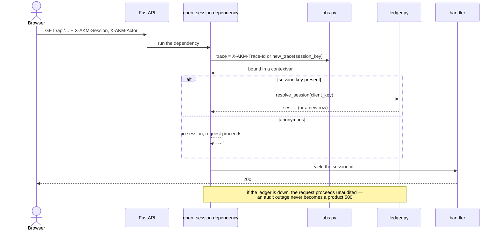

## Collection run (manual, scheduled, or gap-driven)

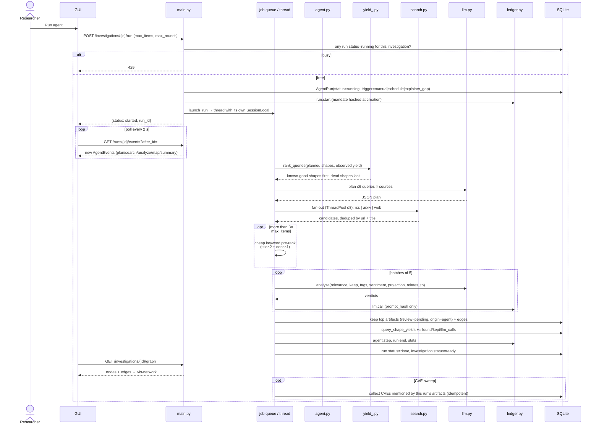

## Explainer: a question becomes a grounded, illustrated answer

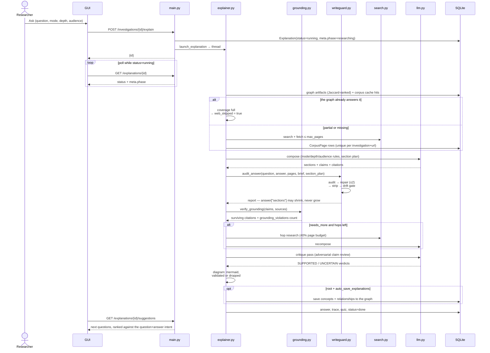

## Security assessment: A2A workflow plus an approval gate

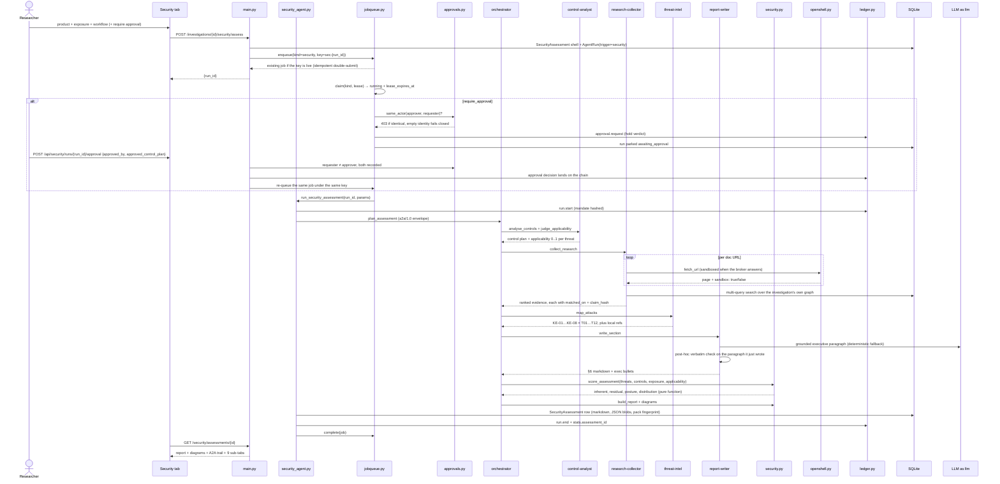

## Agentic Manager: one command, N investigations, one summary

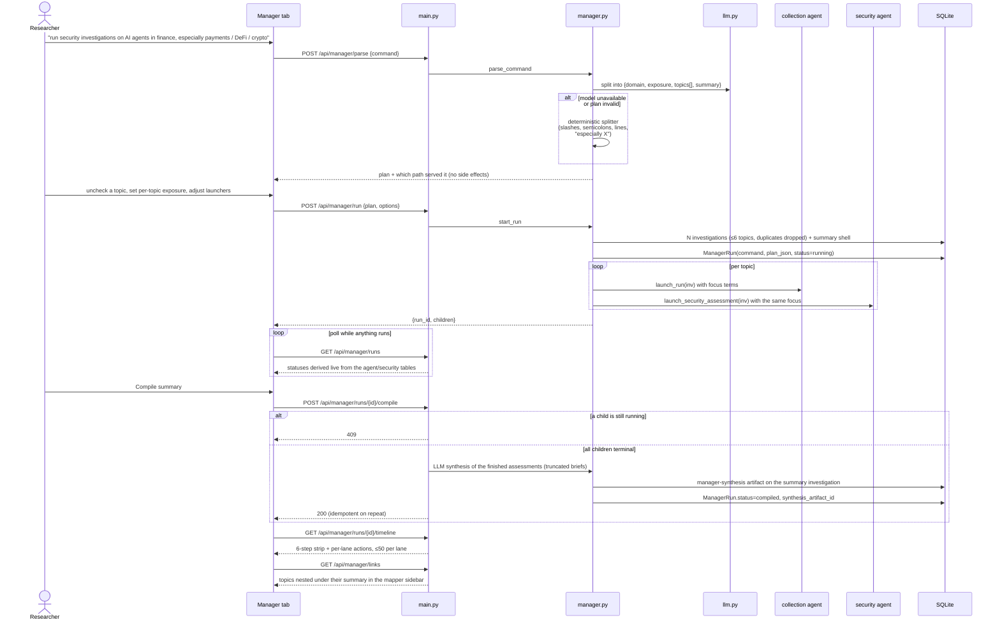

## The job queue: row before thread, lease before retry

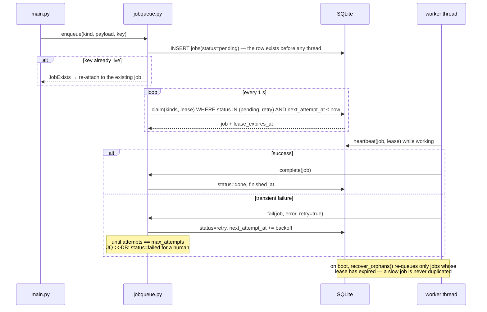

## Audit: verify a chain, a proof, and a claim

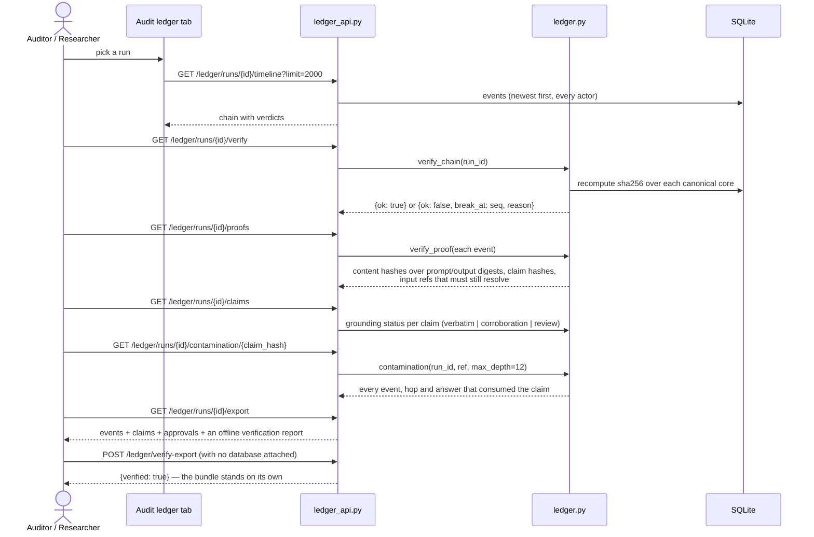

## Human actions and sessions

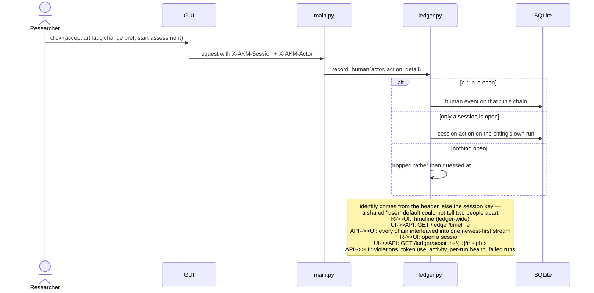

## Standards coverage, and the OpenShell-sandboxed fetch

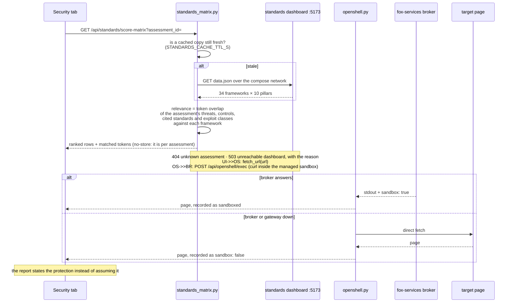

## CVE collection

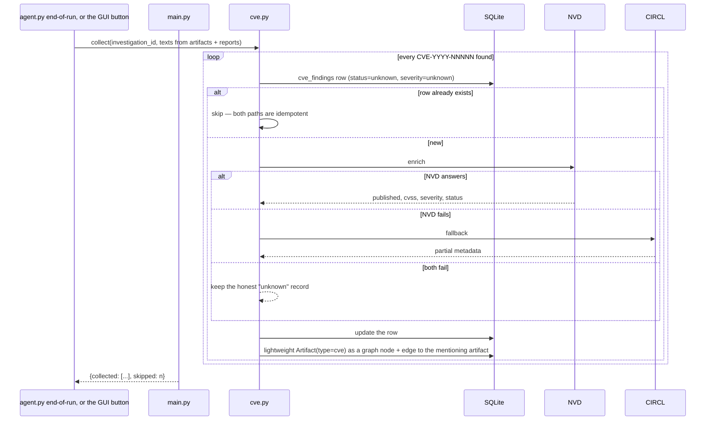

## Watch, drift, and the self-closing loop

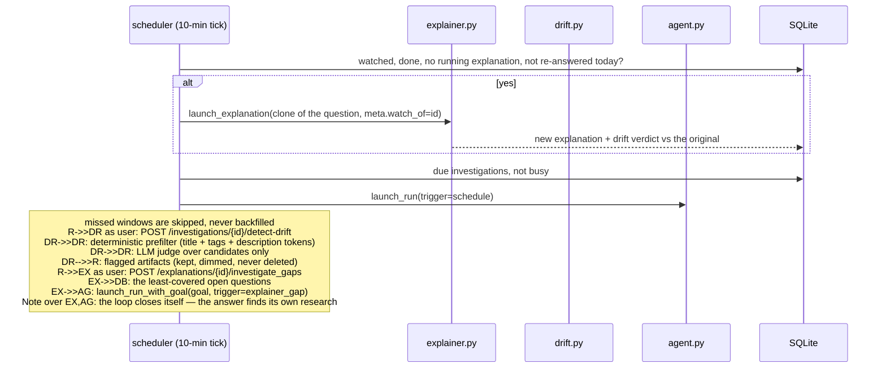

## Failure-path interaction: the LLM is an unreliable dependency

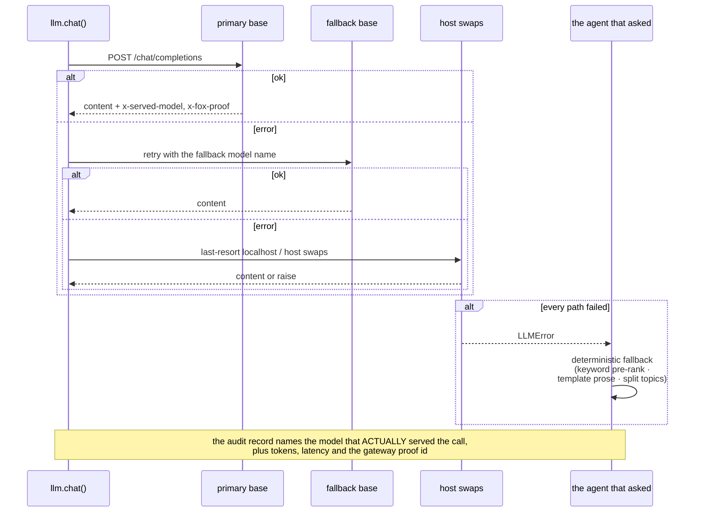

## Related

- Decisions inside the agents: [activity.md](activity.md)
- Run / job / approval lifecycles: [state.md](state.md)
- What each hop records, and what it must not: [privacy.md](privacy.md)
