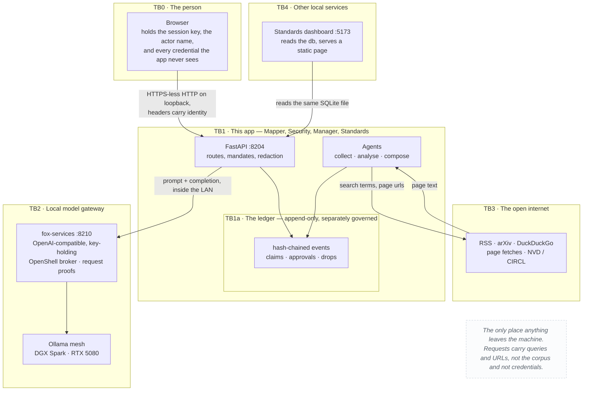
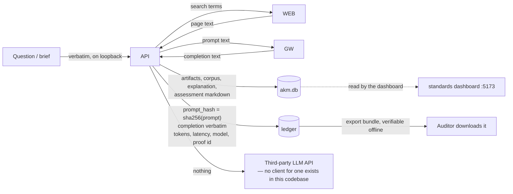
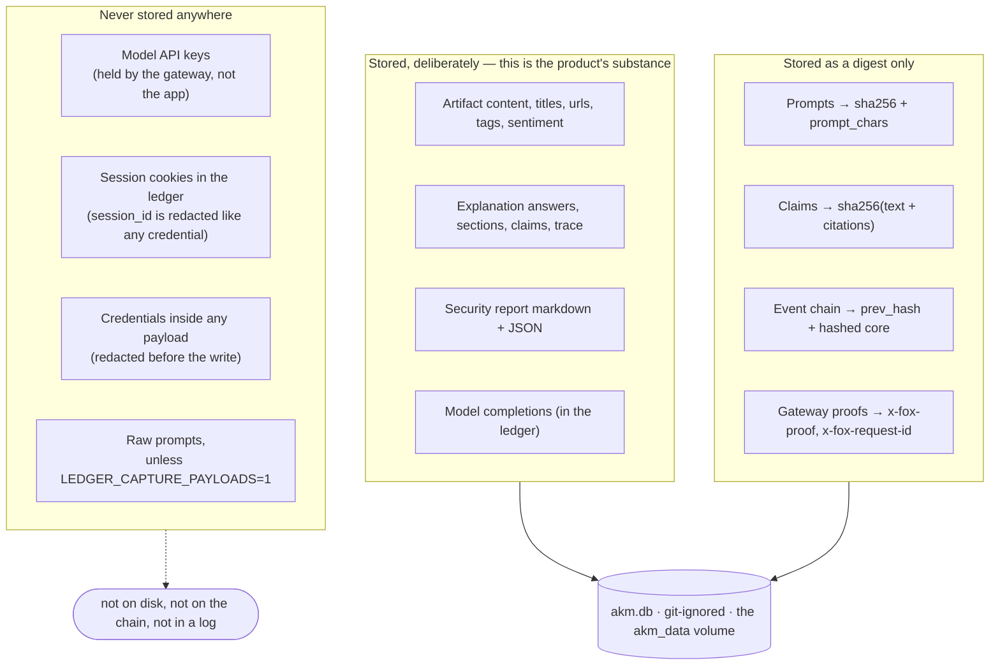
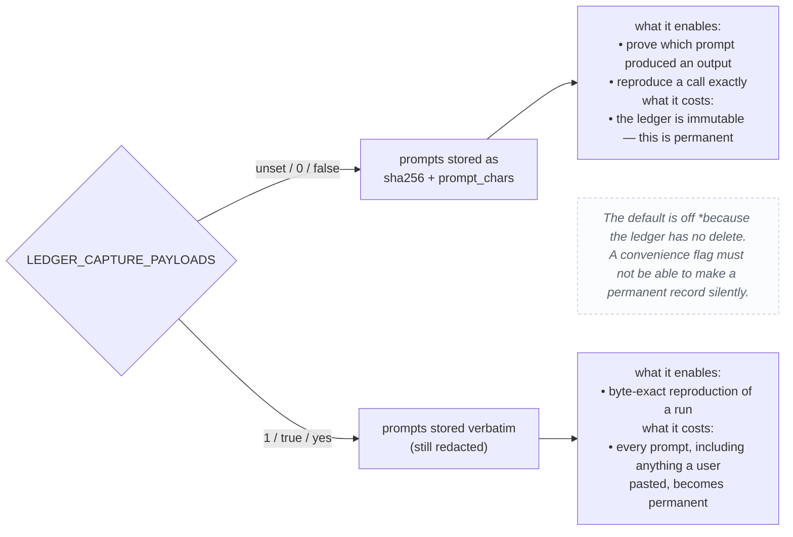
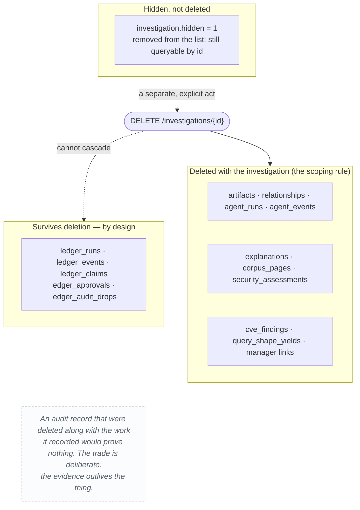
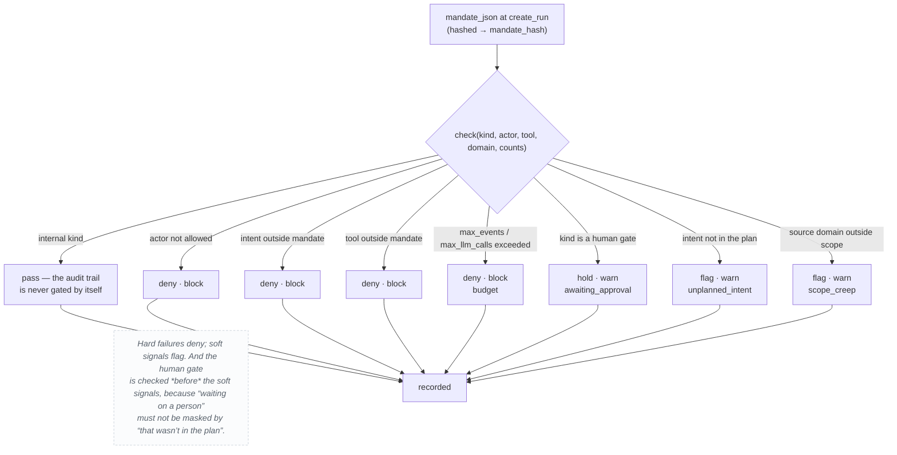
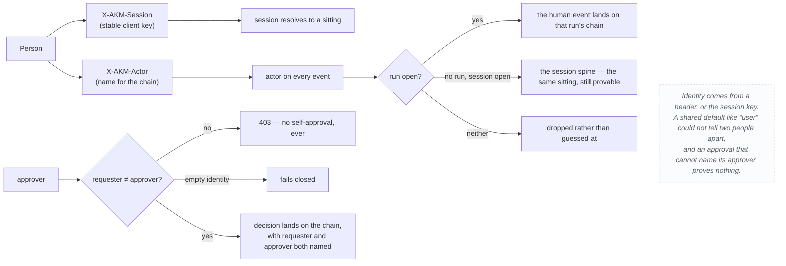
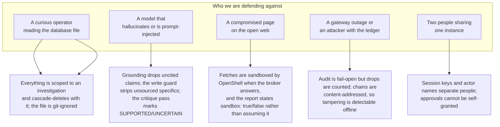
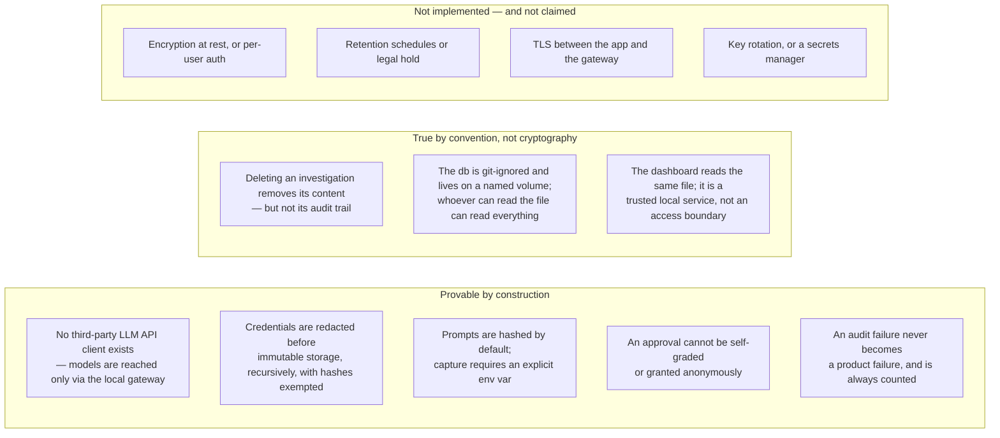

# 08 — Privacy

What data exists, who can see it, where it can go, and what provably cannot
leave. This document is written to be checkable: every claim below names the
code that enforces it, and every gap is labelled as a gap.

Related: [controls.md](controls.md) · [../docs/privacy.md](../docs/privacy.md) ·
[../docs/ledger.md](../docs/ledger.md) · [01-system-context.md](01-system-context.md)

## The five trust boundaries



Four of the five boundaries are crossed by data the person already chose to
send (a question, a keyword, a URL). The fifth — TB1a — is crossed by data the
app generates about itself. That is the boundary that matters most here, and
it is the one the ledger exists to make auditable.

## Data-flow: what crosses each boundary, and in what form



The single most important line in that diagram is the last one on the right: a
model request goes to the local gateway and nowhere else. There is no
cloud-provider client in the codebase — the only way an OpenAI-compatible
endpoint is reached is through `fox-services`.

## What is stored, hashed, or never kept



The distinction in the top box is the honest one: **completions are kept
because they cannot be re-derived.** A prompt can be regenerated from its
inputs; a completion is the evidence. The design accepts that cost and makes
it visible rather than pretending the ledger is free of content.

## Redaction, exactly

`ledger._redact` runs on the way into immutable storage, on every payload,
recursively through dicts and lists. Its rules are narrow on purpose:

| Rule | Behaviour | Why |
|---|---|---|
| `_SECRET_KEY` | `password`, `secret`, `api_key`/`apikey`, `authorization`, `credential`, `private_key`, `session_id`, `cookie`, `passphrase` → `[redacted]` **whatever the value is** | these names are never metrics |
| `_SECRET_IF_STRING` | `token`, `tokens`, `auth`, `bearer` → `[redacted]` **only when the value is a string, list or dict** | `tokens_in: 812` is a metric; `access_token: "…"` is a secret |
| `_SECRET_VALUE` | `sk-…`, `pk-…`, `ghp-`/`gho-`, `xox[baprs]-`, and any 40+ char opaque base64-ish run | catches credentials in free text and in headers |
| Hex-digest exclusion | a 40+ character `[A-Fa-f0-9]` run is **not** redacted | hashes are evidence — payload hashes, genesis values, claim addresses. Redacting them would gut exactly the records the function exists to preserve |
| Numbers survive | `relevance: 0.87`, `latency_ms: 2410` are never touched | an audit record is full of counts; redacting them would destroy evidence while protecting nothing |

The exclusion is the interesting part. A naive secret scrubber would eat every
hash on the chain and quietly destroy the audit trail it was protecting. This
one knows the difference between a credential and a content address.

## Prompt capture: off by default, and the reason



## Retention and deletion



This is the sharpest privacy trade in the system and it deserves to be stated
plainly rather than buried: **deleting an investigation does not delete the
audit trail of that investigation.** The scoping rule gives per-investigation
deletion of collected content; the ledger is deliberately outside that scope.

## The audit-fail-open trade

```mermaid
stateDiagram-v2
    [*] --> recorded
    recorded --> recorded : the event lands on the chain
    recorded --> dropped : the write fails
    dropped --> recorded : an operator investigates and the trail resumes
    note right of dropped<br/>The chain write failing must not become<br/>a product 500. A tool that refuses to<br/>work when its log breaks is a tool<br/>people disable logging on.<br/>So the drop is recorded elsewhere:<br/>ledger_audit_drops — durable, countable,<br/>joinable to the run — and visible at<br/>GET /api/ledger/audit-drops.<br/>The gap is disclosed, not hidden.
    end note

```

A hole that exists only as a line on stderr is a hole nobody reads: it scrolls
past, is not queryable, and leaves no count. The drop table is where it goes
instead, so "did we lose anything?" has an answer after the fact.

## The mandate: what a run is allowed to do

The mandate is hashed into the run at creation and re-checked on every gated
action. It is the one place where policy is *enforced* rather than recorded.



## Identity



## Threat model: what this design is defending against



And what it does **not** defend against, stated plainly:

- **The database file itself.** Anyone who can read `akm.db` can read the
  artifacts, the completions and the chain. There is no encryption at rest.
  Per-investigation deletion scopes access by *convention*, not by
  cryptography.
- **A person who sets `LEDGER_CAPTURE_PAYLOADS=1`.** It is a deliberate,
  documented switch, and turning it on makes prompts permanent.
- **Traffic on the LAN.** The gateway hop is plain HTTP inside the local
  network; integrity there rests on the network, not on TLS.
- **A malicious gateway.** Proofs let you *detect* a substituted response; they
  do not make a dishonest gateway honest.
- **Legal/compulsion.** Nothing here implements retention-by-policy, hold, or
  legal hold. Retention is "until the file is deleted".

## What a person can see about themselves

| Question | Answer | Where |
|---|---|---|
| What did the app send to a model? | The prompt hash, character count, token counts, and the completion verbatim | Audit ledger → a run → its `llm.call` events |
| Which model actually served it? | `x-served-model` on the event, plus the gateway proof id | Audit ledger |
| What did it fetch from the web? | `mcp.call` events with the domain, and the OpenShell `sandbox` flag per fetch | Audit ledger, and Security → Evidence |
| Why was that answer phrased that way? | The full trace: sources, grounding violations, write-guard report, critique verdicts | Explainer → the answer's trace |
| Who approved this? | The approval request, the decider, and the chained decision event — never the same person | Security → the run's audit chain |
| Is the record still intact? | `GET /ledger/runs/{id}/verify` recomputes every hash; `break_at` names the seq where it changed | Audit ledger |
| Can I prove it without your database? | `GET /ledger/runs/{id}/export` + `POST /ledger/verify-export` — the bundle verifies standalone | Audit ledger |

## Summary: the claims, and where each is enforced



An honest privacy document has three sections, not one. The claims that are
provable, the ones that are conventional, and the ones that are simply not
implemented. The last section is the one most worth keeping, because it is
what stops the other two from being read as more than they are.

## Related

- Every rule above, as a numbered control with its enforcing file: [controls.md](controls.md)
- The ledger's own design: [../docs/ledger.md](../docs/ledger.md)
- Where the data physically lives: [data-model.md](data-model.md)
