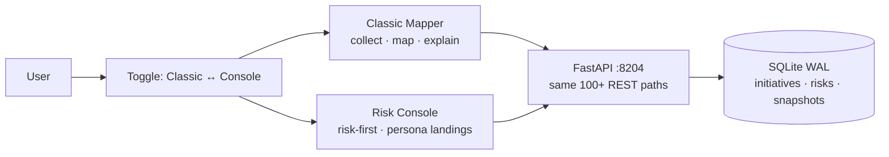
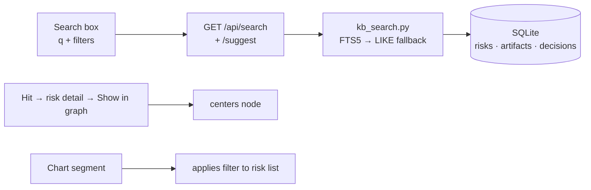

# Risk Console — Alternative GUI

Parallel presentation layer ("Clarity" / Risk Console) over the same
Agentic Knowledge Mapper backend. No forked business logic: every number is a
read from stored rows, every brief reuses `dossier.py` assembly.

Related: [01-system-context.md](01-system-context.md) ·
[02-uml.md](02-uml.md) · [data-model.md](data-model.md) ·
[ui-interaction.md](ui-interaction.md) · [privacy.md](privacy.md) ·
[../docs/architecture.md](../docs/architecture.md) ·
[../docs/frontend.md](../docs/frontend.md)

## Intent

| Item | Decision |
|---|---|
| What | Alternate **presentation layer** over existing REST; Classic Mapper remains `static/index.html` |
| Why | Leaders/legal need risk-first plain language; researchers need graph/A2A — one SPA cannot serve both without harm |
| How | New shell `static/console/index.html` + `/console` route, shared design tokens, role presets |
| Non-goals | New auth (trust boundary is network, not app), rewriting agents, hiding researcher caps |

Working name **Risk Console**, route `/console`, app-switcher entry **Risk Console** vs **Classic Mapper**. Toggle lives next to the light/dark button in both shells.



## Personas (localStorage + ?persona=, not separate apps)

| Persona | Primary job | Default home | Density |
|---|---|---|---|
| Security researcher | Evidence, attacks RM01-06, experiments, graph, A2A | Investigation workbench | High (compact) |
| Security lead / eng | Open risks, mitigations, stale intel, owners | Landscape + attention | Medium-high |
| DPO / privacy | Data flows, retention, training use, datapoints, RLHF01-08 + RM05/06 situational | Privacy & providers | Medium (comfortable) |
| Legal counsel | Terms vs practice, contracts/ZDR, acceptances, exportable brief | Privacy + Decisions | Medium |
| CISO / executive | Coverage, concentration, robustness, board narrative | Executive dashboard | Low (comfortable) |

Same `GET /api/console/home?persona=` shapes the landing; data never diverges.

## Information architecture — Console top areas

1. **Home** — persona landing (KPI strip + 5-7 widgets, rest behind More)
2. **Risks** — unified register (product + model + privacy/leakage + RM*), master-detail, sticky context bar
3. **Landscape** — inventory, simplified graph, cascades, own/inherited/method_general
4. **Privacy & providers** — PDP01-10/RLHF01-08 matrix, datapoint (direct vs indirect), leakage pathways, retention outliers
5. **Models** — W1/W2/W3, memorization RM01-06, experiments, preference_data_exposure signal
6. **Assessments** — runs, status, approvals (Job queue with requester≠approver)
7. **Decisions** — risk acceptance, model selection (ledger-backed)
8. **Insights** — deterministic cards + optional grounded assistive blurb (off by default for Legal/Exec)
9. **Briefs** — Board / Privacy / Counsel / Tech one-click exports
10. **Admin/health** — job health, pack versions, incomplete stats

Researchers keep graph, console events, A2A via Workbench drawer or “Open in Classic Mapper”.

## Risk-first visual language

Every risk card shows severity band + layer (Product/Model/Privacy/Supply-chain), scope Own/Inherited/Cascade/method_general, title + plain-language line, why-it-matters (persona-tuned), evidence count / “no evidence”, status Open/Mitigating/Accepted/Closed, owner + next review, actions (View evidence · Advise · Accept · Open assessment).

Tokens: `--red` Critical, `--orange` High, `--purple` Privacy, dashed Cascade, amber hatched Unknown (`repeating-linear-gradient 45deg`), clock Stale, striped Declared-only “unevidenced”, purple callout for feedback/RLHF override paths.

Progressive disclosure: Executive summary→Top risks→Brief; DPO summary→Pathway/Provider→Risk detail→Evidence; Researcher Risk detail→Evidence→Graph/A2A/Classic.

## Key screens (build priority)

| P0 | Executive Home + Attention — `GET /api/dashboard/summary` + `attention`, sparklines (30d) |
| P0 | Risk register list/detail — `GET /api/console/risks` (tag `rlhf_memorization` etc.) |
| P0 | Persona switcher + shell — `static/console/` + `RISK_CONSOLE_ENABLED` |
| P1 | Privacy & providers compare — provider posture `PDP/RLHF` + `is_posture_evidence`, datapoint panel, RM05 situational |
| P1 | Landscape simplified graph — `GET /api/security/landscape/graph?severity=&types=` filtered, Lite map (200 cap) + list twin |
| P1 | Assessment board — runs + `GET /api/approvals/pending` |
| P2 | Models W1/W2/W3 + RM* — `score_adversarial` with subtypes `preference_memorization` etc. |
| P2 | Decisions + accept — `POST /api/portfolio/register/state` + ledger |
| P2 | Briefs — `GET /api/console/brief?type=` reusing `dossier.py` |
| P3 | Insights — `landscape.insight_cards` deterministic |
| P3 | Workbench bridge — `/?risk=` deep links to Classic |

## Technical approach

```text
static/console/
  index.html      # shell, router, persona, 10 views, Report Reader, charts
  js/  api.js     # shared fetch client (same REST, no BFF fork)
  css/ tokens.css # severity/privacy/cascade/unknown/stale

Classic remains static/index.html (single-file vanilla SPA).
```

API client reuses all existing endpoints; thin aggregators only where composition helps:

- `GET /api/console/home?persona=&investigation_id=&initiative_id=`
- `GET /api/console/risks?layer=&severity=&tag=&status=&limit=&offset=`
- `GET /api/console/brief?type=board|privacy|counsel|tech`

All aggregators read-only, compose `portfolio.register_with_state` + `executive.summary` + `model_kb.landscape`.

State: `persona`, `scope` (investigation/initiative), filters in URL + `localStorage` (`console.persona`, `console.views`), polling for running assessments.

Feature flag `RISK_CONSOLE_ENABLED=1`; classic header links to `/console`.

Related new backend pieces surfaced here:

- **Portfolio** `app/portfolio.py` — initiatives, `situation_json`/`initiative_id`/`requested_by`/`pdp_json` on `security_assessments`, unified register (`RiskEntry` with `stable_key`, human overlay, null severity for posture), leakage `LP01-08` + playbooks `PB01-07` (`app/leakage.py`), `Initiative` + `DashboardSnapshot` (`app/models.py`).
- **Provider posture** `app/provider_posture.py` — `provider_data_posture_v1` PDP01-10 + `provider_safety_context_v1` SAF01-06 (firewalled), `akm-rlhf-feedback-retention` RLHF01-08, templated Manager parse per provider, planner families, `contribution_map` direct vs indirect, `guard_provider_claims`.
- **Memorization** `app/memorization.py` — `akm-rlhf-memorization` RM01-06, attack classes `memorization`/`alignment_data_leakage` + subtypes `preference_memorization`/`sft_memorization`/`preference_mi`/`rlhf_preference_extraction`, `method_general` weight 0.25, `PREFERENCE_EXPOSURE` signal, query pack, `PB07`, hypothesis `H-RM01`/`H-RM05`.
- **Dashboard** `app/executive.py` — availability (initiative/model/product/pdp/safety coverage, freshness, unknowns, KB sync) + distribution (by_provider, top RM*) + robustness (mapping/validation/acceptance/inventory lift, approval hygiene, pack hygiene) + attention queue + snapshots/trends + briefs.
- **Search** `app/kb_search.py` — FTS5 (LIKE fallback) over risks/artifacts/assets/decisions, `GET /api/search?q=&types=&layer=&severity=&status=&limit=&offset=&accepted_only=` + `GET /api/search/suggest`, field filters, prefix `memoriz*`, highlights `why matched`, facets, recent boost, persona accepted-only default.
- **Ledger/A2A** — `mitigation-advisor` (`advise_portfolio_risks` / `advise_rlhf_memorization`), `model-adv-intel` `map_rlhf_memorization`, hypothesis fallback for RM.

## Usability

- Scan → decide → act: every row shows severity/layer/status/owner, primary action one click.
- Low load: Executive/DPO max 5–7 widgets; rest behind More; same object names (Risk/Asset/Evidence/Decision) in UI and briefs.
- Master–detail (≥1280px side-by-side, stacked narrow), sticky context bar (scope/persona/filters/last refreshed), drawers for evidence/A2A, saved views (`localStorage` + server later), bulk actions (Lead: assign owner/status, add to brief).
- Skeleton loaders, optimistic chips, debounced search (250 ms), toast with ledger id, stale banner if snapshot > N minutes.
- Keyboard: `/` search, `j/k` nav, `e` evidence, `esc` close; density Comfortable (exec/legal) vs Compact (researcher/lead); WCAG AA, charts with table fallback, graph with list twin, focus traps, screen-reader labels on severity.

## Report readability

Reader component for assessments, dossier, briefs:

- Typography H1–H3, 70–80ch, narrative first (exec blurb → numbers → tables → appendix), claim chips, risk callouts with severity stripe, collapsible, inline mermaid/PNG, glossary tooltips (T01/RM05/ZDR...), modes Full/Summary/Privacy-only/Risks-only, print CSS (hide chrome, severity as text+pattern, repeat headers, cover with date/scope/unknowns), dual view readable ↔ source, `summary_plain` vs `summary_technical` per persona.

## Reporting & charts

Home modules: KPI strip with sparklines, attention SLA colors, burndown, heat matrix severity×layer|family, privacy spotlight, Generate brief.

Studio (`Reports` area): Board (Exec), Privacy memo (DPO), Counsel pack (Legal), register export (Lead), assessment pack, landscape snapshot — composer: type → filters/scope → preview in Reader → export MD/PDF/bundle (reuse `dossier.py`).

Chart stack: one library (Chart.js, `cdn.jsdelivr.net`), title + `n=`, View table, no 3D, palette = risk tokens, 3–4 charts for Exec, Analytics for researcher.

Required sets: open by severity, by layer, own/inherited/cascade/method_general, provider posture heatmap, coverage over time (snapshots), mitigation mapping rate, top families by High, stale/unknown gauges, W1/RM* attack class bar, attention aging — all drill to filtered register (URL-shareable).

## Knowledge graphs

Three levels: Lite map (Exec/DPO, curated initiative→systems→top risks), Risk graph (Lead/Legal, risks/assets/providers, inherits/cascades/mitigates/evidences), Full KB (Researcher, Classic vis-network, type filters, Open in Classic).

Lite/risk share `graphRenderer` with Classic to avoid drift; server-filtered `GET /api/security/landscape/graph?types=&severity=`.

Privacy preset Data pathway: data class → pathway → sink with retention badges.

Filters (node/edge types, severity≥, privacy-only), focus depth 1–2, minimap, list twin always, layouts hierarchical/radial/force, cap 200 + “narrow filter” message, caption what is/is not shown.

## Search

Global header single box, as-you-type top-8 grouped by type, full results tabs All|Risks|Evidence|Assets|Reports|Decisions, facets (layer/severity/status/date/persona), highlight + why-matched, field filters, prefix, phrase, AND/OR, boosts title>tags>body, synonyms `ZDR≈zero data retention`, saved searches, FTS5 default (Elastic behind interface later), index on artifact accept / assessment complete / risk sync / decision, accepted-only default for DPO/Legal/Exec, recent searches, zero-result CTA.



## Security & privacy emphasis

Every Home shows open privacy + security counts; provider/model views sort by user-impact (training/retention/leakage) not capability; datapoint + indirect contribution visible without graph; cascade/inherited labeled; unknowns/no-evidence first-class; no composite “secure %”.

## Deliverables checklist

- [x] Shell + persona presets
- [x] Risk register UX + risk cards (severity/privacy/cascade/unknown/stale distinct)
- [x] Executive / DPO / Legal / Lead / Researcher landings
- [x] Privacy & provider insights (RLHF retention callouts)
- [x] Briefs (board/privacy/counsel)
- [x] `/api/console/*` aggregators
- [x] Feature flag + Classic link (`header-right` ↔ `/console`)
- [x] Fixture-based UI tests `tests/test_console.py` (persona × empty/full)
- [x] Design note (this file) + search syntax help + tokens
- [x] Usability (density, master–detail, shortcuts `j/k`, saved views, bulk), Report Reader, charts drill-down, FTS search, shared graph renderer, lite/risk/pathway modes, indexing hooks
- [x] Tests: search operators, chart drill-down, report snapshots
