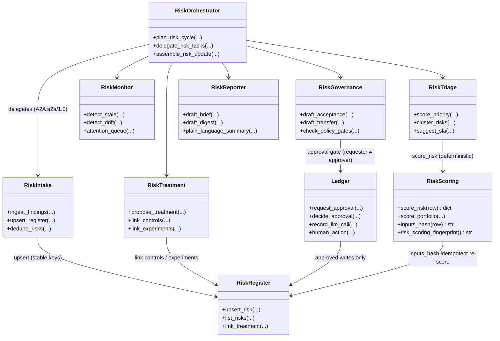
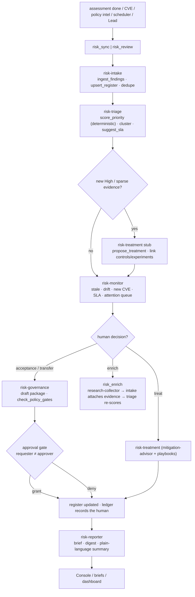

# Risk Management — Agent Family

Deterministic propose & draft; humans own and decide. Ledger + approval gates still apply.

Related: [risk-scoring.md](risk-scoring.md) · [02-uml.md](02-uml.md) · [interaction.md](interaction.md) · [privacy.md](privacy.md) · [../docs/architecture.md](../docs/architecture.md)

## Design thesis

| Principle | Choice |
|---|---|
| Propose, don't decide | Every agent drafts; `accepted`/`closed` require a human or an approved governance package |
| Numbers from code | Priority/severity/residual are deterministic (`risk_scoring`); the LLM explains, never renumbers |
| Idempotent | `inputs_hash` + stable register keys make re-sync update rows instead of duplicating |
| One register | The unified register is the only risk spine; agents read/write it through `mcp-register` |
| Gated | Approval MCP (`requester ≠ approver`), write-guard phrases, no silent severity downgrades |
| Audited | Every sync/review/decision/change is a chained ledger event signed by an identity |

## Architecture

```
Assessment / CVE / policy intel / scheduler / Lead
        │
        ▼
  Job queue (risk_sync | risk_review | risk_decide | risk_enrich)
        │  lease · heartbeat · orphan recovery · task_id = ledger run id
        ▼
  ┌──────────────────────── Risk agent family ───────────────────────┐
  │ risk-orchestrator ──► risk-intake → risk-triage → risk-treatment │
  │                        └► risk-monitor ─► risk-reporter           │
  │                        └► risk-governance ─► mcp-ledger approval  │
  └───────────────┬──────────────────────────────────────────────────┘
                  ▼
        Deterministic core (never reimplemented in prompts)
        risk_scoring · risk_register · jobqueue · ledger · writeguard
                  ▼
              SQLite register / ledger
```

## UML — the agent family and its spine



## Agent cards (A2A `a2a/1.0`)

| Agent | Skills | Role |
|---|---|---|
| `risk-orchestrator` | `plan_risk_cycle`, `delegate_risk_tasks`, `assemble_risk_update` | Coordinates a `risk_sync`/`risk_review` run |
| `risk-intake` | `ingest_findings`, `upsert_register`, `dedupe_risks` | Assessment/CVE/intel → register (stable keys) |
| `risk-triage` | `score_priority`, `cluster_risks`, `suggest_sla` | Ordering & grouping (severity × exposure × aging × unknowns) |
| `risk-treatment` | `propose_treatment`, `link_controls`, `link_experiments` | Extends `mitigation-advisor` (catalog + playbooks) |
| `risk-monitor` | `detect_stale`, `detect_drift`, `attention_queue` | Hygiene: stale evidence, policy drift, new CVEs, SLA breaches |
| `risk-reporter` | `draft_brief`, `draft_digest`, `plain_language_summary` | Console/briefs, persona-aware, no vanity score |
| `risk-governance` | `draft_acceptance`, `draft_transfer`, `check_policy_gates` | Decision packages (human approves) |

Reuse: `mitigation-advisor` ← `risk-treatment`, `research-collector` for sparse risks, ledger approvals for `accepted`.

## Activity — the risk lifecycle



Every arrow that writes a number touches the deterministic core; every
`accepted`/`closed`/policy-change write crosses the approval gate; the ledger
records the whole path (`task_id` = ledger run id).

## Run types

- **risk_sync** (assessment `done` or manual Sync): intake → triage → treatment stub for new High → persist, emit attention
- **risk_review** (scheduler / Lead button): monitor (stale/unowned/overdue/superseded/new CVE) → triage refresh → reporter digest (deterministic fallback if LLM fails) → optional treatment for top N
- **risk_decide** (user selects risks → Prepare acceptance/treatment): governance/treatment drafts package → parks for approval (`requester ≠ approver`) → on grant update register + ledger
- **risk_enrich** (sparse evidence): `research-collector` targeted queries → intake attaches evidence → triage may adjust confidence (not severity theater)

All go through `jobqueue` `kind=risk_sync|risk_review|risk_decide|risk_enrich` (lease, heartbeat, orphan recovery, `task_id` = ledger run id, idempotent re-sync updates rows).

## Data contracts — register fields agents may write

`priority_score`, `cluster_id`/`cluster_label`, `suggested_owner_role`, `sla_due_at`, `treatment_plan_json` (`steps[]`, `control_ids[]`, `experiment_ids[]`, `residual_notes`), `last_agent_review_at`, `monitor_flags[]` (`stale_evidence`, `no_owner`, …), `plain_summary`.

Human fields `owner`, `status=accepted` only via explicit user action or **approved** governance job.

Priority (deterministic core, LLM may explain, not replace — pinned in `tests/test_risk_scoring.py`):

```
priority = w1*residual_norm + w2*aging_norm + w3*unowned + w4*untreated + w5*uncertainty + w6*cascade_boost  (0–100)
```

Accepted/closed drop out unless review overdue.

## Console hooks

| UI | Agent |
|---|---|
| Sync risks from assessment | `risk_sync` |
| Run risk review | `risk_review` |
| Suggest treatment | `risk_treatment` |
| Prepare acceptance | `risk_decide` / governance |
| Enrich evidence | `risk_enrich` |
| Attention queue | monitor |
| Insights cards | triage + monitor flags |
| Brief generate | `risk_reporter` |

Stages shown as intake → triage → treatment → report, polled like security runs. Persona defaults: Exec digests, Lead full review+assign, DPO/Legal privacy-filtered, Researcher enrich+experiments.

## Safety

- `accepted`/`closed` require human or approved package
- Policy-change treatment → approval gate
- No ledger/register audit field deletion, no severity downgrade on unknown, no bulk accept without governance + approval
- Write-guard: no “fully mitigated” without mapped controls + evidence

## Integration map

```
Assessment done → risk_sync → Register → Console
Scheduler/CVE/policy intel → risk_review → Attention + Digest
User Treat → risk_treatment → mitigation-advisor + experiments
User Accept → governance draft → approval → Register + Ledger
Search/Graph → read enriched register
Dashboard robustness → % with treatment_plan/owner/SLA
```

## Privacy guarantees (by design)

| # | Guarantee | Enforced by |
|---|---|---|
| P1 | Register rows are risk *facts*, never raw evidence | evidence referenced by id (`evidence_ids`), not copied into the row |
| P2 | The LLM never numbers a register row | `risk_scoring.score_risk` is deterministic; `inputs_hash` makes re-score idempotent; agents call `mcp-score` |
| P3 | No silent risk acceptance | `accepted`/`closed`/policy-change writes need a human action or an **approved** governance package |
| P4 | Every risk write is attributable | each sync/review/decide/enrich/change is a chained ledger `human_action`/`approval.*` event with an identity |
| P5 | Approvals are two-person | `request_approval` records the requester; `decide_approval` signs the decision — `requester ≠ approver` |
| P6 | No fabricated mitigation | `writeguard` blocks “fully mitigated” without mapped controls + evidence |
| P7 | No destructive edits | register/ledger audit fields are never deleted; no severity downgrade on unknown |
| P8 | Deterministic fallback on briefs | reporter digests degrade to deterministic summaries if the model is unavailable — the audit stays truthful |

## Privacy design elements

- **One register, one spine.** `risk_register` holds rows with stable keys and an `inputs_hash` lineage; every agent writes through `mcp-register`, so no agent keeps a private copy of the risk truth.
- **Evidence by reference.** Findings/attacks live in their assessment rows; the register links `evidence_ids` and coverage rather than duplicating content, so PII never has to be copied into a risk row to be usable.
- **Approval as the human-in-the-loop seam.** Governance drafts a package and parks it at `mcp-ledger request_approval`; only `decide_approval` (signed, chained) can move `accepted`/`closed`. The resume itself is ledgered.
- **Numbers from code, wording from the model.** Priority/severity/residual come from `risk_scoring`; the model only writes `plain_summary`/treatment prose — so a drafting error can't move a score.
- **Write-guard vocabulary.** `writeguard` tier-gates provider/model writes and blocks unbacked “fully mitigated” claims.
- **Digests and chains.** LLM calls and human actions land on the ledger as digests/events; `verify_export` replays a risk decision offline without network.
- **Deterministic fallbacks.** Briefs and digests degrade to template summaries when the model is unreachable, so a downstream reader is never handed an invented number.

## Trust boundaries under the risk path

Risk agents run *inside* TB1 (the app) — they never cross to the open internet on their own; the only exits are the fox-services node for model calls (TB2) and the broker for any sparse-evidence collection. The register and ledger (TB1a) cross no boundary.

```mermaid
flowchart TB
    subgraph TB1["TB1 · The app — risk agents in process"]
        direction TB
        API["FastAPI :8204<br/>risk_sync · review · decide · enrich routes"]
        Q["Job queue<br/>leases · heartbeats · orphan recovery"]
        subgraph SW["Risk agent family (A2A bus)"]
            INT["risk-intake / triage / treatment"]
            MON["risk-monitor / reporter / governance"]
        end
        DET["Deterministic core<br/>risk_scoring · register · writeguard"]
        subgraph TB1a["TB1a · Register + ledger — same app, separately governed"]
            REG["risk rows (stable keys · inputs_hash)"]
            LG["hash-chained events · approvals"]
        end
    end
    subgraph TB2["TB2 · fox-services GPU node"]
        GW["LLM gateway :8210/v1<br/>prompt + completion (local model)"]
        BR["OpenShell broker<br/>sparse-evidence fetch"]
    end
    subgraph TB3["TB3 · The open internet"]
        WEB["RSS · arXiv · web"]
    end

    API --> Q
    Q --> SW
    SW --> DET
    SW --> REG
    SW --> LG : approval gate / human_action
    SW -->|"prompt + completion"| GW
    SW -->|"enrich queries + page urls"| BR
    BR --> WEB
    LG --> REG : approved writes
```

| Boundary | What flows | Never crosses |
|---|---|---|
| TB1 → TB1a | register rows, `task_id`, approval verdicts, digests | raw evidence content (referenced by id), prompt text |
| TB1 → TB2 | prompt + completion for the local model | the corpus, credentials, pack constants |
| TB1/TB2 → TB3 | enrich queries and page URLs, on the broker's behalf | the corpus, any secret |
| TB1a | the register + ledger read/written by the same app | anything — no boundary crossing |

Gaps (per `privacy.md`): loopback HTTP between browser and API is not TLS.