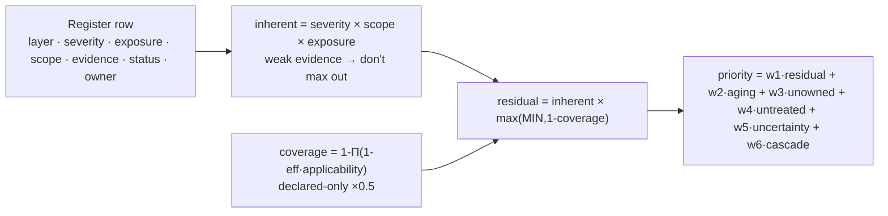
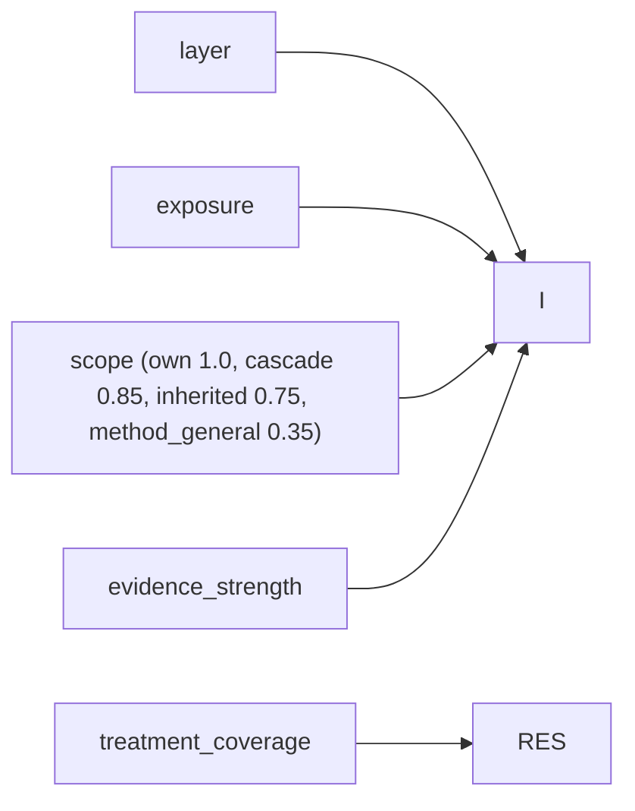
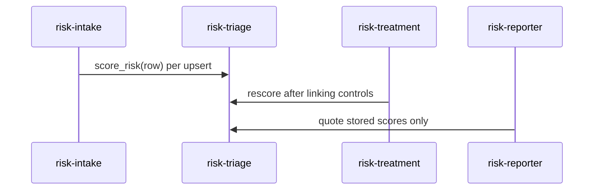

# Risk Scoring — Register-risk-scoring-v1

Pure, fingerprinted functions producing inherent, residual, priority, confidence, band. No second opaque AI score.

Related: [risk-management.md](risk-management.md) · [02-uml.md](02-uml.md) · [../docs/architecture.md](../docs/architecture.md)

## Score kinds

| Score | Meaning | Used for |
|---|---|---|
| `inherent_score` | Before treatment | Heat maps, inherent posture |
| `residual_score` | After mapped treatments | Residual posture, board residuals |
| `priority_score` | What to work next (ops) | Attention queue, triage sort |
| `confidence` | Evidence strength 0–1 | Uncertainty, never silent upgrade |
| `band` | Critical/High/Medium/Low/Unknown from residual (or inherent) | Badges + counts |

Forbidden: one blended “AI risk %” mixing product residual + misuse potential + hypothesis confidence.

- **Product** (`product`): `likelihood_i * impact_i` from pack (prefer assessment snapshot if present)
- **Model/RM***: `severity_prior * scope_weight * exposure_weight * (0.5+0.5*evidence_strength)`, `method_general` 0.35, null if no evidence → Unknown
- **Privacy**: `scale(likelihood_factor * impact_factor * exposure_weight)` from PDP/RLHF discrete maps; unknown fields → confidence low or null inherent
- **Residual floor** `MIN_RESIDUAL_FACTOR 0.15`; `accepted` keeps residual as-is with badge.
- **Coverage** `1-Π(1-eff·applicability·evidence_factor)`, product C* ~0.6, model MM* ~0.5, playbook 0.25; unlinked text → 0.

`RISK_SCORING_METHOD = "register-risk-scoring-v1"`, `risk_scoring_fingerprint()` hashes weights/bands/formulas, stored per row (`scoring_method`, `scoring_fingerprint`, `inputs_hash`, `scored_at`, `score_rationale`).

Portfolio: **stacked counts by layer + band**, separate strips per method (product vs model vs privacy), attention index = mean top-5 priority (labeled ops attention).

Recompute triggers: `risk_sync` (full), treatment link (residual+priority), owner assign (priority), evidence change (confidence), situation/exposure change (full), pack change (new rows only, fingerprint stored), `risk_review` (priority + stale flags, only if `inputs_hash` changed). `inputs_hash` avoids needless writes.

APIs: `POST /api/risks/rescore` (scope), `POST /api/risks/{id}/rescore`, `GET /api/risks/{id}` (scores + method), dashboard reads stored scores, Risk Console list default `priority_score` desc (Exec: band), detail shows inherent→residual arrow + coverage breakdown, superseded scoring badge, Recompute button.

Evalkit: 9 cases + 2 invariants in `tests/test_risk_scoring.py` locking formula; LLM `explain_score` may narrate, never alter numbers. Rebaseline only on intentional `register-risk-scoring-v2` bump.

