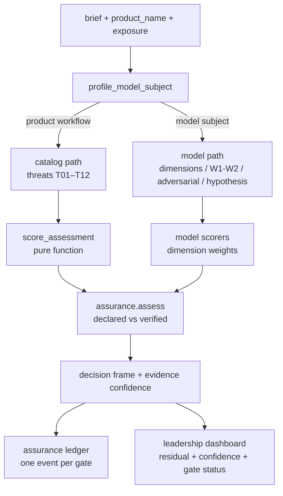

# Security assessment scoring

How the AI Security Engineering & Evaluation Agent turns a product or model
into the scores AKM shows — and how those numbers stay honest when evidence is
missing.

Related: [assurance.md](assurance.md) · [risk-scoring.md](risk-scoring.md) ·
[data-model.md](data-model.md) · [../docs/security-agent.md](../docs/security-agent.md) ·
[../docs/threatpack.md](../docs/threatpack.md)

## The scores in AKM

| Number | Where it comes from | What it means |
|---|---|---|
| `inherent_pct` | aggregate of per-threat `likelihood × impact` before controls | the risk if nothing is in place |
| `residual_pct` | aggregate after declared controls apply | the risk the organisation actually carries |
| `delta` | `residual_pct − inherent_pct` | how much the controls moved the number (a negative delta is a reduction) |
| `posture` | banded `residual_pct` | HIGH / ELEVATED / MODERATE / LOW RISK wording for a headline |
| per-threat `inherent_score` / `residual_score` | `L × I` per threat (1–25) | which threats dominate, in severity bands |
| `verified.residual_pct` | residual using only **accepted primary evidence** | the honest number — controls with no evidence do not count |
| `declared.residual_pct` | residual using all declared controls | the optimistic number the vendor would quote |
| `evidence_confidence` | share of the reduction resting on accepted evidence | 0% (all declared) to 100% (all verified) |
| decision state | derived from gates + evidence + human decision | `open` · `guardrails_required` · `accepted` · `rejected` · `blocked_on_architecture` |

## One pipeline, four assessment paths



The catalog path is the one scored threat-by-threat; the model paths score how
a model handles data, how sound it is, how exposed and how governed. Both end
in the same assurance overlay, so the headline always carries its evidence
confidence and gate status.

## Catalog path (a product workflow)

### Exposure scales likelihood

Every assessment picks an exposure tier. Its weight scales each threat's
baseline likelihood mildly — restricted keeps full severity, public reduces it.

| Tier | Weight | Example |
|---|---|---|
| `restricted_data` | 1.0 | trade secrets, regulated PII/PHI, credentials |
| `confidential_data` | 0.8 | roadmaps, customer data, internal financials |
| `internal` | 0.55 | internal-only, non-sensitive |
| `public` | 0.3 | public or synthetic data |

```
scaled_likelihood = max(1, min(5, round(base_likelihood × (0.55 + 0.45 × weight))))
```

A threat catalogued at likelihood 5 at `confidential` scores `round(5 × 0.91) = 5`;
at `public` it scores `round(5 × 0.685) = 3`.

### Per-threat inherent and residual

Each of the 12 catalogue threats (T01–T12) carries a STRIDE class, an OWASP
LLM mapping, a 1–5 likelihood (at the confidential baseline) and a 1–5 impact.

```
inherent_score = likelihood × impact            # 1..25
```

Controls (C01–C15) each have an efficacy and a per-threat weight. Coverage is
a diminishing-returns combination:

```
coverage = 1 − Π (1 − efficacy_i × weight_i)    # over active controls on this threat
residual_likelihood = max(likelihood × 0.35, likelihood × (1 − coverage))
residual_score = residual_likelihood × impact
```

The `0.35` floor is deliberate: **controls never take a threat below 35% of its
inherent likelihood**, so residual can approach but never reach zero on a
scored threat.

Per-threat scores map to severity bands: ≥20 **Critical**, ≥12 **High**, ≥6
**Medium**, else **Low**.

### The portfolio aggregate

The headline is a weighted worst-case plus breadth, normalized to the 1–25
range:

```
aggregate = 0.55 × mean(top-5 worst threat scores) + 0.45 × mean(all threat scores)
pct = min(100, aggregate / 25 × 100)
```

- The **worst-case component (55%)** means one severe threat cannot hide in a
  healthy-looking mean; the **breadth component (45%)** means many
  medium threats still count.
- **Applicability** scales each threat's contribution by a 0–1 relevance and
  renormalizes, so a uniform map scores exactly as if unweighted. A threat with
  applicability below `0.3` is reported but excluded from the aggregate — never
  a meaningless zero.
- `delta` is signed: a negative value is a reduction the controls earned.

Posture is banded from `residual_pct`: ≥75 **HIGH RISK**, ≥50 **ELEVATED
RISK**, ≥30 **MODERATE RISK**, else **LOW RISK**. The band wording is the
headline, not a policy decision — the decision is made on the dashboard.

### Worked example — T01 at Confidential

T01 (accidental paste of sensitive content): baseline likelihood 5, impact 5.

- **Inherent** at `confidential`: scaled likelihood `round(5 × 0.91) = 5`,
  `inherent = 5 × 5 = 25` → **Critical**.
- With controls **C02** (schema-only prompt, efficacy 0.70 × weight 0.9) and
  **C03** (client-side DLP redaction, efficacy 0.65 × weight 1.0) declared:
  - `coverage = 1 − (1 − 0.63)(1 − 0.65) = 0.87`
  - `residual_likelihood = max(5 × 0.35, 5 × 0.13) = 1.75`
  - `residual = 1.75 × 5 = 8.75` → **Medium**

So the threat drops from Critical to Medium **if both controls are verified**.
If neither has accepted primary evidence, the assurance layer keeps the
verified residual higher — the reduction is declared, not real.

## Model paths (a model subject)

A model is not a product workflow, so it is not scored threat-by-threat. Each
model path stamps its own `assessment_path` and its own method string, so a
number can never be mistaken for a catalog score.

| Path | Method | What it is |
|---|---|---|
| `model` | `model-internals-v1` | weighted dimensions — training-data privacy 0.35, model integrity 0.25, deployment surface 0.20, governance 0.20 (internals first, governance last) |
| `model_engineering` | W1 + W2 (+W3) | adversarial coverage + adoption risk (+ mitigation plan); the `model-adv-intel` / `model-adoption-analyst` paths |
| `model_adversarial` | `model-misuse-v1` | attacker-capability aggregate (capability abuse, data recon, evasion, manipulation, abuse persistence) |
| `model_hypothesis` | `hypothesis-synthesis-v1` | confidence in drafted claims — higher is better-evidenced, not more dangerous |

The model scorer is deliberately honest about controls: **residual equals
inherent** in `model-internals-v1` because v1 maps no declared controls onto
model dimensions. A residual that pretended otherwise would be fiction, and the
posture text says exactly that.

## The assurance overlay

Every score, on any path, passes through `assurance.assess()` before it is
shown. The overlay does not re-score; it decides how much of the score to
believe:

- **Verified vs declared.** A control is `evidenced` only when an **accepted
  primary artifact** names its id. Self-attested vendor pages and pending
  evidence never verify a control. `verified.residual_pct` is computed by
  re-scoring with only evidenced controls; it is the number the dashboard leads
  with.
- **Architecture gate.** On Restricted/Confidential tiers, an incomplete
  data-flow/retention/residency/subprocessor checklist blocks scoring: affected
  threats stay at inherent and the state is `blocked_on_architecture`.
- **Evidence gate.** A top threat (top 5 by residual) must have ≥3 accepted
  artifacts at relevance ≥0.6 or it is `gated` — its reduction is capped and
  the confidence lowered.
- **Injection cap.** Prompt-injection (T05) coverage is capped at 35% until an
  accepted adversarial test result exists.
- **Blast radius.** A go/no-go on Restricted/Confidential requires a quantified
  exposure inventory (records at risk, restricted/confidential asset counts,
  privileged users); an unquantified radius blocks the decision.
- **Forensics readiness.** Whether the incident-relevant material can be
  reconstructed from what was kept, as a band with its score.

`evidence_confidence` is the share of the reduction resting on accepted
evidence — a 62.7 residual at 31% confidence is a different decision from the
same residual at 85%.

## From a number to a decision

The score becomes a **decision state** the leadership dashboard renders, and a
**ledger event** the audit fabric keeps:

```
open              # scored, not yet decided
guardrails_required
accepted          # human decision, with identity + rationale, on the ledger
rejected          # reject until the architecture gate closes
blocked_on_architecture
```

A human acceptance, rejection, or time-bounded exception is recorded on the
ledger with the actor, rationale and the evidence confidence at the time of the
decision. An exception always expires (default 90 days) and its expiry drops
the row back to `open` and triggers re-evaluation — an override cannot quietly
become permanent. A residual whose evidence or architecture basis changes after
scoring is flagged by `re_score_triggers()` and re-scored as a superseding run.

## Where the numbers appear

- **Assessment report** — per-threat table (inherent/residual severity, coverage,
  contributing controls), aggregate, delta, posture, applicability.
- **Assurance verdict** — verified vs declared residual, evidence confidence,
  gate statuses, decision frame (what would unblock each gated threat).
- **Leadership dashboard** — residual by data tier each with confidence and
  gate status, verified-vs-declared share, decision queue, exceptions.
- **Known issues** — CVE findings that bear on the threats, mapped by
  `map_cve_to_threats` as hints (never forced applicability).
- **Ledger** — the run's gates, score, and decision as hash-chained events.

Every number that reaches a reader carries its provenance: the method string,
the exposure, the pack version and fingerprint, the evidence confidence, and
the gate status. A number without those is not an AKM score.