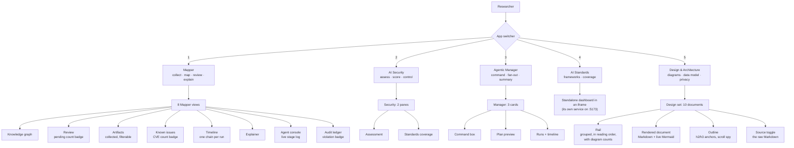
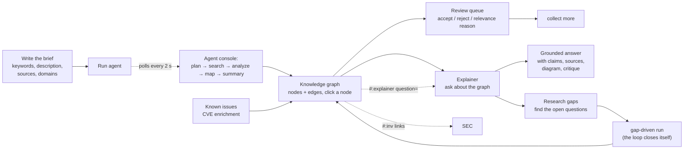
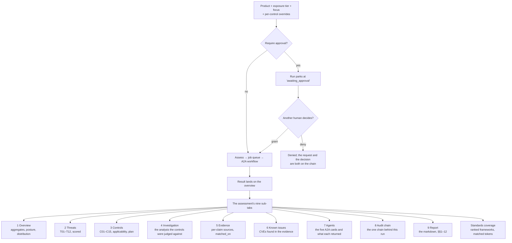
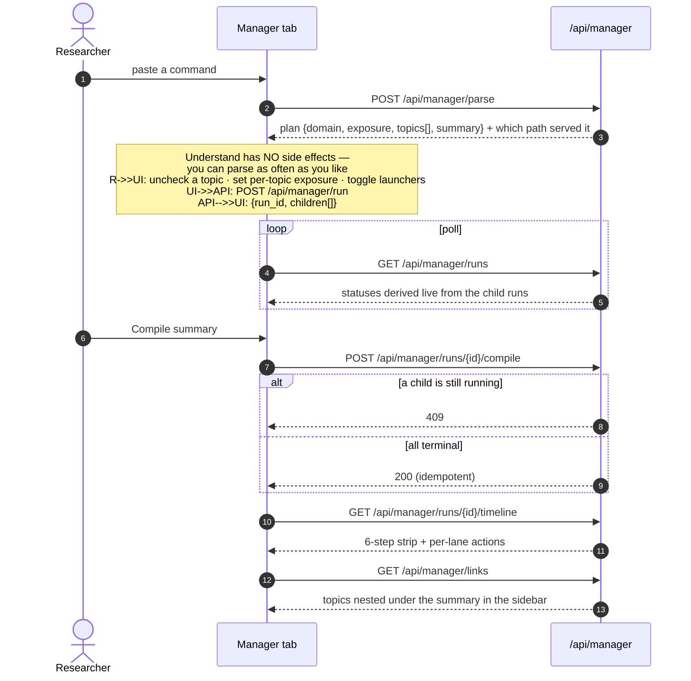
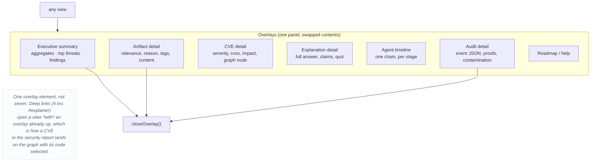
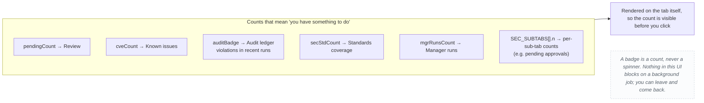
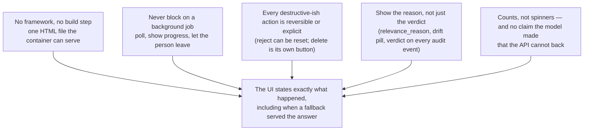

# 07 — UI interaction

How a person actually moves through the app: five top-level apps, their views,
the overlays that sit on top, and what each control does to the system behind
it.

The UI is a single page (`static/index.html`, ~5.9k lines, no framework, no
build step). Every screen below is a `switchApp` / `switchView` target, and
every control is one function that either calls an API route or changes
browser-local state.

Related: [interaction.md](interaction.md) (what the API does) ·
[../docs/frontend.md](../docs/frontend.md) · [state.md](state.md)

## The five apps

The Standards tab is the odd one out and deliberately so: it is a **different
service** in an `<iframe>`, not another view. The same data is also available
as a scored matrix inside Security → Standards coverage, computed by the
mapper itself — the iframe shows the dashboard's own view, the sub-tab shows
the assessment-specific score.

The Design tab is different in kind again: it has no service and no data model.
It reads the `design/` directory in this repository over
`GET /api/design/docs` and renders it, so the diagrams on screen are the ones
in the repository rather than screenshots of them. The selected document lives
in the fragment (`#design/privacy`), which makes every document linkable.

## Mapper: the loop a person is actually in

The `#` deep links are worth calling out: `#explainer` and `#:inv` let any
screen open another one with context, which is how a finding gets from the
security report into the research graph without re-typing the question.

## Security: assessment, then the nine sub-tabs

The audit sub-tab is the interesting one: the A2A task id *is* the ledger run
id, which is how a report and its evidence chain stay bound to each other. The
same chain, scoped to one run, is reachable from the Mapper's Audit ledger tab.

## Manager: understand before you launch

The split between *parse* and *run* is the UX decision worth stealing: the
expensive, irreversible part (creating a dozen investigations) is gated behind
a preview of exactly what will be created, with per-topic control.

## What each control does, in one table

| Control | Screen | Calls | Effect on the system |
|---|---|---|---|
| Run agent | Mapper sidebar | `POST /investigations/{id}/run` | `AgentRun` row + worker thread; 429 if one is already going |
| Executive summary | Mapper sidebar | `GET /investigations/{id}/summary` | Overview overlay: aggregates, top threats, findings |
| Find open gaps | Mapper sidebar | `GET /investigations/{id}/recommendations` | Lists the least-covered questions; each can launch a gap run |
| Investigate gaps | Explainer | `POST /explanations/{id}/investigate_gaps` | Closes the loop: an answer that finds its own research |
| Save schedule | Mapper sidebar | `PUT /investigations/{id}/schedule` | Cron + items + rounds; the 10-min tick starts launching runs |
| Accept / reject | Review queue | `POST /artifacts/{id}/review` | `review` flips; rejection is reversible |
| Detect drift | Artifacts | `POST /investigations/{id}/detect-drift` | Flags off-brief artifacts; nothing is deleted |
| Collect issues | Known issues | `POST /investigations/{id}/cves` | Enriches CVEs from artifacts + reports, idempotently |
| Assess | Security | `POST /investigations/{id}/security/assess` | Job + A2A run, or a parked run awaiting approval |
| Approve / deny | Security | `POST /api/security/runs/{id}/approval` | The decision lands on the chain and re-queues the job |
| Compile summary | Manager | `POST /api/manager/runs/{id}/compile` | Synthesis artifact on the summary investigation |
| Verify chain | Audit ledger | `GET /ledger/runs/{id}/verify` | Recomputes every hash; reports `break_at` if tampered |
| Export | Audit ledger | `GET /ledger/runs/{id}/export` | A bundle that verifies offline, with no database attached |

## Overlays: what floats above everything

## Badges: the app telling you it wants attention

## The design rules the UI follows

That last rule is the one that shows up most in the design: the UI says "Ledge"
or "deterministic fallback" when that is what happened. The person reading the
screen is being told the truth about the machine that produced it.

## Related

- What those calls do server-side: [interaction.md](interaction.md)
- The state each control moves: [state.md](state.md)
- [../docs/frontend.md](../docs/frontend.md) for the view-by-view inventory
