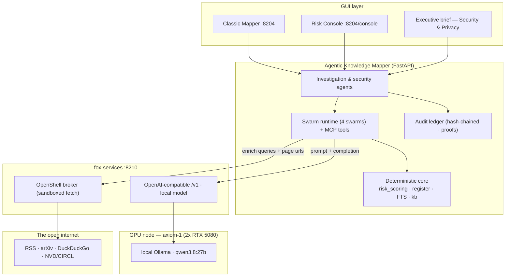
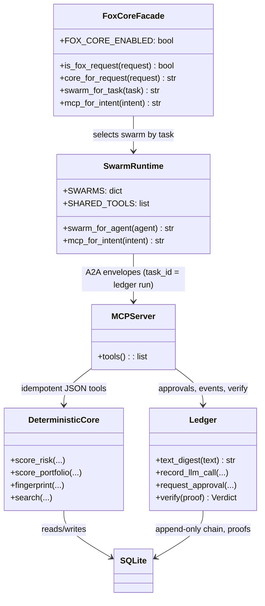
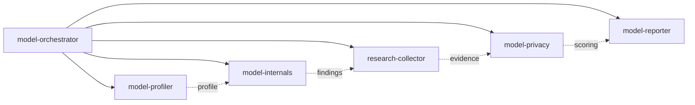
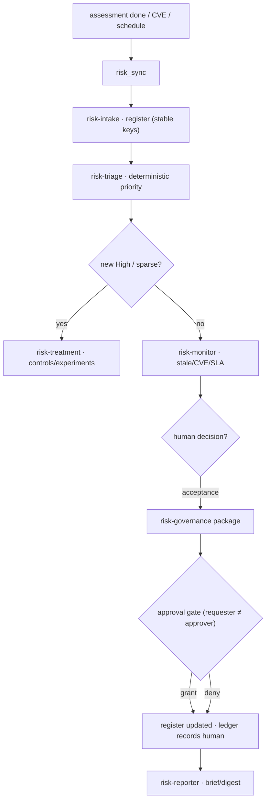
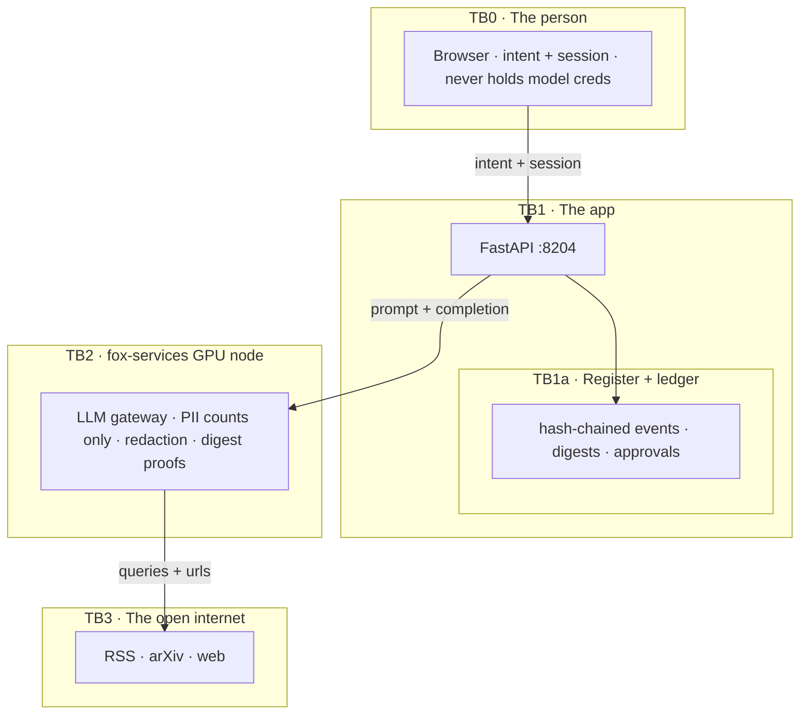
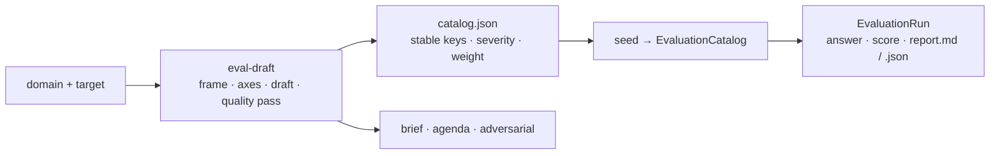

# Agentic Knowledge Mapper — Shareable Mermaid Diagrams

LinkedIn does not render Mermaid, so these diagrams live here as copy-pasteable
source for **https://mermaid.live** (or any Mermaid renderer / docs site). Each
block has a one-line plain-English explanation. Pair with the text in
[linkedin-share.md](linkedin-share.md).

---

## 1. System architecture

Every GUI is a projection over one FastAPI backend; all model calls leave the
app only to the fox-services GPU node; the only way to reach the open internet
is through the sandboxed broker carrying queries and URLs.

---

## 2. The switchable core (UML)

A thin facade picks between the classic engine and the Fox core; below it
everything converges on the same deterministic spine, so switching cores never
changes the numbers — only how the LLM is orchestrated.

---

## 3. Audit ledger — swarm control flow

A reviewer can walk each handoff (who delegated what, how long it took, which
model produced which step) and re-verify the whole chain offline.

---

## 4. Risk management lifecycle (activity)

Agents propose and draft; humans own and decide; every accepted risk or policy
change crosses an approval gate and lands on the ledger.

---

## 5. Privacy & trust boundaries

The ledger holds digests, not prompts; PII is counted, never kept; the only
internet exit is the sandboxed broker carrying queries and URLs.

---

## 6. Deep-research drafting → evaluation run (chain)

Same axis library (identity/binding, authorization, intent integrity, data
privacy, autonomy, adversarial, audit, third parties, regulatory, threat model,
ops) adapts across domains — agentic payments, data export, AI adoption in a
large enterprise — with an LLM draft and a deterministic fallback.