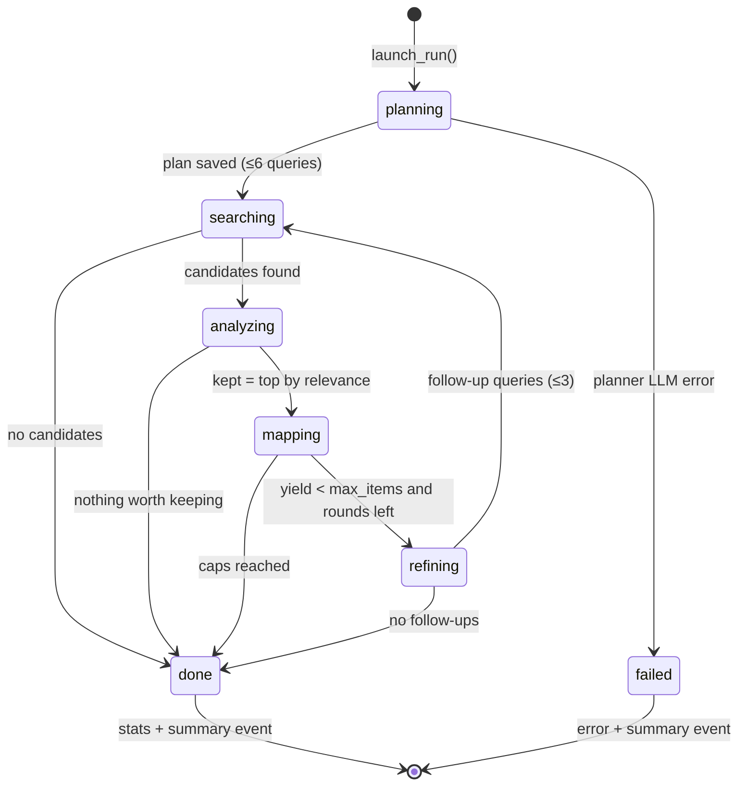
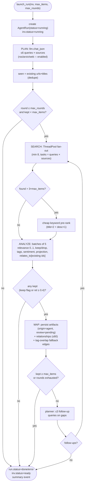
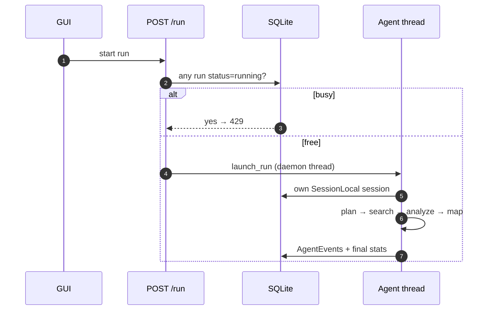

# Collection agent loop

`app/agent.py` — the plan → search → analyze → map → refine loop that turns an
investigation brief into a knowledge graph. Runs in a background thread with
its own DB session; progress streams as `AgentEvent` rows.

Related: [architecture](architecture.md) · [data-model](data-model.md) ·
[frontend](frontend.md) · [operations](operations.md)

## State machine (UML)



## Activity flow



## Stage protocol (what the GUI shows)

Each stage emits `AgentEvent(run_id, stage, message, data)`:

| Stage | Emitted when | `data` payload |
|---|---|---|
| `plan` | queries planned (or refinement) | `{queries: [{text, sources}]}` + rationale |
| `search` | round starts / finishes / pre-ranked | `{count, sample: [titles]}` |
| `analyze` | each 5-item batch judged | progress `analyzed/total` |
| `map` | artifacts + edges persisted | `{kept: [titles]}` |
| `summary` | run done / failed / interrupted | stats or error |

The console polls `GET /api/runs/{id}/events?after_id=` every 2 s and renders
stage-colored entries — see [frontend](frontend.md#agent-console).

## Analysis verdict (LLM contract)

`_analyze_batch` sends ≤5 candidates plus up to 40 already-collected artifacts
as `relates_to` reference, and expects a JSON list:

```json
[{
  "index": 0,
  "relevance": 0.85,
  "keep": true,
  "reason": "directly measures scaling-law claim",
  "artifact_type": "paper",
  "tags": ["scaling-laws", "eval"],
  "sentiment": 0.1,
  "summary": "one–two sentences",
  "projection": {"type": "accelerationist", "confidence": 0.7,
                 "timeframe": "2027-2030", "summary": "..."} | null,
  "relates_to": [{"id": 12, "relationship_type": "supports",
                  "description": "..."}]
}]
```

Kept rule: `keep == true` **or** `relevance ≥ 0.4`, and `relevance > 0`.
Relationship types are restricted to
`references | supports | contradicts | builds_upon | responds_to | similar_to`
(else coerced to `similar_to`); edges to unknown ids or self-edges are dropped.

## Concurrency & guards



- One running run per investigation for manual runs (`429` guard); the
  scheduler additionally skips (never queues) when busy.
- Search fan-out uses `ThreadPoolExecutor(max_workers=min(8, tasks))`.
- Crash recovery on boot: runs stuck `running` are marked `error`
  ("interrupted by server restart") so the guard never deadlocks.
- Entry points: `launch_run(inv, …)` (manual/scheduled) and
  `launch_run_with_goal(inv, goal, …)` (explainer-gap auto-investigation,
  trigger `explainer_gap`).
