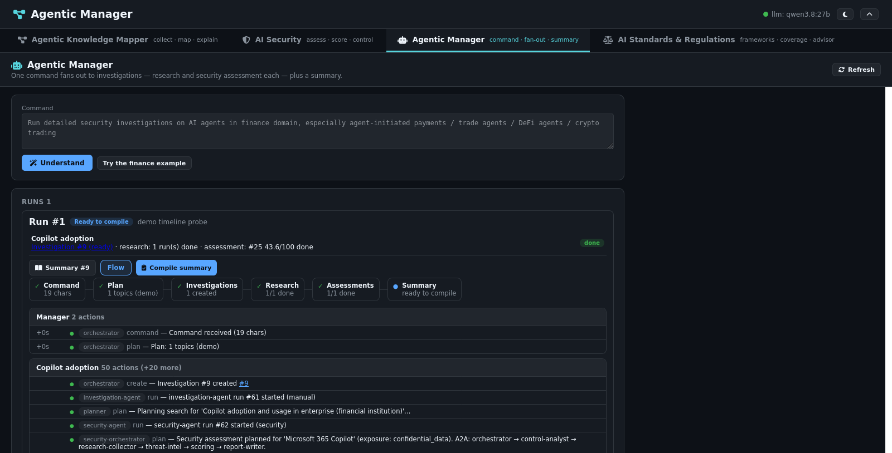

# Agentic Manager tab

One command fans out to N investigations plus a summary. The **Agentic
Manager** top-level tab takes a command such as "run detailed security
investigations on AI agents in finance domain, especially
agent-initiated payments / trade agents / DeFi agents / crypto trading",
understands it, and serves it: one investigation per topic -- each with a
research run and a security assessment launched -- and a final summary
investigation.

## Flow

1. **Understand** (`POST /api/manager/parse`): the model splits the command
   into `{domain, exposure, topics[], summary}`. If the model is
   unreachable or its plan validates to nothing, a deterministic splitter
   (slashes, semicolons, lines, numbered items; "especially X" scopes the
   topics) takes over; the preview says which path served it. No side
   effects.
2. **Run** (`POST /api/manager/run`): the confirmed plan (topics can be
   unchecked, exposure and both launchers adjusted) creates N
   investigations plus the summary shell, then launches per topic. At most
   6 topics; duplicates dropped. Runs queue through the existing agent and
   security workers.
3. **Track** (`GET /api/manager/runs`): per-topic research status and latest
   assessment score, polled while anything runs. Statuses derive live from
   the agent/security tables -- no background watcher, so restarts strand
   nothing.
4. **Compile** (`POST /api/manager/runs/{id}/compile`): once every child is
   terminal, an LLM synthesis of the finished assessments (truncated briefs)
   is stored as a `manager-synthesis` artifact on the summary
   investigation, which flips to ready. 409 while anything still runs;
   idempotent afterwards.

Implementation: `app/manager.py`, `ManagerRun` model (new table, created by
`create_all`), routes in `app/main.py`. Pinned in `tests/test_manager.py`
(launchers and model mocked).

## Execution flow

Each run card has a **Flow** toggle: a six-step strip (Command → Plan →
Investigations → Research → Assessments → Summary, with done/active/pending
states and counts) above per-lane action lists. Lanes are the Manager, one
per topic, and the Summary; every action carries its timestamp relative to
the command, the subagent role behind it (planner, research-collector,
threat-intel, control-analyst, scoring, report-writer, synthesizer …),
mapped from the recorded agent-event stages, and links back to its
investigation. `GET /api/manager/runs/{id}/timeline` serves it as pure
reads (capped at 50 actions per lane, head and tail), so open flows refresh
with the runs poll.

