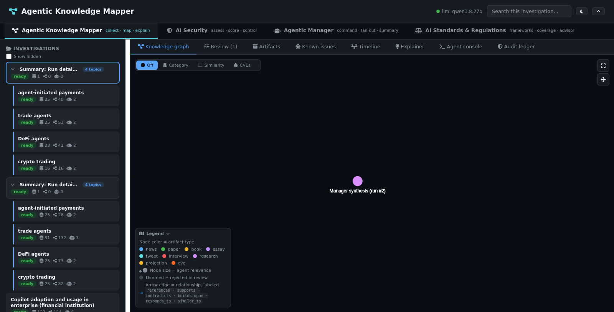
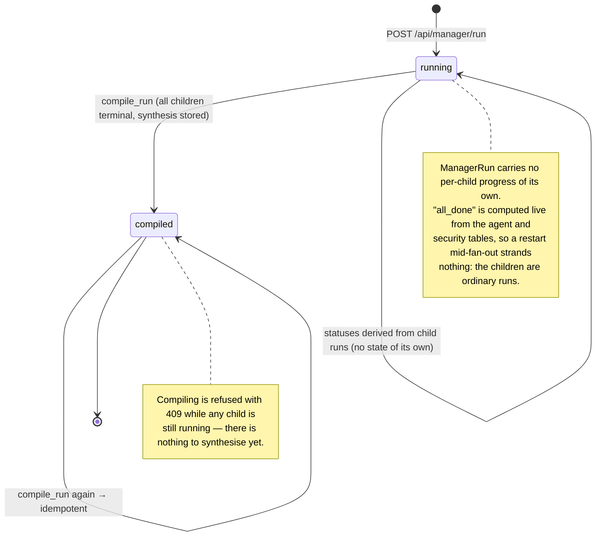

# Agentic Manager tab

One command fans out to N investigations plus a summary. The **Agentic
Manager** top-level tab takes a command such as "run detailed security
investigations on AI agents in finance domain, especially
agent-initiated payments / trade agents / DeFi agents / crypto trading",
understands it, and serves it: one investigation per topic -- each with a
research run and a security assessment launched -- and a final summary
investigation.

## Flow

1. **Understand** (`POST /api/manager/parse`): the model splits the command
   into `{domain, exposure, topics[], summary}`, with each topic carrying
   `subject` (the thing assessed — never the command verb phrase), `task`,
   `focus` and `anti_focus` (directions the command rules out, e.g. after
   "rather than"). A pasted-twice command collapses to one copy first. If
   the model is unreachable or its plan validates to nothing, a
   deterministic splitter (slashes, semicolons, lines, numbered items;
   "especially X" scopes the topics) takes over; the preview says which
   path served it. No side effects.
2. **Run** (`POST /api/manager/run`): the confirmed plan (topics can be
   unchecked, exposure set per topic, launchers adjusted) creates N
   investigations plus the summary shell, then launches per topic. At most
   6 topics; duplicates dropped. Runs queue through the existing agent and
   security workers. Each topic's assessment is launched with
   `product_name` = its subject (falling back to the title) and a use case
   carrying the focus directives and explicit out-of-scope lines, so the
   assessment reasons about the intent instead of echoing the command.
   When the subject is a model, `security.profile_model_subject` further
   profiles its nature, architecture, class, family and data processing
   (see security-agent.md), and chat-surface threats drop below the
   scoring floor for subjects with no conversational surface. A model topic
   then gets **three** assessments, not one: `target` (is the model sound),
   `adversarial` (what could be built with it), and `hypothesis` (which of
   those claims is true, and what would settle it). They are queued in that
   order because the third reads the stored rows of the first two and the job
   queue claims in `(next_attempt_at, id)` order; if an earlier flow is waiting
   out a retry the third reads what exists and says so. A catalog topic still
   gets exactly one.
3. **Track** (`GET /api/manager/runs`): per-topic research status and latest
   assessment score, polled while anything runs. Statuses derive live from
   the agent/security tables -- no background watcher, so restarts strand
   nothing.
4. **Compile** (`POST /api/manager/runs/{id}/compile`): once every child is
   terminal, an LLM synthesis of the finished assessments (truncated briefs)
   is stored as a `manager-synthesis` artifact on the summary
   investigation, which flips to ready. 409 while anything still runs;
   idempotent afterwards. The run card's **View summary** toggle renders
   the synthesis -- deterministic top-risk/overlap/lapse tables plus prose
   -- through a dependency-free markdown renderer; the same rendering
   applies to synthesis artifacts opened in the mapper's detail overlay,
   where other artifacts keep their plain-text view.

Implementation: `app/manager.py`, `ManagerRun` model (new table, created by
`create_all`), routes in `app/main.py`. Pinned in `tests/test_manager.py`
(launchers and model mocked).

## Nested sidebar

In the mapper tab, each summary investigation holds its topics as nested,
collapsible rows (chevron on the summary row; expanded by default), served
by `GET /api/manager/links`. Children keep their status pills and counts;
clicking any row selects it as usual. If the links call fails, the list
renders flat exactly as before.

## Execution flow

Each run card has a **Flow** toggle: a six-step strip (Command → Plan →
Investigations → Research → Assessments → Summary, with done/active/pending
states and counts) above per-lane action lists. Lanes are the Manager, one
per topic, and the Summary; every action carries its timestamp relative to
the command, the subagent role behind it (planner, research-collector,
threat-intel, control-analyst, scoring, report-writer, synthesizer …),
mapped from the recorded agent-event stages, and links back to its
investigation. `GET /api/manager/runs/{id}/timeline` serves it as pure
reads (capped at 50 actions per lane, head and tail), so open flows refresh
with the runs poll.

## The command record

Each run stores the exact command that produced it, so a run six weeks later
is still reproducible: `ManagerRun.command` holds the raw text, and
`plan_json` holds the confirmed `{domain, exposure, topics[], summary}` with
whatever edits were made before launch (unchecked topics, per-topic exposure,
launcher toggles). `GET /api/manager/runs` returns all of it.

`status` is `running` until a compile succeeds, then `compiled` — which is what
the run card's **View summary** toggle keys off, and why compiling twice is
idempotent rather than an error.

## The state diagram

## Relationship to the rest of the system

- Each topic's research run is a normal `AgentRun` with `trigger='manual'`-style
  focus terms; each topic's assessment is a normal security run, with its own
  job, ledger run, and A2A task id. When a topic's subject profiles as a
  model, its assessments automatically take the three model A2A paths
  (see security-agent.md) — no manager option needed, since the routing
  reads the same subject the plan already extracted.
- The summary is a real investigation holding a `manager-synthesis` artifact,
  so it is readable in the mapper, nestable in the sidebar, and answerable by
  the Explainer like any other graph.
- Every fan-out and every synthesis is a normal audited run — the Manager is
  not a privileged path around the ledger.

Implementation: `app/manager.py`, `ManagerRun` model (created by `create_all`),
routes in `app/main.py`. Pinned in `tests/test_manager.py` (launchers and model
mocked). Diagrams: [../design/interaction.md](../design/interaction.md),
[../design/activity.md](../design/activity.md).
