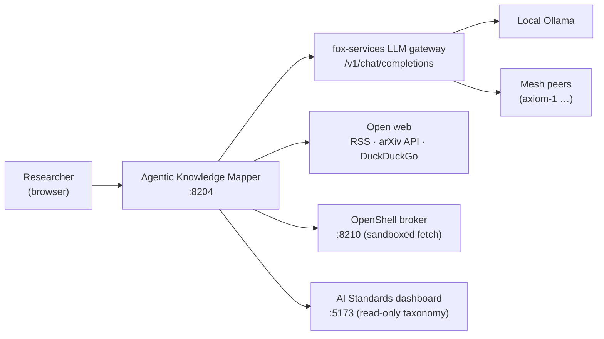
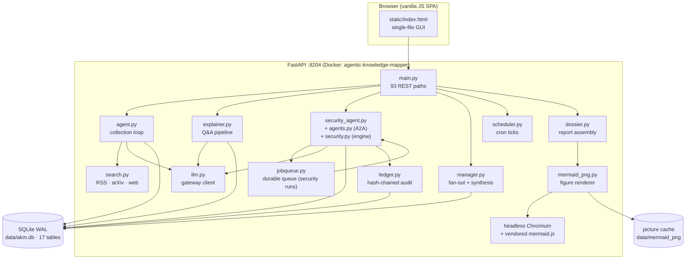
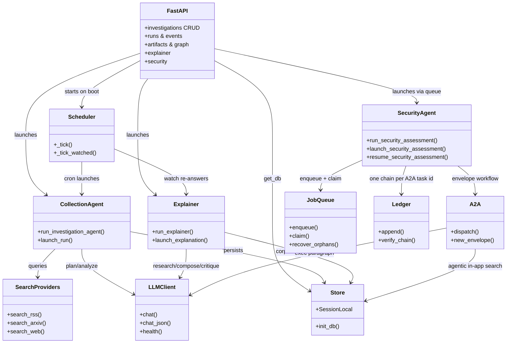
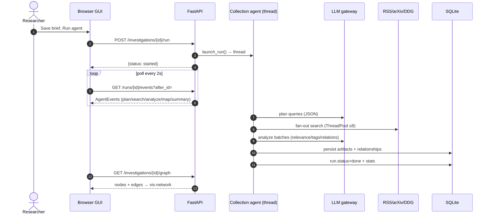
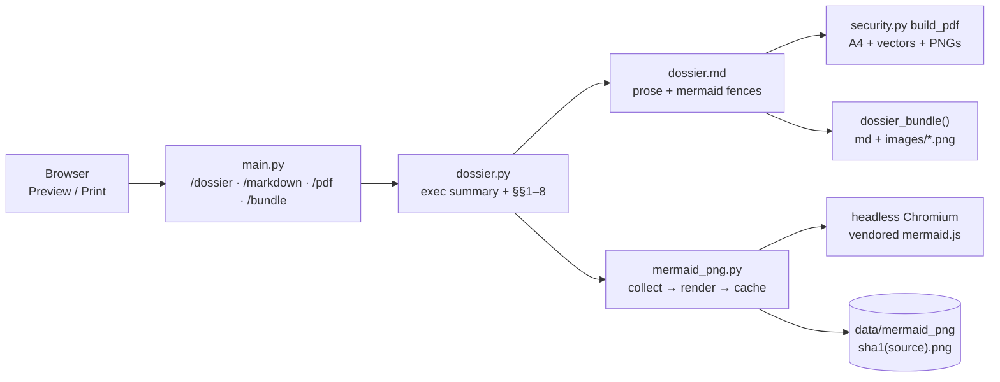

# Architecture

How the Agentic Knowledge Mapper fits together: system context, containers,
components, and the data flow between them.

Related: [agent-loop](agent-loop.md) · [explainer](explainer.md) ·
[security-agent](security-agent.md) · [data-model](data-model.md) ·
[frontend](frontend.md) · [operations](operations.md)

## System context

The Mapper is a self-hosted research assistant. The user defines
**investigations** (a brief: title + keywords + free-text description); agents
collect and map knowledge into per-investigation graphs, and an explainer
answers questions with grounded, illustrated explanations. All LLM reasoning
goes through the fox-services gateway — no external API keys, with automatic
failover across local and mesh models.

The two dashed-service integrations are optional by design: the OpenShell
broker degrades to a direct fetch (recording `sandbox: false` rather than
failing), and the standards dashboard is a read-only consumer source that
returns 503 with a reason when unreachable. Neither is on the critical path of
collecting or answering.

## Four applications, one subject

The word "mapper" undersells what is deployed. Four applications are involved,
and they are not layers of one thing — they are peers with different jobs:

| App | Port | Role | Talks to |
|---|---|---|---|
| **Agentic Knowledge Mapper** | 8204 | investigations, graph, explainer, security | fox-services, standards dashboard, OpenShell, web |
| **fox-services** | 8210 | LLM gateway (OpenAI-compatible) | local Ollama, mesh peers, OpenShell broker |
| **AI Standards dashboard** | 5173 | browsable standards taxonomy | its own `data.json` |
| **OpenShell broker** | 8210 (in fox-services) | sandboxed fetch, egress policy | Mapper's fetch requests |

The mapper is the only one that holds research data. Everything else is either
a dependency it calls or a dataset it reads.

Do not confuse this with the **five app tabs** in the mapper's own UI. AI
Standards is a separate container that the Mapper *iframes*; the other four
tabs — Mapper, AI Security, Agentic Manager, and Design & Architecture — are
pane switches inside the single `static/index.html`. Design & Architecture
additionally has no service of its own: it reads `design/` through
`app/design_docs.py`.

## Containers

| Container / module | Responsibility |
|---|---|
| `static/index.html` | All GUI: 5 apps (Mapper with 9 views, Security with 9 sub-tabs, Manager, Standards, Design & Architecture), sidebar, overlays, polling, mermaid rendering |
| `app/design_docs.py` | Fixed index over `design/`; serves a design document by id for the Design & Architecture tab |
| `app/main.py` | FastAPI routes, request schemas, JSON serializers |
| `app/agent.py` | Collection loop: plan → search → analyze → map → refine (background thread) |
| `app/explainer.py` | Question answering: graph-first research → compose → ground → critique → diagram |
| `app/security_agent.py` + `app/agents.py` + `app/security.py` + `app/threatpack.py` | Security assessments via the A2A envelope protocol, scored against a versioned pack |
| `app/dossier.py` | Report assembly: executive summary + 7 sections from stored rows, Markdown prose, Markdown+images bundle |
| `app/mermaid_png.py` | Figure renderer: batch-draws mermaid sources to PNG via headless Chromium, cached by source hash |
| `app/model_eval.py` | Model-engineering core: family/modality enums, attack taxonomy, `adversarial_coverage_v1` + `adoption_risk_v1` scoring, method versions/fingerprints (no LLM, evalkit-pinned) |
| Chromium + vendored `mermaid.min.js` | Baked into the image so PDF/bundle exports draw real pictures with no network |
| `app/manager.py` | Command parsing, fan-out over topics, summary compilation |
| `app/standards_matrix.py` | Relevance-ranked standards score matrix served to the security pane |
| `app/cve.py` | CVE collection and enrichment (NVD → CIRCL → recorded unknown) |
| `app/recommend.py` | Coverage gaps, control leverage, stale brief, per-query-shape yields |
| `app/drift.py` | Deterministic prefilter + LLM judge for watch re-answers |
| `app/writeguard.py` | audit → repair → strip → drift gate on the way out of the explainer |
| `app/grounding.py` | Verbatim citation checks (stdlib only) |
| `app/jobqueue.py` | Row-before-thread queue for security runs: leases, backoff, orphan recovery |
| `app/approvals.py` | Requester ≠ approver, fails closed |
| `app/openshell.py` | Sandboxed fetch, egress policy generation, posture reporting |
| `app/ledger.py` + `app/ledger_api.py` + `app/ledger_models.py` | Hash-chained audit ledger, mandates, sessions, proofs, approvals, exports |
| `app/evalkit.py` | Pinned scoring cases and invariants, a CI gate on the threat pack |
| `app/scheduler.py` | Cron timetables for investigations + watch/drift re-answers |
| `app/search.py` | Keyless providers: RSS feeds, arXiv API, DuckDuckGo HTML |
| `app/llm.py` | OpenAI-compatible gateway client with base-chain failover + `chat_json` |
| `app/obs.py` | Traces and contextvars, re-bound at job claim |
| `app/models.py` / `database.py` | SQLAlchemy models (17 tables), WAL engine, column migrations |

## Component dependencies (UML)

## Runtime data flow (a collection run)

## Report exports (dossier → Markdown / PDF / bundle)

The Summary tab's Full report section previews the dossier and exports it in
three formats. All of them read the same `investigation_dossier()` payload,
so preview, Markdown, PDF and bundle can never disagree about what was
investigated or how a score was reached.

- **Markdown** is the prose plus the mermaid fences verbatim — it renders
  natively on GitHub and keeps every figure re-renderable elsewhere.
- **PDF** draws the three canonical figures (`dataflow`, `workflow`,
  `threat_paths`) as ReportLab vectors and every other mermaid fence as a
  rendered PNG picture. A fence with no picture keeps its source text: a
  missing picture never breaks the export.
- **Bundle** (`.zip`) is the Markdown with a picture link above each fence
  plus the pictures under `images/` — figures show in viewers with no
  diagram plugin, and the fences stay for GitHub and reproducibility.
- **Pictures are content-addressed.** Rendered PNGs persist in the
  `akm_data` volume keyed by source hash, so repeat exports never relaunch
  the browser; a changed diagram re-renders, an unchanged one does not.

## Key design decisions

- **Investigations scope everything.** Artifacts, relationships, runs, explanations,
  corpus pages, security assessments, CVE findings, yields, and manager runs
  all carry `investigation_id`. Deleting an investigation cascades — except
  through the `ledger_*` tables, which attach by id and never cascade, because
  an audit record that dies with its subject is not an audit record. See
  [data-model](data-model.md).
- **A long security run is a row before it is a thread.** Security work goes
  through `app/jobqueue.py` with a lease, a heartbeat, exponential backoff, and
  orphan recovery on boot; a run row alone was not a durable record of a job.
  Collection and explainer runs still use a guarded daemon thread each
  (one running run per investigation, crash recovery on boot) — the queue is
  where it is needed, not everywhere.
- **Agents run in background threads with own sessions**, never on request
  threads. Progress is an append-only `AgentEvent` log the GUI polls —
  no websockets, no blocking calls. See [agent-loop](agent-loop.md).
- **LLM is an unreliable dependency, treated as one.** Every LLM call is wrapped
  in try/except with deterministic fallbacks (keyword pre-rank, template
  paragraphs); the gateway client walks a base chain (primary → fallback →
  localhost/host swaps). See [operations](operations.md).
- **Graph-first answering.** The explainer prefers the already-collected
  knowledge graph and cached corpus before hitting the web, and records which
  path it took in the trace. See [explainer](explainer.md).
- **Security is a separate agent family** speaking an envelope protocol (A2A),
  searching the app's own graph for evidence. See [security-agent](security-agent.md).
- **Exports are assembled, not generated.** Dossier prose, PDF vectors, and
  rendered figures all read stored rows and cached pictures — no LLM, no
  recomputation — so re-exporting the same investigation byte-agrees on the
  numbers. See [frontend](frontend.md).
- **Model assessments are a separate mode, not a product flavor.**
  `assessment_mode=model_engineering` runs W1 adversarial research plus W2
  adoption risk (plus W3 mitigation planning when requested) through their
  own A2A agents, scores, catalogs and report template. Scores may be null
  (no evidence) and stay null through display. Families are data in
  `app/model_eval.py`, never new code paths.
- **Mitigations are recommended, never implemented.** The MM01–MM15 catalog
  carries efficacy priors and burden ratings; the analyst ranks by driver
  pressure minus burden, residuals stay indicative, and inapplicable controls
  are deferred with reasons rather than silently dropped.
- **The LLM is optional in the loop, not in the product.** Research, scoring,
  and diagram generation all have deterministic paths; the pack's own evalkit
  pins the expected scores so a silent model change fails CI instead of
  quietly re-scoring every assessment in the database. See
  [threatpack](threatpack.md).

## Where the boundaries are

Four boundaries in this system are worth stating explicitly, because most of
what could leak crosses one of them. The full diagram, including the data
flows, is in [../design/privacy.md](../design/privacy.md).

1. **Browser → Mapper** — prompts and briefs. Hashed or redacted before
   storage; raw payloads only when `LEDGER_CAPTURE_PAYLOADS=1`.
2. **Mapper → fox-services** — prompt text and completions. This is the one
   boundary where research content actually moves.
3. **Mapper → Open web** — outbound fetches. Attempts go through the OpenShell
   broker; on failure they fall back to direct and record `sandbox: false`.
4. **Mapper → SQLite** — persistence. Wallet for the audit chain, git-ignored
   for everything else.

What is **not** implemented, and is not implied by any diagram here: user
authentication, encryption at rest, TLS, and a data-retention schedule. The
`ledger_approvals` table enforces requester ≠ approver, which is an integrity
control, not an access control — there are no accounts behind it.
