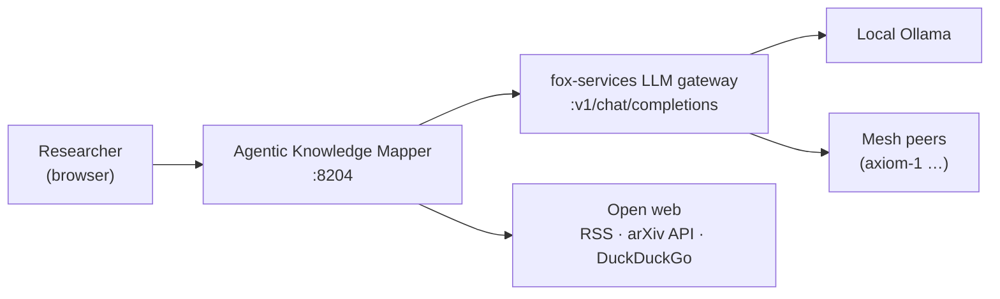
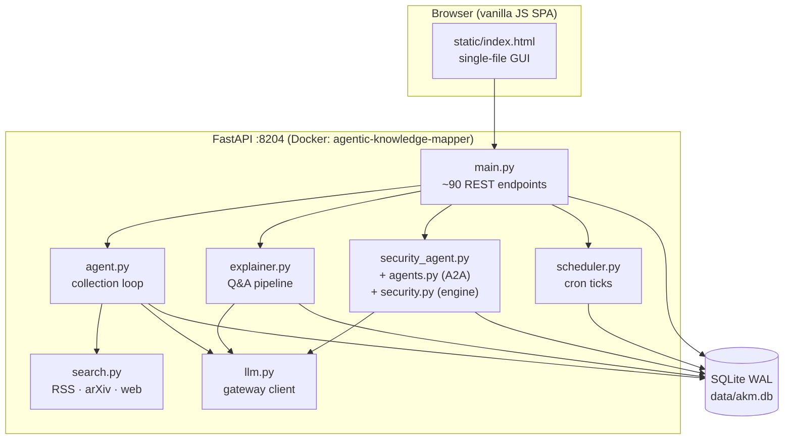
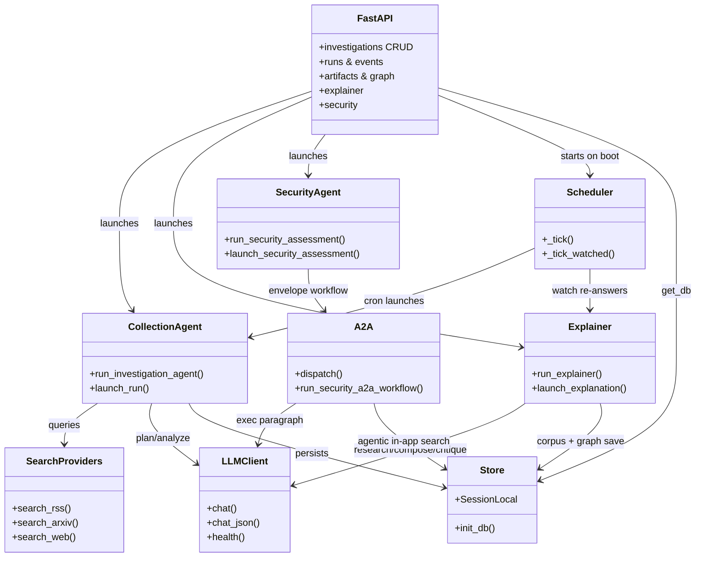
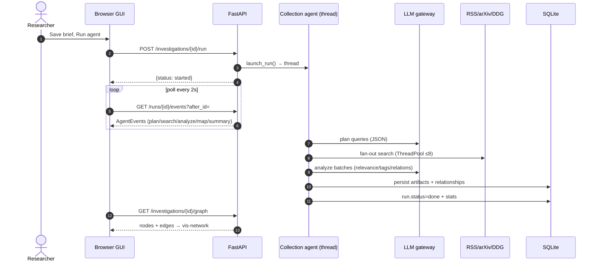

# Architecture

How the Agentic Knowledge Mapper fits together: system context, containers,
components, and the data flow between them.

Related: [agent-loop](agent-loop.md) · [explainer](explainer.md) ·
[security-agent](security-agent.md) · [data-model](data-model.md) ·
[frontend](frontend.md) · [operations](operations.md)

## System context

The Mapper is a self-hosted research assistant. The user defines
**investigations** (a brief: title + keywords + free-text description); agents
collect and map knowledge into per-investigation graphs, and an explainer
answers questions with grounded, illustrated explanations. All LLM reasoning
goes through the fox-services gateway — no external API keys, with automatic
failover across local and mesh models.

## Containers

| Container / module | Responsibility |
|---|---|
| `static/index.html` | All GUI: sidebar, 6 tabs, overlays, polling, mermaid rendering |
| `app/main.py` | FastAPI routes, request schemas, JSON serializers |
| `app/agent.py` | Collection loop: plan → search → analyze → map → refine (background thread) |
| `app/explainer.py` | Question answering: graph-first research → compose → ground → critique → diagram |
| `app/security_agent.py` + `app/agents.py` + `app/security.py` | Security assessments via the A2A envelope protocol |
| `app/scheduler.py` | Cron timetables for investigations + watch/drift re-answers |
| `app/search.py` | Keyless providers: RSS feeds, arXiv API, DuckDuckGo HTML |
| `app/llm.py` | OpenAI-compatible gateway client with base-chain failover + `chat_json` |
| `app/models.py` / `database.py` | SQLAlchemy models, WAL engine, column migrations |

## Component dependencies (UML)

## Runtime data flow (a collection run)

## Key design decisions

- **Investigations scope everything.** Artifacts, relationships, runs, explanations,
  corpus pages, and security assessments all carry `investigation_id`. Deleting
  an investigation cascades. See [data-model](data-model.md).
- **Agents run in background threads with own sessions**, never on request
  threads. Progress is an append-only `AgentEvent` log the GUI polls —
  no websockets, no blocking calls. See [agent-loop](agent-loop.md).
- **LLM is an unreliable dependency, treated as one.** Every LLM call is wrapped
  in try/except with deterministic fallbacks (keyword pre-rank, template
  paragraphs); the gateway client walks a base chain (primary → fallback →
  localhost/host swaps). See [operations](operations.md).
- **Graph-first answering.** The explainer prefers the already-collected
  knowledge graph and cached corpus before hitting the web, and records which
  path it took in the trace. See [explainer](explainer.md).
- **Security is a separate agent family** speaking an envelope protocol (A2A),
  searching the app's own graph for evidence. See [security-agent](security-agent.md).
