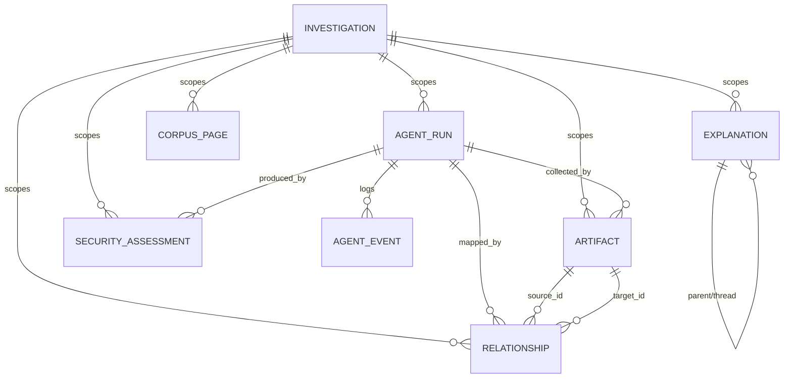
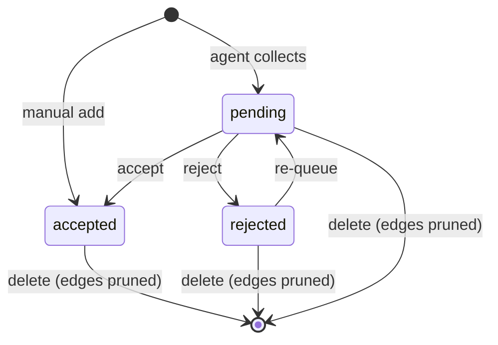

# Data model

All tables live in SQLite (`data/akm.db`, WAL mode). **Everything is scoped by
`investigation_id`** — deleting an investigation cascades to its artifacts,
relationships, runs, events, explanations, corpus pages, and assessments.

Related: [architecture](architecture.md) · [agent-loop](agent-loop.md)

## Entity-relationship diagram (UML)

## Tables

| Table | Key columns | Notes |
|---|---|---|
| `investigations` | `title`, `keywords`, `description`, `sources`, `status` (`draft\|running\|ready`), schedule (`schedule_enabled/cron/max_items/rounds`, `last/next_run_at`), prefs (`preferred_domains`, `auto_save_explanations`) | the brief; one row per topic |
| `artifacts` | `investigation_id`, `title`, `artifact_type` (news/paper/essay/research/tweet/interview/book/projection), `url`, `description`, `content`, `source`, `author`, `date_published`, `tags`, `sentiment`, `relevance` 0..1, `relevance_reason`, `review` (`pending\|accepted\|rejected`), `origin` (`agent\|manual`), `run_id` | collected items |
| `relationships` | `investigation_id`, `source_id`, `target_id`, `relationship_type` (`references\|supports\|contradicts\|builds_upon\|responds_to\|similar_to`), `description`, `origin`, `run_id` | directed graph edges |
| `agent_runs` | `investigation_id`, `status` (`running\|done\|error`), `trigger` (`manual\|schedule\|explainer_gap\|security`), `plan`/`stats`/`error` JSON, `started/finished_at` | one row per agent execution |
| `agent_events` | `run_id`, `stage` (`plan\|search\|analyze\|map\|summary`), `message`, `data` JSON | append-only progress log |
| `explanations` | `investigation_id`, `question`, `answer` JSON, `trace` JSON, `status`, `mode/depth/audience`, `max_pages`, `hops`, `meta` JSON (phase, feedback, watch_of, drift), `parent_id`, `thread_id`, `quiz` JSON, `bookmarked`, `watched` | Q&A outputs + threads |
| `corpus_pages` | `investigation_id`, `url` (unique per investigation), `title`, `domain`, `text`, `published`, `images` JSON, `fetched_at` | fetched-page cache |
| `security_assessments` | `investigation_id`, `run_id`, `product_name/url`, `exposure`, `use_case`, `overall_pct`, `posture`, `markdown`, `diagrams/threats/evidence/a2a_trace` JSON | security reports |

## Review lifecycle (UML)

Node size in the graph = `relevance`; the review queue is ordered by
`relevance DESC`. `run_id` on artifacts/relationships attributes each node and
edge to the run that created it (powers Timeline compare and `manual` listing
for `run_id IS NULL`).

## Migrations

`init_db()` runs `create_all` plus `ensure_columns()` (`app/database.py`
`_MIGRATIONS`): additive `ALTER TABLE … ADD COLUMN` per missing column, so
existing `akm.db` files upgrade in place. New tables (e.g.
`security_assessments`) are created by `create_all` automatically.
