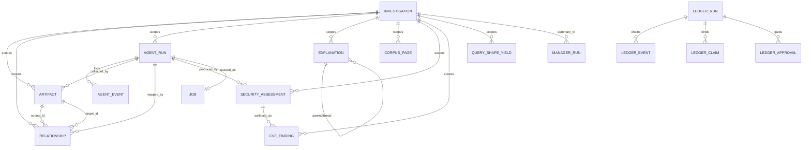
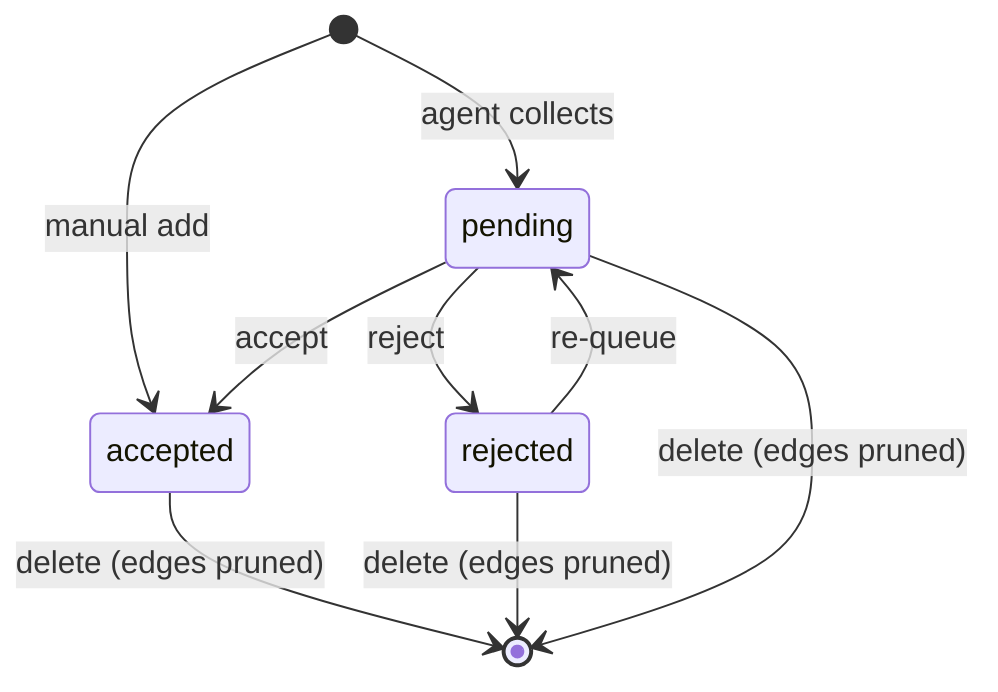
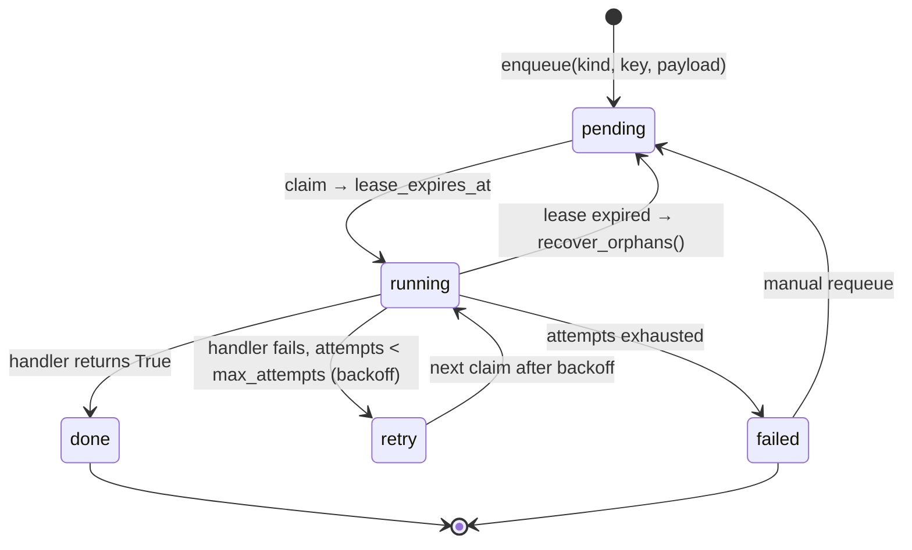

# Data model

All tables live in SQLite (`data/akm.db`, WAL mode). **Everything is scoped by
`investigation_id`** — deleting an investigation cascades to its artifacts,
relationships, runs, events, explanations, corpus pages, and assessments.

Related: [architecture](architecture.md) · [agent-loop](agent-loop.md)

## Entity-relationship diagram (UML)

The `LEDGER_*` cluster attaches to the graph by **id, not by foreign key** — an
`AGENT_RUN`'s A2A task id is the `ledger_runs.run_id`, but the chain
deliberately has no cascade, so dropping an investigation cannot rewrite or
delete history.

## Tables

| Table | Key columns | Notes |
|---|---|---|
| `investigations` | `title`, `keywords`, `description`, `sources`, `status` (`draft\|running\|ready`), schedule (`schedule_enabled/cron/max_items/rounds`, `last/next_run_at`), prefs (`preferred_domains`, `auto_save_explanations`) | the brief; one row per topic |
| `artifacts` | `investigation_id`, `title`, `artifact_type` (news/paper/essay/research/tweet/interview/book/projection), `url`, `description`, `content`, `source`, `author`, `date_published`, `tags`, `sentiment`, `relevance` 0..1, `relevance_reason`, `review` (`pending\|accepted\|rejected`), `origin` (`agent\|manual`), `run_id` | collected items |
| `relationships` | `investigation_id`, `source_id`, `target_id`, `relationship_type` (`references\|supports\|contradicts\|builds_upon\|responds_to\|similar_to`), `description`, `origin`, `run_id` | directed graph edges |
| `agent_runs` | `investigation_id`, `status` (`running\|done\|error\|awaiting_approval`), `trigger` (`manual\|schedule\|explainer_gap\|security`), `plan`/`stats`/`error` JSON, `started/finished_at` | one row per agent execution |
| `agent_events` | `run_id`, `stage` (`plan\|search\|analyze\|map\|summary`), `message`, `data` JSON | append-only progress log |
| `explanations` | `investigation_id`, `question`, `answer` JSON, `trace` JSON, `status`, `mode/depth/audience`, `max_pages`, `hops`, `meta` JSON (phase, feedback, watch_of, drift), `parent_id`, `thread_id`, `quiz` JSON, `bookmarked`, `watched` | Q&A outputs + threads |
| `corpus_pages` | `investigation_id`, `url` (unique per investigation), `title`, `domain`, `text`, `published`, `images` JSON, `fetched_at` | fetched-page cache |
| `security_assessments` | `investigation_id`, `run_id`, `product_name/url`, `exposure`, `use_case`, `overall_pct`, `posture`, `markdown`, `diagrams/threats/evidence/controls/a2a_trace` JSON, `pack_version`/`pack_fingerprint` | security reports |
| `cve_findings` | `investigation_id`, `cve_id`, `summary`, `severity`, `cvss`, `published`, `modified`, `references` JSON, `matched_artifact`/`matched_on` | CVEs from the evidence, deduped per CVE id |
| `query_shape_yields` | `investigation_id`, `shape_key`, `runs`, `accepted`, `rejected` | cumulative per-query-shape yield |
| `manager_runs` | `command`, `plan` JSON, `status` (`running\|compiled`), `summary_investigation_id` | one row per manager command |
| `jobs` | `key` (partial-unique over `pending\|retry\|running`), `kind`, `status` (`pending\|retry\|running\|done\|failed`), `lease_until`, `attempts`, `last_error`, `payload` | the durable queue every run goes through |
| `ledger_runs` | `run_id` (= the A2A task id), `investigation_id`, `kind`, `goal`, `status` | one chain per run |
| `ledger_events` | `run_id`, `seq`, `ts`, `actor`, `event`, `payload` JSON, `prev_hash`/`hash` | append-only hash chain |
| `ledger_claims` | `run_id`, `claim_hash`, `text`, `sources` JSON, `confidence` | per-claim evidence, bound to the run |
| `ledger_approvals` | `run_id`, `requested_by`, `approved_by`, `status`, `control_plan` JSON | requester ≠ approver |
| `ledger_audit_drops` | `ts`, `reason`, `context` JSON | fail-open audit drops |

**17 tables.** The application model (`app/models.py`) and the audit model
(`app/ledger_models.py`) are separate by design: deleting an investigation
cascades through the first, while ledger chains outlive the investigation that
produced them, because an audit record that disappears with its subject is not
an audit record. Only `ledger_*` tables are exempt from the cascade; see
[ledger.md](ledger.md) and [../design/data-model.md](../design/data-model.md)
for the full diagram.

## Review lifecycle (UML)

Node size in the graph = `relevance`; the review queue is ordered by
`relevance DESC`. `run_id` on artifacts/relationships attributes each node and
edge to the run that created it (powers Timeline compare and `manual` listing
for `run_id IS NULL`).

## Migrations

`init_db()` runs `create_all` plus `ensure_columns()` (`app/database.py`
`_MIGRATIONS`): additive `ALTER TABLE … ADD COLUMN` per missing column, so
existing `akm.db` files upgrade in place. New tables (e.g.
`security_assessments`) are created by `create_all` automatically.

Note what this deliberately is **not**: no destructive migration, no
`DROP COLUMN`, no data backfill that overwrites a user-edited value. An
existing database is upgraded in place and its content is left alone, which is
why the full suite runs against a fresh temp database rather than the live
one.

## Job lifecycle (UML)

A lease that expires while the process was dead is recovered on the next boot
(`recover_orphans`), so a restart resumes rather than silently dropping work.

## Two layers: the run and the job

The `AgentRun` is the user-visible unit — it has a status and a result. The
`Job` is the durable unit of work — it survives restarts and retries. Today only
**security runs** go through the queue; collection and explainer runs use a
guarded daemon thread each. The separation is worth the extra table, and the
approval gate is the reason:

- A security run with `require_approval` runs the control-analyst stage, then
  sets `AgentRun.status = awaiting_approval` and stores the proposed plan in
  `stats`. The **job completes normally** — it did its work.
- On approval, `resume_security_assessment` enqueues a *new* job under the same
  key `security:{run_id}`. The old job is `done`, and `done` is not in the live
  set, so the key is free and a double-click cannot start a second run.

So "parked" is a state of the **run**, not of the job — which is the honest
shape: a table where a gate blocked a queue slot would stall unrelated work
behind it.
