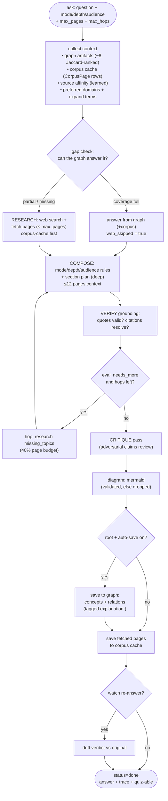
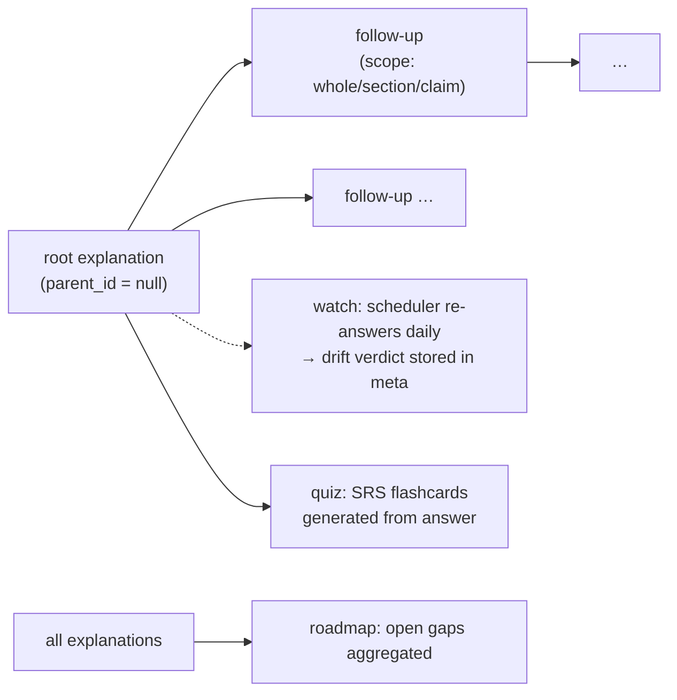

# Explainer pipeline

`app/explainer.py` (~1300 lines) — turns a question into a researched,
illustrated, grounded answer with citations, threads, quizzes, and drift
watching. `run_explainer(exp_id)` runs in a background thread; the GUI polls
`Explanation.status` plus a `phase` field in `meta`
(`researching → composing → critique → saving → done`).

Related: [architecture](architecture.md) · [data-model](data-model.md) ·
[frontend](frontend.md)

## Pipeline flowchart



## Inputs

| Dimension | Values | Effect (`DEPTH_PLAN`) |
|---|---|---|
| `mode` | `explain`, `deep_dive`, `compare`, `tutor`, `critique`, `tldr`, `glossary`, `api_ref` | section rules + tone |
| `depth` | `shallow` (3 pp / 3 § / 2k tok), `balanced` (6 / 5 / 4k), `deep` (8 / 7 / 6k + section plan) | research budget |
| `audience` | `beginner`, `intermediate`, `advanced` | jargon/analogy policy |
| `max_hops` | 0 (default; 1 when `depth=deep`) | research–compose loops |

## Grounding & trust

- **Quote validation** (`_quote_valid`): every quoted claim must appear in a
  cited page; violations are recorded in `answer.grounding` and the trace.
- **Source affinity** (`_source_affinity`): thumbs up/down feedback on claims
  (`POST /explanations/{id}/feedback`) re-ranks domains for future research.
- **Corpus memory** (`CorpusPage`, unique per investigation+URL): every fetched
  page is cached with text/images/date, so repeat questions cost no fetches.
- **Provenance trace** (`Explanation.trace` JSON): queries, hits, fetched pages
  with keep/drop, timings, coverage/gaps, hops, critique count, diagram type.

## Threads, quiz, roadmap, watch



- Follow-ups reuse the parent's excerpt as a synthetic cited source
  (`explanation://{id}`); `thread_id` groups the conversation.
- `POST …/investigate_gaps` launches the collection agent on the open gaps
  (`launch_run_with_goal`, trigger `explainer_gap`) — the loop closes itself.
- Watched roots are re-answered daily by the scheduler; the new child carries
  `meta.watch_of` and a `drift` verdict vs. the original.

## Suggestions, gaps, investigation summary

- `GET …/explanations/{id}/suggestions` ("Next questions"): trace items and
  graph artifacts ranked by overlap against the question+answer intent, most
  plausible first. Trace items clear a low bar (0.2); graph artifacts need
  0.45 plus corpus-distinctive mass (half their matched terms rare in the
  investigation), near-dupes collapse, and thin strips refill from the
  answer's own section headings. Never invented.
- `GET …/investigations/{id}/research-gaps`: open questions ranked by
  supporting-artifact coverage (novel first) plus tag-novel areas;
  `POST …/research-gaps/run` launches a paper-first goal run on the
  least-covered ones.
- `GET …/investigations/{id}/summary`: executive summary (model prose with
  a 45s bound, deterministic factual brief on failure), the query brief it
  started from, review-flag counts, top artifacts by relevance, top threats
  and recent explanations, novel areas, one deterministic evidence diagram
  (brief → artifacts → answered questions), and every answered question with
  an excerpt plus its supporting collected artifacts. Rejected artifacts are
  flagged out of the evidence everywhere. Shown in the brief panel's Executive
  summary overlay, in the Mapper's Summary sub-tab, and reused verbatim by the
  security pane's Investigation sub-tab.
- `POST …/investigations/{id}/summary/regenerate`: recompute the summary from
  the current review flags (same payload, plus `regenerated: true`), logged to
  the ledger — the Summary sub-tab's Regenerate button calls this.
- `GET …/investigations/{id}/recommendations`: the same gaps, plus the three
  derived recommendations — **coverage gaps** (which frameworks/controls have
  no supporting artifact), **control leverage** (which threat's residual score
  would move most per point of efficacy gained), and **stale brief** (a
  security assessment older than the evidence underneath it). Each names the
  action and the artifact that justifies it; nothing is suggested that the
  graph cannot cite.

## Answer JSON (stored in `Explanation.answer`)

```json
{
  "summary": "…",
  "sections": [{"heading": "…", "body_md": "…", "claims": [
    {"text": "…", "sources": [{"url": "…", "quote": "…"}]}]}],
  "key_points": ["…"],
  "sources": [{"url": "…", "title": "…", "published": "…"}],
  "diagram": {"mermaid": "flowchart …", "diagram_type": "…"},
  "critique": ["…"],
  "grounding": {"…": "…"},
  "quiz": null,
  "as_of": "2026-…"
}
```

## The write guard on the way out

`app/writeguard.py` is the last thing an answer passes through, and it is
deliberately boring: **audit → repair → strip → drift gate**, in that order.

- **audit** — every claim's citations are checked against the pages actually
  fetched; anything unresolvable is a finding, not a silent omission.
- **repair** — a missing citation is retried once against the corpus cache
  before being accepted as a finding.
- **strip** — a claim that still cannot be supported is removed from the
  rendered answer, and the removal is recorded, so the answer is shorter
  rather than wrong.
- **drift gate** — when the answer is a watch re-answer, the drift verdict is
  computed *before* the new answer is stored, and a `major` verdict is
  surfaced to the reader rather than swapped in silently.

Pinned in `tests/test_writeguard.py`; the ordering itself is asserted, so
adding a step that would let an unaudited claim reach storage fails CI.

## Related

[architecture](architecture.md) · [data-model](data-model.md) ·
[frontend](frontend.md) · [../design/interaction.md](../design/interaction.md)
