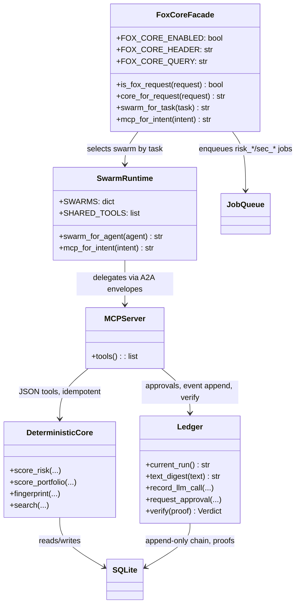
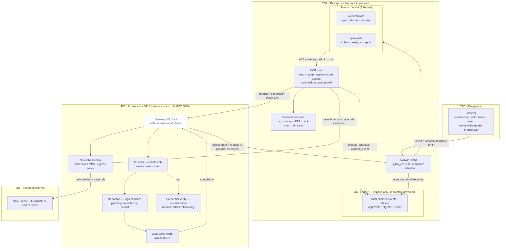

# Fox Security Research Core — switchable core, swarm orchestration

The **Fox Security Research Core** is the switchable orchestration engine
behind the Agentic Knowledge Mapper. Classic mode drives a single
`security_agent` directly; the Fox core runs the same deterministic spine
(register, scoring, ledger, KB) through a **structured swarm of long-lived
agent roles** that talk to **MCP tools** over an A2A bus. Same data, same
numbers, different orchestration — and a ledger that can prove which core
served each run.

> Design spec: [../design/fox-core.md](../design/fox-core.md) · Privacy:
> [privacy.md](privacy.md) · Architecture: [architecture.md](architecture.md)

## What it is

`app/fox_security_research_core.py` is a thin facade over four swarms and the
MCP tool layer. When `FOX_CORE_ENABLED=1` and a request opts in
(`X-Fox-Core: fox` header or `?core=fox`), the API routes through the swarm
orchestrators; otherwise the Classic path runs. The ledger records
`core: fox` vs `core: classic` per run, so the audit can prove which path
produced a result.

```text
GUI ── API ── Job queue ── Swarm runtime (A2A bus) ── MCP tools ── deterministic core ── SQLite/ledger
```

## UML — the core as components



Every layer below the facade is shared with Classic where possible. The two
cores converge on the same spine and differ only in *how the LLM is
orchestrated*.

## The agent swarm

Four role-stable swarms, defined in `app/swarm.py` — a few long-lived role
types, many short-lived tasks (not N personalities):

| Swarm | Agents | Delivers |
|---|---|---|
| **Knowledge** | collector-orchestrator, research-collector, explainer, drift-judge | collection, explanation, drift |
| **Assessment** | security-orchestrator, model-eval-orchestrator, control-analyst, model-mitigation-analyst, threat-intel, model-adv-intel, provider-posture, report-writer | internals / misuse / model reviews |
| **Risk** | risk-orchestrator, risk-intake, risk-triage, risk-treatment, risk-monitor, risk-governance, risk-reporter | sync · review · decide · enrich |
| **Portfolio** | manager-orchestrator, synthesizer | run synthesis, briefs |

Shared roles: research-collector, profiler, `mcp-search`. Orchestrators
delegate via **A2A envelopes** (`task_id` = ledger run id); specialists call
**MCP tools**; the deterministic core is never reimplemented in a prompt.

MCP servers (`app/mcp/*`): `search`, `graph`, `register`, `score`, `assess`,
`index`, `ledger`, `catalog`, `brief`. All tools are idempotent, JSON-only,
and never silently accept risk or change pack constants.

## How it improves workflow

- **GUI is a projection.** Risk Console and Classic call APIs only; no agent
  logic lives in the browser, so the same workflow runs from either surface.
- **Structured, not chat.** Orchestrators plan, specialists execute, and the
  flow is a pipeline: `plan → collect → analyze → score → report`, with
  fan-out/fan-in for manager topics and parallel provider posture.
- **Reactive triggers.** `assessment.done → risk_sync`, `CVE → risk_review` —
  the swarm reacts to state changes instead of polling prompts.
- **Human gates.** Treatment/acceptance suspend the job and resume only after
  `mcp-ledger request_approval`; the resume is itself ledgered.
- **One risk spine.** The unified register + `risk_scoring` feed the Console,
  briefs, and every agent, so no agent holds its own copy of the truth.
- **Job leases + shared caches.** One `risk_sync` per assessment id, shared
  collector cache, deduped queries.

## How it improves efficiency

- **GPU inference.** All LLM calls route to the fox-services GPU node
  (`axiom-1`, 2× RTX 5080) — no fallback, no silent hop to a peer. Cold loads
  are fast and parallel agentic calls stop contending for one CPU model slot.
- **Numbers come from code.** `risk-triage` calls `mcp-score`; scoring,
  pack math, FTS and priority are deterministic (`risk_scoring`), idempotent
  via `inputs_hash`. The LLM plans, judges and drafts — it never renumbers a
  register row, so it cannot silently drift the numbers.
- **One inference choke point.** Every model call goes through
  `app/llm.py:chat`, which records tokens + latency + gateway proof once.
  Adding a swarm cannot bypass it.
- **Stored, not regenerated.** Diagrams are read from the stored figure set;
  briefs and dossiers reuse the same assembly, so nothing is recomputed on
  every read.

## How it improves privacy

- **One exit.** The only path that can reach the open internet is through the
  fox-services node (TB2), carrying search terms and page URLs — never the
  corpus, credentials, or pack constants. See the trust boundaries in
  [../design/privacy.md](../design/privacy.md).
- **Digests, not content.** The ledger records `prompt_sha256`/`output_sha256`
  and gateway proof ids — not prompt text. `ledger._redact` scrubs strings
  before any row is written, and the append-only chain makes edits detectable.
- **Local-only inference.** Prompts/completions stay inside the LAN to the GPU
  node; `LLM_FALLBACK_URL` is empty, so nothing fails over to a mesh peer.
- **Approval gates + PII hygiene.** High-stakes writes require a human
  `Mandate`; the broker computes PII counts per request and `writeguard`
  tier-gates provider/model writes.
- **Sandboxed fetching.** Page fetches go through the fox-services OpenShell
  broker, never a direct fetch.
- **Verifiable offline.** `ledger.verify_export` replays a run's digests,
  claims and approvals with no network.

## Privacy guarantees (by design)

Guarantees the core inherits from the shared spine, plus a few the swarm
orchestration adds. Every claim names the code that enforces it:

| # | Guarantee | Enforced by |
|---|---|---|
| P1 | Prompts/completions never leave the app to the open internet | `app/llm.py` → fox-services GPU node only (`LLM_FALLBACK_URL` empty, `_bases()` yields a single base) |
| P2 | Nothing secret is written into audit rows | `app/ledger.py` `_redact` — strings scrubbed, only counts/digests survive |
| P3 | Every LLM call is provably linked to its run | `ledger.record_llm_call` — `text_digest(prompt)` + `text_digest(output)` + `gateway.request_id`/`proof` recorded; `verify_proof`/`verify_export` replay it |
| P4 | A human must approve high-stakes writes | `mcp-ledger request_approval` gate on treatment/acceptance; `ledger.Mandate` records the verdict |
| P5 | PII is kept out of agent-facing context | fox-services broker computes `pii_counts`/`pii_max_level` per request; `writeguard` tier-gates provider writes |
| P6 | No silent risk acceptance | risk triage calls `mcp-score` (deterministic) — the LLM judges, never numbers a register row by itself |
| P7 | Telemetry is digest-only (and off by default) | `llm._report_proof` sends only `prompt_sha256`/`output_sha256` + metadata, never content; requires `FOX_TELEMETRY_URL` |
| P8 | Fetching is sandboxed | every page fetch goes through the fox-services OpenShell broker, never a direct fetch |

## Trust boundaries with the new core — what data flows and why

The fox path adds orchestration *inside* TB1 (swarm + MCP) but does **not** add
a boundary: every LLM call and every fetch still crosses exactly one exit — the
fox-services node. What the core changes is *what the ledger can prove*:
because orchestration is structured (A2A envelopes + MCP), each step is a
recordable event with a digest.



| Boundary | What flows | What fox-services does with it | Why it must flow | Never crosses |
|---|---|---|---|---|
| TB0 → TB1 | the person's intent, session id, actor name (loopback HTTP) | — (not seen by fox-services) | the app must know who asked and what for, so it can mandate, redact and ledger the run | model credentials, browser secrets |
| TB1 → TB1a | `task_id`, event chain, proof hashes, verdicts | — (ledger, same app) | the audit must replay who ran, which model, and what was approved | prompt/output text (redacted to digests) |
| TB1 → TB2 | prompt + completion for the chosen local model | **PII-scan** (records field counts only), **redacts** logs, attributes to `X-Service-Name`, returns a **digest proof** + request id; optional **credential verify** returns the redacted form only | the LLM plans, judges and drafts; it runs only on the local GPU node inside the LAN | corpus, credentials, pack constants (values never stored) |
| TB2 → TB3 | search terms and page URLs | routed through the **OpenShell broker sandbox** with an egress policy | collection must reach public sources (RSS, arXiv, web) to gather evidence | the corpus, any secret, model weights |
| TB1a | app-generated claims: who ran, what model, digests, approvals | — (ledger crosses no boundary) | the ledger is the single provable record | anything redacted by `ledger._redact` |

The only path that can reach TB3 is through the fox-services node (TB2), and
it carries queries/URLs — never the corpus or credentials. Inside TB2 every
prompt is PII-scanned (counts only) and its logs redacted before it reaches
the local GPU model, so the value never persists; the ledger (TB1a) crosses
no boundary at all, and its export is verifiable offline without any network.

## Privacy offered by fox-services

TB2 is more than a wire — the fox-services node (the gateway the Mapper and
every model call go through) has its own privacy layer, applied before any
prompt is answered:

| Fox-services guarantee | What it does | Why it matters for the core |
|---|---|---|
| **PII scanning, values never stored** | Every prompt is scanned (`app/pii.py` + `_content_signals`) and only *counts* of sensitive field types (SSN, credit card, email, phone, …) with a per-field sensitivity label are recorded — `pii_counts`, `pii_total`, `pii_max_level` | The core can see *that* a request touched PII and at what sensitivity, without the value ever being persisted |
| **Redaction at the gateway** | `app/redact.py` `redact()`/`sanitize()`/`redact_bytes()` scrub request bodies and headers from logs; peer logs are redacted by default | Prompts can never show up verbatim in fox-services logs or forwarded logs |
| **Credential verify without exposure** | `/api/credentials/verify` compares a presented credential to the expected one in constant time (`hmac.compare_digest`), never logs either side, and returns only the redacted form + kind + length | A leaked value can be checked against the registry and *proven* redacted, without ever re-exposing the secret |
| **Per-service attribution** | Every request carries `X-Service-Name` and is recorded under it | The audit can attribute every prompt to the service that sent it — accountability without a shared account |
| **Digest-only proofs/telemetry** | Gateway request ids + proofs link a call; telemetry reports carry `prompt_sha256`/`output_sha256`, never content | The ledger's per-call digests match the gateway's proofs, so a call is provable end-to-end |
| **Sandboxed fetching (OpenShell broker)** | Page fetches run inside a managed sandbox with an egress policy; no direct fetch | Collection can reach the web without the Mapper ever holding a raw connection to an arbitrary host |
| **Loop guard** | `X-Fox-Forwarded` stops a peer from forwarding back to the originating node | No request can bounce between peers and leak where it came from |

Net effect: the Mapper decides *what* to send (intent, digests, queries/URLs),
fox-services decides *what to keep and how to prove it* (counts, redacted
logs, constant-time checks, digest proofs), and the ledger records *what
happened* — the three never need to see each other's plaintext.

## Switching cores

- Env `FOX_CORE_ENABLED=1` (default on).
- Per request: `X-Fox-Core: fox` or `?core=fox` (the Console/Classic dropdown
  sets it for every API call).
- Ledger rows record `core: fox | classic`, so the audit can prove which path
  served each result.