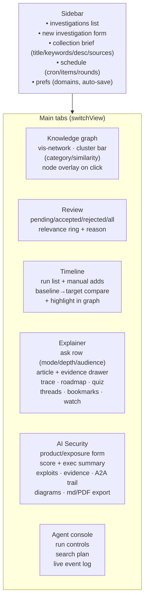
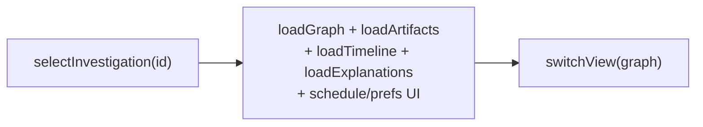

# Frontend guide

`static/index.html` — a single-file vanilla-JS SPA (vis-network for the graph,
lazy-loaded mermaid for diagrams, no build step). Layout: header, sidebar,
main tab area.

Related: [architecture](architecture.md) · [agent-loop](agent-loop.md) ·
[explainer](explainer.md) · [security-agent](security-agent.md)

## View map

## Key flows

**Select investigation → work it.** `selectInvestigation(id)` loads brief,
graph, review queue, timeline, explanations, prefs. All tab loaders are scoped
by the global `currentInv`.

**Run the collection agent.** `startRun()` saves the brief, `POST …/run`,
then `watchRun()` polls `GET /runs/{id}/events?after_id=` every 2 s and
appends stage-colored entries; on `done` it refreshes graph, review count,
timeline, and investigations.

**Ask the explainer.** `askExplainer()` posts question + mode/depth/audience,
then polls the explanation until `done`; renders the article, evidence drawer,
trace panel, mermaid diagrams (lazy-loaded `mermaid@10` once, `run({nodes})`),
suggestions, quiz, and follow-up composer.

**Security assessment.** `runSecurityAssessment()` posts product + exposure,
polls the run's events into a compact stage log, then loads the finished
`SecurityAssessment` by `stats.assessment_id` and renders score, executive
paragraph, threat register, exploits/evidence tables, A2A trail with queries,
mermaid diagrams, full markdown, and md/PDF/history actions.

## Conventions

- `escHtml()` for all interpolated strings; `mdInline`/`mdBlock` for light
  markdown; `showNotif()` for toasts; `debounce()` on search input.
- Dark/light theme via CSS variables + `localStorage`.
- Node click → detail overlay (`openDetailOverlay`): description, source link,
  relationships, similar artifacts with shared tags.
- Compare mode: `compareRuns()` diffs two runs (`new_node_ids/new_edge_ids`),
  `highlightInGraph()` spotlights them; banner clears.
