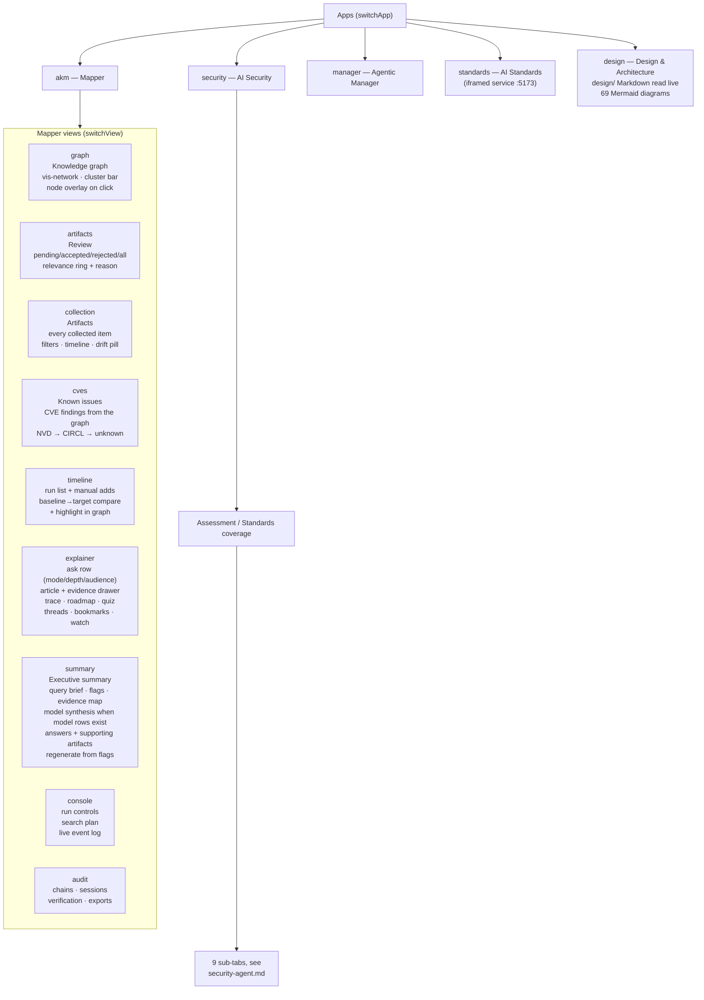
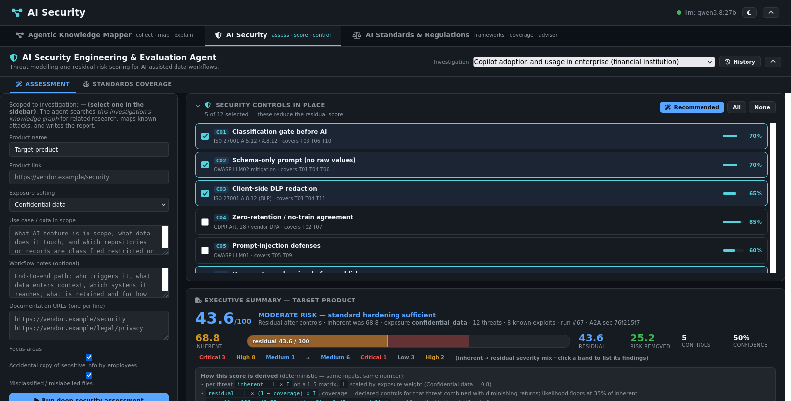
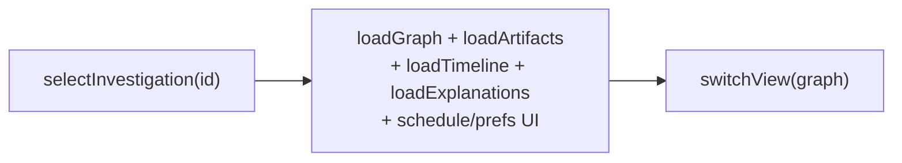
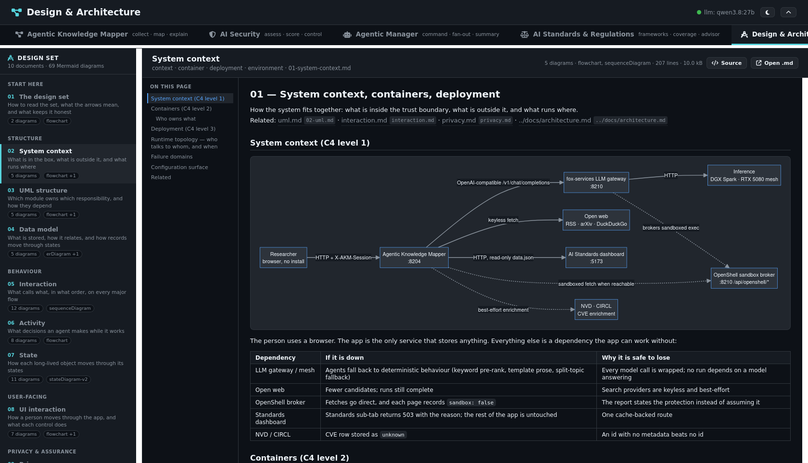

# Frontend guide

`static/index.html` — a single-file vanilla-JS SPA (vis-network for the graph,
lazy-loaded mermaid for diagrams, no build step). Layout: header, sidebar,
main tab area.

Related: [architecture](architecture.md) · [agent-loop](agent-loop.md) ·
[explainer](explainer.md) · [security-agent](security-agent.md)

## View map

`switchApp()` selects one of **five apps**; `switchView()` selects one of the
**nine Mapper views**. This is the distinction that trips people up: AI
Security, Agentic Manager, AI Standards and Design & Architecture are sibling
*apps*, not tabs inside the Mapper, and the Mapper's own view list does not
include them.

## Sidebar

The sidebar is shared across the Mapper views and carries the brief
(title / keywords / description / sources), the schedule, the prefs, the
investigation list — with manager summaries nesting their topics, expandable
and expanded by default — and the two loop-closing buttons, **Executive
summary** and **Find open gaps**.

## Key flows

**Select investigation → work it.** `selectInvestigation(id)` loads brief,
graph, review queue, timeline, explanations, prefs. All tab loaders are scoped
by the global `currentInv`.

**Run the collection agent.** `startRun()` saves the brief, `POST …/run`,
then `watchRun()` polls `GET /runs/{id}/events?after_id=` every 2 s and
appends stage-colored entries; on `done` it refreshes graph, review count,
timeline, and investigations.

**Ask the explainer.** `askExplainer()` posts question + mode/depth/audience,
then polls the explanation until `done`; renders the article, evidence drawer,
trace panel, mermaid diagrams (lazy-loaded `mermaid@10` once, `run({nodes})`),
suggestions, quiz, and follow-up composer.

**Security assessment.** `runSecurityAssessment()` posts product + exposure
plus the chosen `assessment_mode`, polls the run's events into a compact stage
log, then loads the finished `SecurityAssessment` by `stats.assessment_id` and
renders the sub-tabs — Overview, Threats, Controls, Investigation, Evidence,
Known issues, Agents, Audit chain, Report. Each sub-tab loads its own route on
selection and retries in place on failure, so a slow or unreachable sub-tab
does not block the report behind it.

**One report, four questions.** The report renders from
`data.assessment_path`, because the three model paths answer different
questions with different numbers and the UI must not let one be read as
another:

| Path | What the number is | Register | Hidden |
|---|---|---|---|
| standard catalog | residual risk after controls (L×I) | Threat & risk | — |
| `model` | dimension weighting | Threat & risk | Controls, what-if |
| `model_adversarial` | misuse potential | Misuse scenario (prerequisites) | Controls, what-if |
| `model_hypothesis` | confidence in the claims | Hypothesis (refuted-by) | Controls, what-if |

Model paths get a weighted-dimension strip instead of the catalog
inherent→residual gauge, because printing "risk removed" for a number that
never subtracted anything invents a control effect the run never measured. The
Controls tab lists the catalog control plan, so it is removed on model paths
rather than showing a checklist the run never consulted. Hypothesis colour is
teal, not the risk scale: higher confidence is good news.

For a model subject the form exposes a mode selector (internals / adversarial /
hypothesis / auto), revealed by the debounced `secClassifySubject()`
classification call; the choice is sent with the run and echoed back in the
response, so the pipeline shown is the pipeline that ran. Hypothesis is never
inferred from wording — the selector is the only way to ask for it.

**Manager command.** `parseManagerCommand()` previews the plan with no side
effects, the user edits topics/exposure/launchers, `runManagerCommand()`
creates the fan-out, and the runs poll derives per-topic status live. Each run
card's **Flow** and **View summary** toggles are pure reads against
`/timeline` and the synthesis artifact.

**Job states in the UI.** A run waiting on an approval renders as
`awaiting_approval` with the proposed control plan and the Approve / Reject
buttons, not as a spinner — a blocked run is visibly blocked.

## Conventions

- `escHtml()` for all interpolated strings; `mdInline`/`mdBlock` for light
  markdown; `showNotif()` for toasts; `debounce()` on search input.
- Dark/light theme via CSS variables + `localStorage`.
- Node click → detail overlay (`openDetailOverlay`): description, source link,
  relationships, similar artifacts with shared tags.
- Compare mode: `compareRuns()` diffs two runs (`new_node_ids/new_edge_ids`),
  `highlightInGraph()` spotlights them; banner clears.
- Synthesis artifacts render through a dependency-free markdown renderer in
  the detail overlay; other artifacts keep their plain-text view.

## Design & Architecture app

The fifth app reads `design/` over `GET /api/design/docs` and renders it in the
page. The point is that the diagrams people read are the ones in the repo: a
screenshot of a diagram that has since changed cannot be distinguished from a
correct one, so the viewer renders the Markdown and hands the Mermaid to the
same renderer the rest of the app uses.

`mmRender()` runs every diagram through one app-wide queue, sequentially, never
`Promise.all`. Mermaid measures label text in shared global state, so two
`run()` calls in flight measure each other's labels: the losers come back too
small and their text lands on neighbouring elements, differently on every load.
If you are tempted to parallelise it for speed, re-read that sentence first.

`mmFixContrast()` rechecks every label after render against the colour actually
behind it, using computed paint rather than inline style — Mermaid's injected
theme paints most fills through its own stylesheet. The viewer relies on the
same mechanism: its clone keeps a rewritten copy of the SVG id so the id-scoped
theme rules keep matching. Break either half and diagrams go monochrome.

- **Rail** — the ten documents in reading order, grouped (Start here →
  Structure → Behaviour → User-facing → Privacy & assurance). Each row carries
  the question it answers and its diagram count, read from the file rather than
  hard-coded.
- **Document** — `designRender()` is a small block-level Markdown renderer
  (headings, tables, lists, fences, blockquotes, hr) that emits
  `
<pre class="mermaid">` for Mermaid fences. It is
  deliberately not a general-purpose parser: it covers what these files use.
- **Outline** — h2/h3 anchors with a scroll spy, hidden in source view.
- **Source toggle** — the same document as raw Markdown, for checking a
  diagram against the text around it.
- **Deep links** — the selected document is in the fragment (`#design/privacy`),
  and a `hashchange` listener picks it up so a pasted link works in an open tab.
  An id that is not in the index falls back to the first document.
- **Viewer** — the enlarge button on every diagram opens it across the whole tab
  at its natural size, with zoom (wheel, `+`/`-` buttons and keys, 10%–800%),
  drag pan, double-click toggling fit/natural, `←`/`→` stepping through the
  document's diagrams, and `Esc` to close. The viewer clones the already-rendered
  SVG; it never re-runs Mermaid, so opening it cannot re-race a render.

Relative links and images inside these documents point at files the API does
not serve, so they render as a visible path reference (`.design-ref`) rather
than an anchor that 404s. `app/design_docs.py` resolves a document only by
looking its id up in a fixed index — a traversal attempt is a 404, exactly like
an unknown id.

## Screens

Captured from a real browser session against the live app; see the full index
in the [README](../README.md).

| Screen | File | Screen | File |
|---|---|---|---|
| Knowledge graph | [01](screenshots/01-knowledge-graph.png) | Artifacts | [14](screenshots/14-artifacts-collection.png) |
| Review queue | [02](screenshots/02-review-queue.png) | Known issues | [15](screenshots/15-known-issues.png) |
| Explainer | [03](screenshots/03-explainer.png) | Research gaps | [16](screenshots/16-research-gaps.png) |
| Audit timeline | [04](screenshots/04-audit-timeline.png) | Executive summary | [17](screenshots/17-executive-summary.png) |
| Security report | [05](screenshots/05-security-report.png) | Manager summary | [18](screenshots/18-manager-summary.png) |
| fox-services | [06](screenshots/06-fox-services.png) | Security controls | [19](screenshots/19-security-controls.png) |
| Security sub-tabs | [07](screenshots/07-security-subtabs.png) | Threat assessment | [20](screenshots/20-security-investigation-summary.png) |
| Standards matrix | [08](screenshots/08-standards-matrix.png) | Security evidence | [21](screenshots/21-security-evidence.png) |
| Standards detail | [09](screenshots/09-standards-detail.png) | Security agents | [22](screenshots/22-security-agents.png) |
| Findings single | [10](screenshots/10-findings-single.png) | Security audit chain | [23](screenshots/23-security-audit-chain.png) |
| Findings compare | [11](screenshots/11-findings-compare.png) | Standards dashboard | [24](screenshots/24-standards-dashboard.png) |
| Manager flow | [12](screenshots/12-manager-flow.png) | Manager nesting | [13](screenshots/13-manager-nest.png) |
| Design & Architecture | [25](screenshots/25-design-architecture.png) | Design viewer (zoom) | [26](screenshots/26-design-viewer.png) |
| Executive summary sub-tab | [27](screenshots/27-summary-tab.png) | | |

### Model security synthesis (Summary tab, node overlay, security pane)

When the investigation holds model-path rows, `GET /summary` carries a
`model_synthesis` block: the latest stored row per workflow that has run
(internals, misuse, and the hypothesis synthesis only when it exists), each
with its own headline number and meaning, top items, exec paragraph, and
mermaid diagram. The Summary tab and the node overlay render the same block
from the same payload, so the two can never disagree; the security
investigation pane shows the compact three-number strip. Nothing is merged
and nothing is ranked across workflows -- a confidence is not comparable to
a risk, so the sections sit side by side with their meanings attached.
