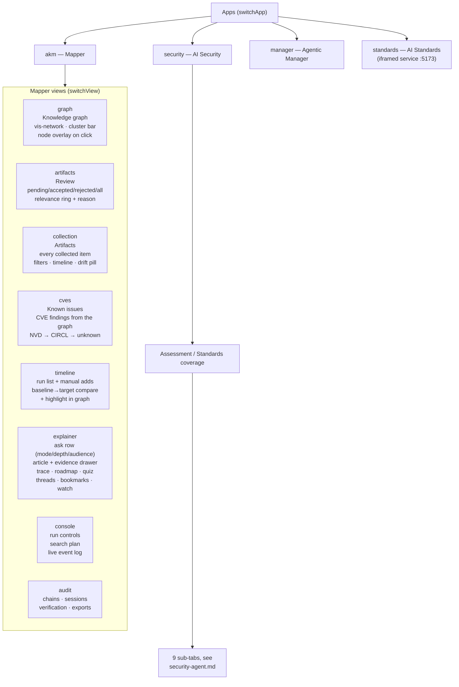
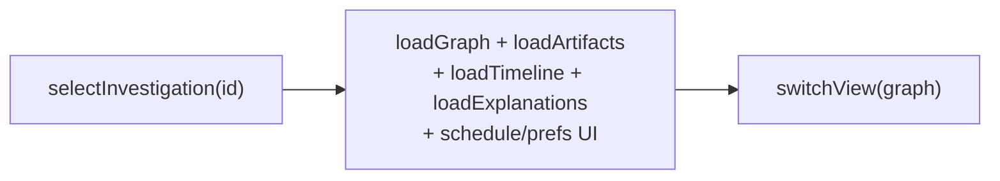

# Frontend guide

`static/index.html` — a single-file vanilla-JS SPA (vis-network for the graph,
lazy-loaded mermaid for diagrams, no build step). Layout: header, sidebar,
main tab area.

Related: [architecture](architecture.md) · [agent-loop](agent-loop.md) ·
[explainer](explainer.md) · [security-agent](security-agent.md)

## View map

`switchApp()` selects one of **four apps**; `switchView()` selects one of the
**eight Mapper views**. This is the distinction that trips people up: AI
Security and Agentic Manager are sibling *apps*, not tabs inside the Mapper,
and the Mapper's own view list does not include them.

## Sidebar

The sidebar is shared across the Mapper views and carries the brief
(title / keywords / description / sources), the schedule, the prefs, the
investigation list — with manager summaries nesting their topics, expandable
and expanded by default — and the two loop-closing buttons, **Executive
summary** and **Find open gaps**.

## Key flows

**Select investigation → work it.** `selectInvestigation(id)` loads brief,
graph, review queue, timeline, explanations, prefs. All tab loaders are scoped
by the global `currentInv`.

**Run the collection agent.** `startRun()` saves the brief, `POST …/run`,
then `watchRun()` polls `GET /runs/{id}/events?after_id=` every 2 s and
appends stage-colored entries; on `done` it refreshes graph, review count,
timeline, and investigations.

**Ask the explainer.** `askExplainer()` posts question + mode/depth/audience,
then polls the explanation until `done`; renders the article, evidence drawer,
trace panel, mermaid diagrams (lazy-loaded `mermaid@10` once, `run({nodes})`),
suggestions, quiz, and follow-up composer.

**Security assessment.** `runSecurityAssessment()` posts product + exposure,
polls the run's events into a compact stage log, then loads the finished
`SecurityAssessment` by `stats.assessment_id` and renders the nine sub-tabs —
Overview, Threats, Controls, Investigation, Evidence, Known issues, Agents,
Audit chain, Report. Each sub-tab loads its own route on selection and retries
in place on failure, so a slow or unreachable sub-tab does not block the
report behind it.

**Manager command.** `parseManagerCommand()` previews the plan with no side
effects, the user edits topics/exposure/launchers, `runManagerCommand()`
creates the fan-out, and the runs poll derives per-topic status live. Each run
card's **Flow** and **View summary** toggles are pure reads against
`/timeline` and the synthesis artifact.

**Job states in the UI.** A run waiting on an approval renders as
`awaiting_approval` with the proposed control plan and the Approve / Reject
buttons, not as a spinner — a blocked run is visibly blocked.

## Conventions

- `escHtml()` for all interpolated strings; `mdInline`/`mdBlock` for light
  markdown; `showNotif()` for toasts; `debounce()` on search input.
- Dark/light theme via CSS variables + `localStorage`.
- Node click → detail overlay (`openDetailOverlay`): description, source link,
  relationships, similar artifacts with shared tags.
- Compare mode: `compareRuns()` diffs two runs (`new_node_ids/new_edge_ids`),
  `highlightInGraph()` spotlights them; banner clears.
- Synthesis artifacts render through a dependency-free markdown renderer in
  the detail overlay; other artifacts keep their plain-text view.

## Screens

Captured from a real browser session against the live app; see the full index
in the [README](../README.md).

| Screen | File | Screen | File |
|---|---|---|---|
| Knowledge graph | [01](screenshots/01-knowledge-graph.png) | Artifacts | [14](screenshots/14-artifacts-collection.png) |
| Review queue | [02](screenshots/02-review-queue.png) | Known issues | [15](screenshots/15-known-issues.png) |
| Explainer | [03](screenshots/03-explainer.png) | Research gaps | [16](screenshots/16-research-gaps.png) |
| Audit timeline | [04](screenshots/04-audit-timeline.png) | Executive summary | [17](screenshots/17-executive-summary.png) |
| Security report | [05](screenshots/05-security-report.png) | Manager summary | [18](screenshots/18-manager-summary.png) |
| fox-services | [06](screenshots/06-fox-services.png) | Security controls | [19](screenshots/19-security-controls.png) |
| Security sub-tabs | [07](screenshots/07-security-subtabs.png) | Threat assessment | [20](screenshots/20-security-investigation-summary.png) |
| Standards matrix | [08](screenshots/08-standards-matrix.png) | Security evidence | [21](screenshots/21-security-evidence.png) |
| Standards detail | [09](screenshots/09-standards-detail.png) | Security agents | [22](screenshots/22-security-agents.png) |
| Findings single | [10](screenshots/10-findings-single.png) | Security audit chain | [23](screenshots/23-security-audit-chain.png) |
| Findings compare | [11](screenshots/11-findings-compare.png) | Standards dashboard | [24](screenshots/24-standards-dashboard.png) |
| Manager flow | [12](screenshots/12-manager-flow.png) | Manager nesting | [13](screenshots/13-manager-nest.png) |

