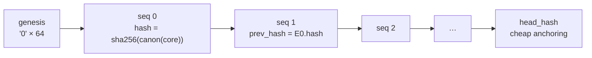
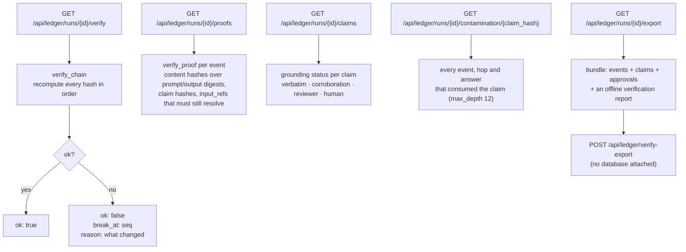
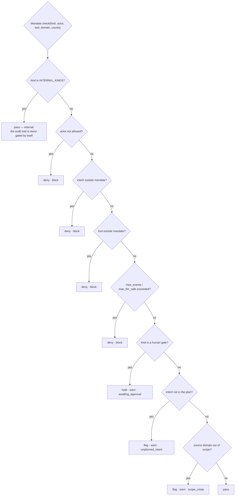
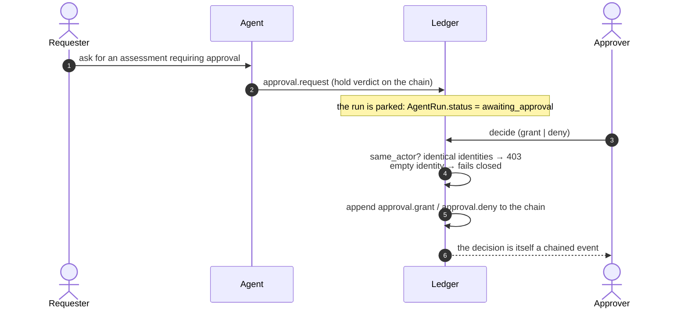
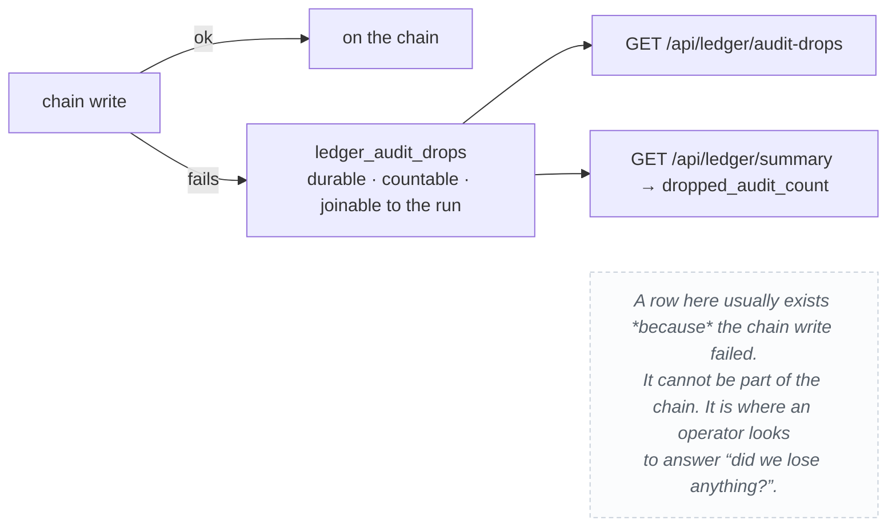

# The audit ledger

Every agent step, model call, tool call, and human action in one hash-chained,
independently verifiable log. This is the document for *how the ledger works*;
[privacy.md](privacy.md) is the document for what it means for your data, and
[../design/controls.md](../design/controls.md) is the control catalogue.

The ledger is not a log file. It is a content-addressed structure designed so
that the party being audited cannot quietly change what it says.

## What gets recorded

| Record | Emitted by | Carries |
|---|---|---|
| `run.start` / `run.end` | `RunCtx`, `scope` | the mandate in force, close status |
| `llm.call` | `RunCtx.llm` | model, `prompt_hash`, completion, tokens, latency, `x-served-model`, gateway proof id |
| `mcp.call` | `RunCtx.mcp` | server, tool, args (redacted), output, ok, latency, domain |
| `agent.hop` | `RunCtx.hop` | sender → recipient, A2A envelope, intent, task id, payload digest |
| `gate.check` | `RunCtx.gate` | what was decided and why, with the verdict |
| `claim.emit` / `claim.verify` | `RunCtx.claim` | claim text, citations, grounding verdict, verifier |
| `approval.request` / `.grant` / `.deny` | `RunCtx.ask` / `.decide` | requester, decider, subject hash — never the same person |
| `run.anchor` | `anchor_run` | a task adopted into a session, in order |
| `source.fetch` | `RunCtx.source` | URL, kept/dropped, the OpenShell `sandbox` flag |
| `drift.detect` / `drift.judge` | `detect_drift` | the candidate set and the verdict |
| `human.*` | `record_human` | actor, action, detail, on the run or the session spine |
| `audit.dropped` | `_record_drop` | a chain write that failed |

Actor types are a fixed set: `agent`, `llm`, `mcp`, `a2a`, `human`, `system`.
Verdicts: `pass`, `allow`, `deny`, `flag`, `hold`, `block`, `grant`.
Severities: `info`, `warn`, `block`.

## The hash chain



The hashed core is exactly eleven fields:

```python
CORE_FIELDS = ("run_id", "seq", "ts", "actor_type", "actor", "kind",
               "intent", "verdict", "severity", "data", "prev_hash")
```

`canon()` is `json.dumps(sort_keys=True, separators=(",", ":"), ensure_ascii=False, default=str)` —
canonical because a hash that changes with dict ordering or Python version
would be useless as evidence.

### Two columns are deliberately *outside* the hash

| Column | Why it is not hashed |
|---|---|
| `proof_json` | It is derived state. Verification recomputes it and reports drift rather than trusting the stored copy. |
| `trace` | It says *when* and *under which request* a record was written, not what the record claims. Folding it into `data_json` would change every event hash and break verification of every run already on disk. |

Both are documented in `app/ledger_models.py` in the same words, because this
is the kind of decision that looks like a mistake six months later.

### The timestamp is a string

`ts` is an ISO-8601 **string**, not a `DateTime`. Audit needs the exact authored
timestamp with its offset preserved, and lexicographic order must equal
chronological order.

## Runs, tasks, and sessions

One `ledger_runs` row is a spine. Two kinds share the machinery:

- `kind='task'` — one piece of work (an A2A task, an agent run). Its chain
  holds the actual events.
- `kind='session'` — a sitting. Its chain holds **one `run.anchor` event per
  adopted task, in adoption order**. Each task still verifies on its own, and
  the session chain independently proves the order they happened in.

The run id is **caller-supplied**, not an autoincrement, so an external
orchestrator can key the ledger by its own correlation id. In this app the A2A
task id doubles as the ledger run id, which is how a security report and its
evidence chain stay bound together.

## Verification



`verify_chain` recomputes `sha256` over each canonical core and walks the chain
from genesis. Any edit to `data_json` — a single character — moves the hash and
the walk stops, naming the exact `seq`.

`verify_proof` is the layer *above* the chain. It checks that the things a
record points at still resolve: the prompt hash, the output digest, the claim
hash, and every `input_ref`. A record can be internally perfect and still be
lying about where its data came from; proofs catch that.

### Offline verification

The export bundle verifies with no database attached, which is the whole point:

```python
verify_export(doc)   # app/ledger.py
```

You can hand the JSON to someone who has never run this app, and they can check
it with a hundred lines of Python. Trust does not require trusting the server
that made the claim.

## Contamination analysis

`contamination(run_id, ref, max_depth=12)` walks backwards from a claim hash
through every event, hop and answer that consumed it. Given a bad claim, one
address gives you its full blast radius — which is only possible because
`claim_hash = sha256(text + citations)` is a pure function of the claim's own
content. Two agents asserting the same thing produce the same hash, so "did B
simply parrot A?" is answerable.

## Mandates

A mandate is the policy in force for a run. It is hashed at creation
(`mandate_hash`) so later edits to the stored JSON cannot retroactively widen
what was permitted.



The human gate is checked **before** the soft signals, because "waiting on a
person" is the more urgent signal and must not be masked by "that wasn't in the
plan".

## Approvals



The decision being a chained event, rather than a mutable row, is what makes it
unforgeable after the fact: there is no column anyone can update.

## When the write fails

Audit is **fail-open**. A chain write that fails does not become a product
`500` — a tool that breaks when its log breaks is a tool people disable logging
on. But the failure is not silent:



Every recorder goes through `_safe()`, so no call site has to remember to catch
its own exceptions.

## Configuration

| Variable | Default | Effect |
|---|---|---|
| `LEDGER_CAPTURE_PAYLOADS` | unset (off) | `1`/`true`/`yes` stores prompts and args verbatim instead of hashes. Off by default **because the ledger has no delete.** |
| `X-AKM-Session` | — | Browser-supplied session key; resolves or creates a sitting |
| `X-AKM-Actor` | — | Actor name for `human.*` events |
| `X-AKM-Trace-Id` | — | Groups every event written under one request/trace |

## API

| Route | Purpose |
|---|---|
| `GET /api/ledger/runs` | list runs, newest first |
| `GET /api/ledger/runs/{id}/timeline` | the chain, with filters (kind, actor, verdict, min severity, since_seq) |
| `GET /api/ledger/runs/{id}/verify` | recompute the chain |
| `GET /api/ledger/runs/{id}/proofs` | per-event proof checks |
| `GET /api/ledger/runs/{id}/claims` | claims and their grounding verdicts |
| `GET /api/ledger/runs/{id}/contamination/{claim_hash}` | blast radius of a claim |
| `GET /api/ledger/runs/{id}/summary` | counts, token use, drift |
| `GET /api/ledger/runs/{id}/export` | verifiable bundle |
| `POST /api/ledger/verify-export` | verify a bundle offline |
| `GET /api/ledger/timeline` | every chain interleaved, newest first |
| `GET /api/ledger/sessions` / `/{id}` / `/{id}/insights` | sittings, their tasks, violations, token use |
| `GET /api/ledger/audit-drops` | what the chain failed to write |
| `POST /api/ledger/runs/{id}/close` | `closed` or `aborted` |

## Related

- [privacy.md](privacy.md) — what this means for your data
- [../design/controls.md](../design/controls.md) — every control, with its enforcing file
- [data-model.md](data-model.md) — the five ledger tables
