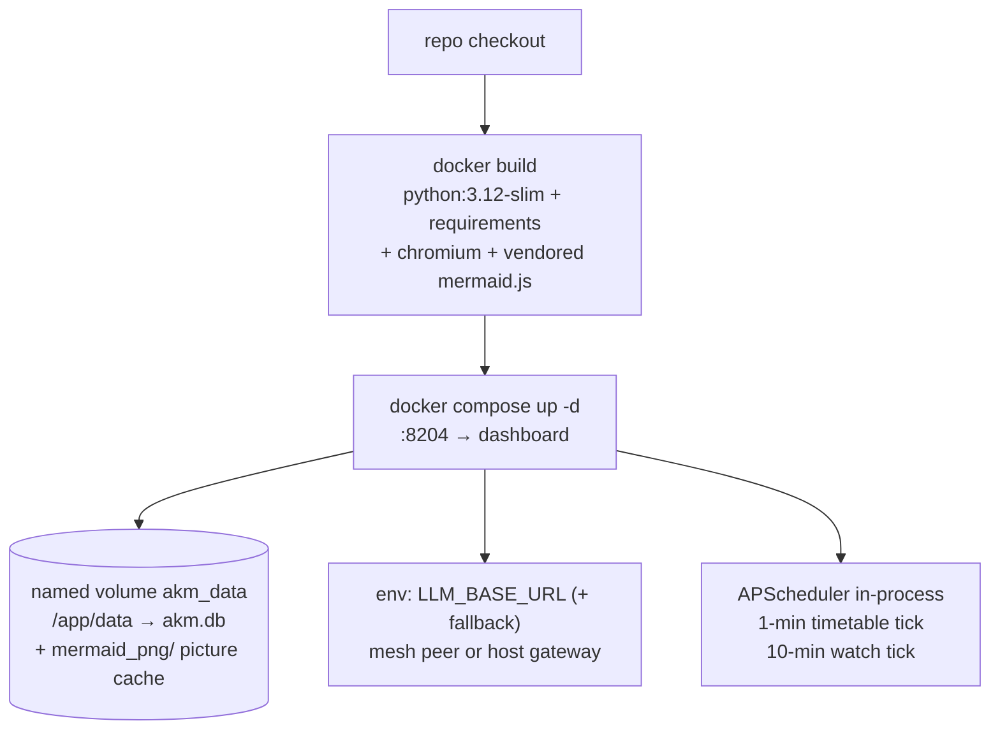
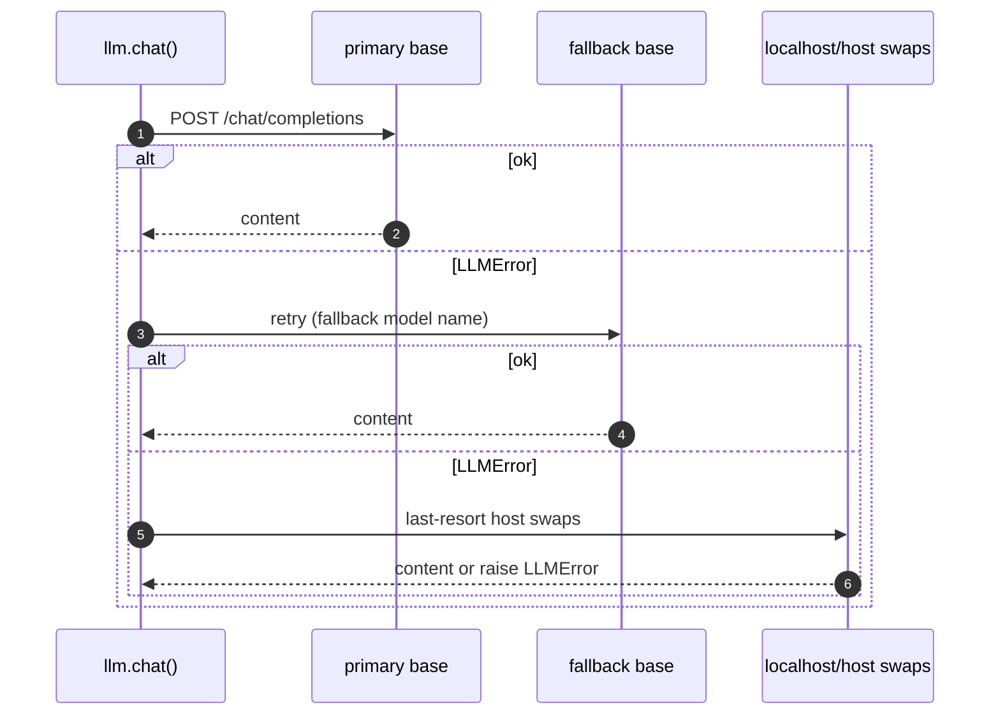
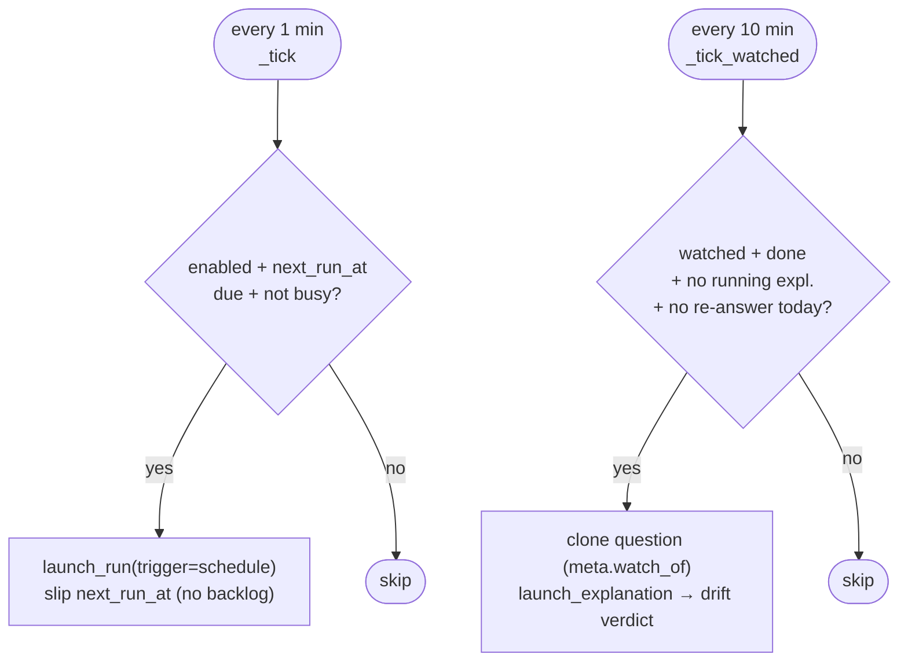

# Operations

Deploy, configure, schedule, and recover the Mapper.

Related: [architecture](architecture.md) · [data-model](data-model.md)

## Deployment



```bash
docker compose up -d --build
# GUI at http://localhost:8204 (container: agentic-knowledge-mapper)
```

Local dev:

```bash
pip install -r requirements.txt
LLM_BASE_URL=http://localhost:8210/v1 python -m uvicorn app.main:app --port 8204 --reload
```

## Configuration

| Env var | Default | Meaning |
|---|---|---|
| `LLM_BASE_URL` | `http://host.docker.internal:8210/v1` (compose: mesh peer `100.101.3.115:11434/v1`) | primary OpenAI-compatible backend |
| `LLM_FALLBACK_URL` | `http://host.docker.internal:8210/v1` | second backend |
| `LLM_MODEL` / `LLM_FALLBACK_MODEL` | `qwen3.8:latest` / `qwen3.8:27b` | model names per backend |
| `LLM_TIMEOUT_S` | `180` | per-request timeout |
| `AKM_CHROMIUM_BIN` | auto-detected (`chromium`, `chromium-browser`, `google-chrome`) | browser used to draw mermaid figures for PDF/bundle export; empty means no binary and exports fall back to source text |
| `AKM_MERMAID_JS` | `static/vendor/mermaid.min.js` | figure renderer; falls back to the pinned CDN when the vendored file is absent |
| `AKM_MERMAID_CACHE` | `data/mermaid_png/` (inside the `akm_data` volume) | rendered pictures, keyed by source hash; survives rebuilds, so repeat exports skip the browser |

`GET /api/health` reports gateway reachability and the model inventory
(`model_available` flag) — the header shows a green/amber/red dot.

## LLM failover (UML sequence)



`chat_json()` strips code fences and extracts the first `{…}`/`[…]` block;
callers treat failure as "LLM unavailable" and use deterministic fallbacks.

## Scheduler ticks



Per-investigation timetables are edited in the sidebar
(`PUT …/schedule {enabled, cron, max_items, max_rounds}`); cron validated with
`croniter`. Missed windows are skipped, never backfilled.

## Data & recovery

- SQLite WAL + `busy_timeout=5000`; background threads use their own
  `SessionLocal` sessions — never share sessions across threads.
- On boot, runs stuck `running` are marked `error` ("interrupted by server
  restart") so the 429 guard never deadlocks; the scheduler then resumes.
- Schema upgrades are additive (`ensure_columns`); the DB file persists in the
  `akm_data` volume across rebuilds. Back up `data/akm.db` (or the volume)
  to preserve investigations. The `data/mermaid_png/` picture cache beside it
  is disposable: deleting it only makes the next PDF/bundle export re-render
  its figures.
- Search providers are keyless and best-effort (RSS/arXiv/DuckDuckGo HTML);
  rate-limits surface as fewer candidates, never as run failures.
