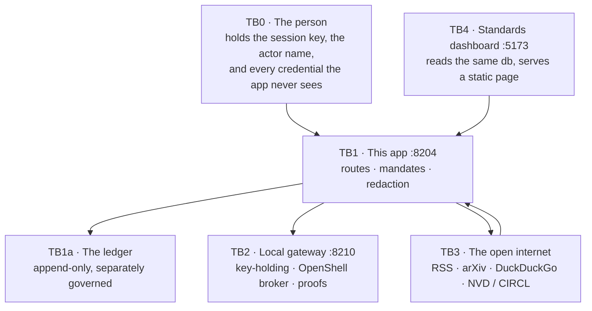

# Privacy

What the app stores, where it goes, and what cannot leave. Short version first,
then the detail, then the parts that are *not* implemented — because the last
section is what stops the first two from being read as more than they are.

For diagrams: [../design/privacy.md](../design/privacy.md). For the controls
that enforce each rule: [../design/controls.md](../design/controls.md).

## The short version

| | |
|---|---|
| **Where model requests go** | The local gateway (`fox-services` :8210) and the Ollama mesh. There is no third-party LLM client in this codebase. |
| **What leaves the machine** | Search terms, page URLs, and CVE ids. Not the corpus, not credentials, not API keys. |
| **Who holds the model API keys** | The gateway. This app holds none. |
| **Are prompts stored?** | Hashed (`sha256` + `prompt_chars`) by default. Verbatim only with `LEDGER_CAPTURE_PAYLOADS=1`. |
| **Are completions stored?** | Yes, verbatim, in the ledger — they are evidence and cannot be re-derived. Credentials inside them are redacted first. |
| **Can I delete my data?** | Deleting an investigation cascade-deletes its artifacts, relationships, runs, explanations, corpus, assessments, CVEs and yields. It does **not** delete the audit trail of that investigation. |
| **Is there encryption at rest?** | No. `akm.db` is a plaintext SQLite file. |
| **Is there authentication?** | No. The trust boundary is "whoever can reach the port". |

## Trust boundaries

TB1a is the boundary that matters most: it is crossed by data the app generates
about itself, not data a person chose to send.

## What crosses each boundary

| Boundary | Crossing | In what form |
|---|---|---|
| TB0 → TB1 | question, brief, decisions | verbatim, on loopback; identity in `X-AKM-Session` / `X-AKM-Actor` headers |
| TB1 → TB2 | prompt text, and the completion back | plaintext HTTP on the LAN; integrity rests on the network, not TLS |
| TB1 → TB3 | search terms, page URLs, CVE ids | the only egress in the system |
| TB3 → TB1 | page text, CVE metadata | stored as `corpus_pages` / `cve_findings` |
| TB1 → TB1a | prompt hash, completion, tokens, latency, served model, proof id | redacted, then immutable |
| TB4 → TB1 | reads the SQLite file | a trusted local service, not an access boundary |

## Redaction

`ledger._redact` runs on the way into immutable storage, recursively through
dicts and lists. It is narrow on purpose.

| Rule | Behaviour |
|---|---|
| Credential names | `password`, `secret`, `api_key`/`apikey`, `authorization`, `credential`, `private_key`, `session_id`, `cookie`, `passphrase` → `[redacted]` **whatever the value is** |
| Ambiguous names | `token`, `tokens`, `auth`, `bearer` → `[redacted]` **only when the value is a string, list or dict** |
| Value patterns | `sk-`, `pk-`, `ghp-`/`gho-`, `xox[baprs]-`, and any 40+ char opaque base64-ish run |
| Hex exemption | a 40+ character `[A-Fa-f0-9]` run is **not** redacted |
| Numbers | never redacted |

Two of those deserve a sentence each:

**Numbers survive.** An audit record is full of counts — `tokens_in: 812`,
`latency_ms: 2410`, `relevance: 0.87`. Redacting them would destroy the
evidence while protecting nothing. Credentials are strings, so the ambiguous
name rules only fire when the value is a string.

**Hashes survive.** A naive secret scrubber would eat every hash on the chain
and quietly destroy the audit trail it was protecting. This one knows the
difference between a credential and a content address: a 40+ character hex run
is a payload hash, a genesis value, or a claim address, and it is evidence.

## Prompt capture

`LEDGER_CAPTURE_PAYLOADS` is off by default, and the reason is one sentence:
**the ledger has no delete.** A convenience flag must not be able to make a
permanent record silently. Turn it on and prompts become permanent too.

## Retention and deletion

Deleting an investigation removes everything scoped to it. The ledger is
deliberately outside that scope, because an audit record that vanished along
with the work it recorded would prove nothing.

| Deleted with the investigation | Hidden, not deleted | Survives deletion |
|---|---|---|
| `artifacts`, `relationships`, `agent_runs`, `agent_events`, `explanations`, `corpus_pages`, `security_assessments`, `cve_findings`, `query_shape_yields` | `investigation.hidden = 1` — out of the list, still queryable by id | `ledger_runs`, `ledger_events`, `ledger_claims`, `ledger_approvals`, `ledger_audit_drops` |

## What a person can see about themselves

| Question | Where to look |
|---|---|
| What did the app send to a model? | Audit ledger → a run → its `llm.call` events |
| Which model actually served it? | `x-served-model` plus the gateway proof id on the same event |
| What did it fetch from the web, and was it sandboxed? | `mcp.call` events with the domain; the OpenShell `sandbox` flag per fetch |
| Why was the answer phrased that way? | Explainer → the answer's trace: sources, grounding violations, write-guard report, critique verdicts |
| Who approved this? | Security → the run's audit chain: requester and decider, never the same person |
| Is the record intact? | `GET /api/ledger/runs/{id}/verify` — `break_at` names the seq where it changed |
| Can I prove it without your database? | `GET /api/ledger/runs/{id}/export` + `POST /api/ledger/verify-export` |

## Not implemented, and therefore not claimed

- **Authentication and authorisation.** No login, no roles, no per-user data
  scoping.
- **Encryption at rest.** `akm.db` is plaintext. Per-investigation scoping is
  convention, not cryptography.
- **TLS.** The app and the gateway hop are plain HTTP on the LAN.
- **Retention schedules, legal hold, or right-to-erasure of the ledger.**
  Retention is "until the file is deleted".
- **Secrets management or key rotation.** The gateway holds the keys.
- **Rate limiting** against the API itself.
- **A malicious-gateway defence.** Proofs make a substituted response
  *detectable*; they do not make a dishonest gateway honest.

## Related

- [ledger.md](ledger.md) — how the chain is built and verified
- [../design/privacy.md](../design/privacy.md) — the diagrams
- [../design/controls.md](../design/controls.md) — every rule, with its file
