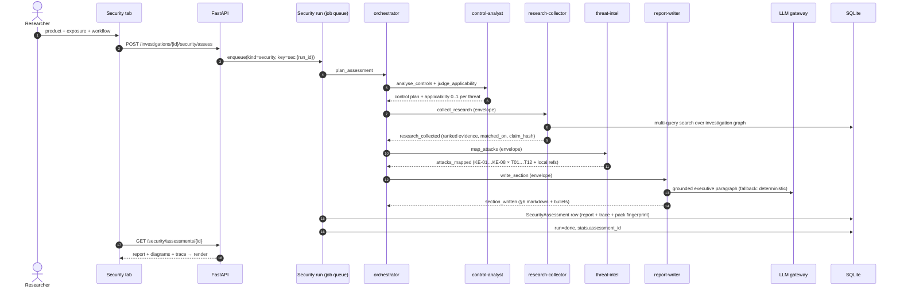
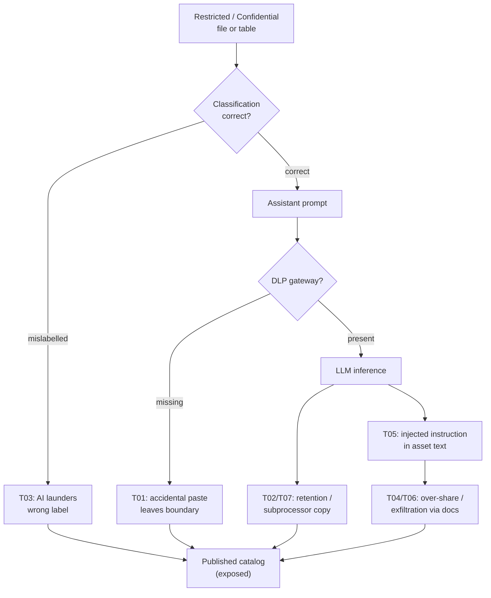

# AI Security agent (A2A)

The **AI Security Engineering & Evaluation Agent** (`app/security_agent.py`,
`app/agents.py`, `app/security.py`) performs deep security assessments of a
product used with sensitive data. It speaks an internal **agent-to-agent
protocol (`a2a/1.0`)**: the work is split across five sub-agents that
communicate only through JSON envelopes on a dispatch bus, each hop appended
to an auditable trace.

Related: [architecture](architecture.md) · [data-model](data-model.md) ·
[frontend](frontend.md) · [threatpack](threatpack.md) ·
[../design/controls.md](../design/controls.md)

## Agent cards

Five cards, discoverable at `GET /api/agents/cards` and
`GET /.well-known/agents`:

| Agent | Skills | Endpoint |
|---|---|---|
| `security-orchestrator` | `plan_assessment`, `delegate_collection`, `assemble_report` | `POST /investigations/{id}/security/assess` |
| `control-analyst` | `analyse_controls`, `judge_applicability`, `propose_control_plan` | `POST /api/agents/invoke` |
| `research-collector` | `agentic_search`, `rank_evidence` | `POST /api/agents/invoke` |
| `threat-intel` | `map_attacks`, `cite_evidence`, `score_evidence_confidence` | `POST /api/agents/invoke` |
| `report-writer` | `write_exploits_section`, `write_exec_bullets` | `POST /api/agents/invoke` |

The **Agents** sub-tab shows these five cards with what each one actually
returned on the run on screen, so the delegation is inspectable rather than
asserted.

## Envelope protocol

```json
{
  "protocol": "a2a/1.0",
  "task_id": "sec-a1b2c3d4",
  "from": "security-orchestrator",
  "to": "research-collector",
  "intent": "collect_research",
  "payload": {"product_name": "…", "investigation_id": 1, "threat_titles": […]},
  "trace": [{"agent": "…", "intent": "…", "at": "…", "note": "…"}]
}
```

The A2A `task_id` **doubles as the ledger run id**, which is how a report and
its evidence chain stay bound to each other. The Audit-chain sub-tab shows
exactly that one chain.

## Workflow sequence



## Job queue and the approval gate

A security run is a **row in `jobs` before it is a thread**. The worker claims
it with a lease, heartbeats while it works, and only re-queues on failure with
backoff. A lease that expires is recovered on the next boot, so a restart
resumes rather than duplicates. Security runs are currently the only work that
goes through the queue — collection and explainer runs still use a guarded
daemon thread each.

With **require approval** ticked, the run stops at
`AgentRun.status = awaiting_approval` and an approval request lands on the chain
with a `hold` verdict before any work is done. Note that the *job completes
normally* here — it did its work — and approval enqueues a fresh job under the
same key `security:{run_id}`, which is free because `done` is not in the live
set. A gate therefore blocks the **run**, not a queue slot:

- `POST /api/security/runs/{run_id}/approval` with `{approved_by,
  approved_control_plan}`.
- `approvals.same_actor` rejects an empty identity (fails closed) and a
  `403` when the approver is the requester.
- The decision is itself a chained event, so it cannot be edited afterwards.
- A plan that arrives with no recorded approver is ignored and the run re-parks,
  so the gate cannot be satisfied by the requester setting a field.


## Threat model (STRIDE × OWASP LLM)

Twelve threats (T01–T12) scaled by exposure tier
(`restricted_data 1.0` → `public 0.3`); severity from `likelihood × impact`
banded Critical ≥ 20, High ≥ 12, Medium ≥ 6. First-class focus areas:

- **T01** accidental paste of sensitive content by employees,
- **T03** misclassified / mislabelled files laundered by AI suggestions.



Eight curated known attacks (KE-01 indirect prompt injection … KE-08
DLP-bypass exfiltration) are mapped onto the threat IDs and joined with the
locally-found evidence, producing **§6 Known exploits & research evidence**
plus executive-summary bullets and paragraph.


## The nine sub-tabs

| Sub-tab | Route | What it shows |
|---|---|---|
| Overview | `/api/security/assessments/{id}` | aggregates, posture, severity distribution, perspectives |
| Threats | same | T01–T12 with inherent → residual, impact, band |
| Controls | same | C01–C15, efficacy, applicability, proposed plan |
| Investigation | `/api/investigations/{id}/summary` | the evidence base, as an executive summary |
| Evidence | same | per-claim sources, `matched_on`, claim hash |
| Known issues | `/api/investigations/{id}/cves` | CVEs found in the evidence |
| Agents | same | the five A2A cards and their returns |
| Audit chain | `/api/ledger/runs/{a2a_task_id}/timeline` | the one chain behind this run |
| Report | `…/markdown`, `…/pdf` | §§1–11 + appendix, with the generated diagrams |


## Applicability (why scores differ)

Each threat carries an applicability 0..1: below 0.3 it is reported but
excluded from the aggregates, and the rest weight the aggregate by
relevance, renormalized so a uniform map scores exactly as unweighted
(pack 2.1.0, method `applicability-weighted-v1` in the fingerprint). The
control-analyst proposes it from product, use case and focus areas; then
threat-intel re-judges it against the collected evidence with the same
deterministic heuristic (`agents.heuristic_applicability`). Evidence and
focus can only confirm relevance — lift toward 1.0, never acquit below
what was proposed — so the 0.45 floor survives while real signals
differentiate topics. The keyword table carries finance-domain bridges
(payment, customer, ledger, PCI …); the LLM, when reachable, still gets
the last word per threat.

## Report structure (§§)

1. Product & evidence base (fetched URLs + workflow context)
2. Reference workflow (mermaid)
3. Data-flow & trust boundary (mermaid)
4. Threat paths (mermaid)
5. Threat & risk register (table + per-threat cards)
5b. Security controls in scope · 5c. OpenShell protection posture
6. **Known exploits & research evidence** (A2A-generated)
7. Deep dive — accidental copy · 8. Deep dive — misclassification
9. Risk heat map · 10. Compliance (GDPR / ISO 27001 / SOC 2)
11. Recommendations 30/60/90
Appendix — sources and the A2A hop trail

Export: Markdown download, PDF (reportlab, tables + headings), browser print.

## Investigation sub-tab executive summary

The report's Investigation sub-tab opens with the investigation's executive
summary (`GET /api/investigations/{id}/summary`, same payload as the mapper's
overlay): prose, query brief, review flags, coverage counts, evidence diagram,
answered questions with supporting artifacts, top supporting artifacts (into
the detail overlay) and top residual threats. It loads when the sub-tab is selected and
retries in place on failure.


## OpenShell protection (C13-C15)

Threat pack 2.x adds three OpenShell controls: **C13** agent tool calls
run in an OpenShell sandbox (kernel-confined FS/syscalls), **C14**
declarative egress allowlist enforced at L7, **C15** credential brokering so
agents never hold secrets. They score like any other control (efficacy ×
threat weights) and appear in §5b automatically; §5c reports which are
active and how the run's pages were fetched.

Product/doc fetches try the managed sandbox first via the fox-services
broker (`OPENSHELL_BROKER_URL`, default `http://host.docker.internal:8210`;
`OPENSHELL_ENABLED=0` forces direct). The broker or gateway being down is
not an error: the fetch falls back to direct and each page records
`sandbox: true/false`, so the report states the protection instead of
assuming it. `app/openshell.py` owns the broker client, the deterministic
policy generator (egress = exactly the hosts the assessment fetched;
restricted/confidential tiers require human review to widen), and the
posture block stored in `controls_json["openshell"]` (survives rescore;
exposed as `openshell` in the assessment JSON).

Pinned in `tests/test_openshell.py`; pack expectations rebased in
`app/evalkit.py` (`all-controls` residual 24.3 → 24.2).

## Standards coverage sub-tab
Beside Assessment, the agent pane has a Standards coverage sub-tab: the AI
Standards & Regulations taxonomy (frameworks × 10 control pillars, 0|1|2)
served by `GET /api/standards/score-matrix` from the dashboard's `data.json`
over the compose network (`STANDARDS_BASE_URL`, cached `STANDARDS_CACHE_TTL_S`).
With an assessment open, each framework carries a deterministic relevance
score -- token overlap of its threats, active controls and known exploits
against the framework text (exact 2, substring ≥4 chars 1; stopwords dropped)
-- sorted relevance-first with the matched tokens shown as the reason.
Matrix, Detail (expandable rows with provenance, controls and pillar grid)
and Findings are one toggle apart. Findings maps each threat to control
pillars (`THREAT_PILLARS`, pinned to cover the whole threat catalogue) and
shows its standing per selected standard -- up to 3 side-by-side in Compare,
one in Single -- worst residual first, gaps before covered.


## What the pack does and does not claim

The catalog is versioned (`akm-threat-pack` 2.1.0) and fingerprinted, so a
likelihood nudged from 4 to 5 changes the fingerprint, and the evalkit's eight
pinned cases plus its invariants fail CI rather than silently re-scoring every
assessment in the database. See [threatpack.md](threatpack.md) for the full
catalog, the scoring constants, and the procedure for changing it.

**C01–C15 are assessed data, not code this app implements.** The app does not
have a DLP, a DPIA, or a role mapper; it *weighs* them when scoring a product.
C13–C15 correspond to the OpenShell integration, which this app does drive.
The controls this app *enforces* over its own behaviour are catalogued
separately in [../design/controls.md](../design/controls.md).
