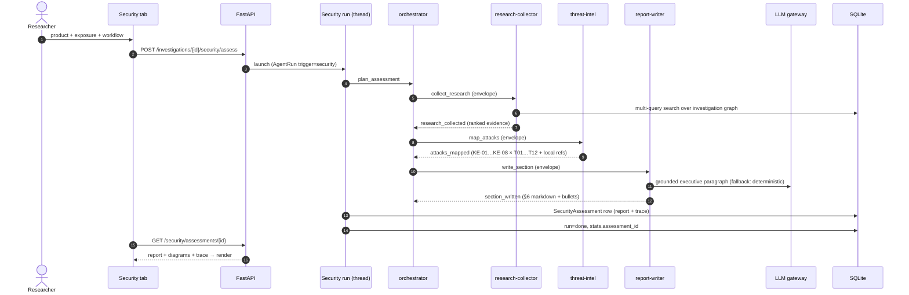
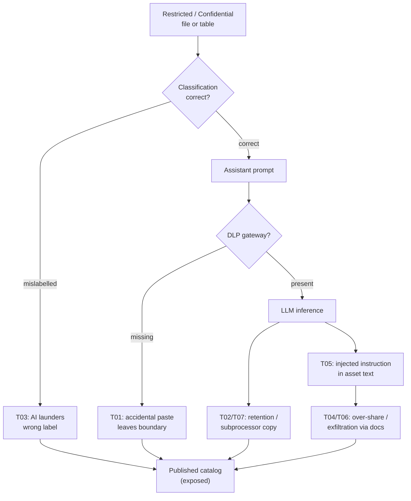

# AI Security agent (A2A)

The **AI Security Engineering & Evaluation Agent** (`app/security_agent.py`,
`app/agents.py`, `app/security.py`) performs deep security assessments of a
product used with sensitive data. It speaks an internal **agent-to-agent
protocol (`a2a/1.0`)**: the work is split across four sub-agents that
communicate only through JSON envelopes on a dispatch bus, each hop appended
to an auditable trace.

Related: [architecture](architecture.md) · [data-model](data-model.md) ·
[frontend](frontend.md)

## Agent cards

| Agent | Skills | Endpoint |
|---|---|---|
| `security-orchestrator` | `plan_assessment`, `delegate_collection`, `assemble_report` | `POST /investigations/{id}/security/assess` |
| `research-collector` | `agentic_search`, `rank_evidence` | `POST /api/agents/invoke` |
| `threat-intel` | `map_attacks`, `cite_evidence` | `POST /api/agents/invoke` |
| `report-writer` | `write_exploits_section`, `write_exec_bullets` | `POST /api/agents/invoke` |

Cards are discoverable at `GET /api/agents/cards` and `GET /.well-known/agents`.

## Envelope protocol

```json
{
  "protocol": "a2a/1.0",
  "task_id": "sec-a1b2c3d4",
  "from": "security-orchestrator",
  "to": "research-collector",
  "intent": "collect_research",
  "payload": {"product_name": "…", "investigation_id": 1, "threat_titles": […]},
  "trace": [{"agent": "…", "intent": "…", "at": "…", "note": "…"}]
}
```

## Workflow sequence



## Threat model (STRIDE × OWASP LLM)

Twelve threats (T01–T12) scaled by exposure tier
(`restricted_data 1.0` → `public 0.3`); severity from `likelihood × impact`
(Critical ≥ 9, High ≥ 6, Medium ≥ 4). First-class focus areas:

- **T01** accidental paste of sensitive content by employees,
- **T03** misclassified / mislabelled files laundered by AI suggestions.



Eight curated known attacks (KE-01 indirect prompt injection … KE-08
DLP-bypass exfiltration) are mapped onto the threat IDs and joined with the
locally-found evidence, producing **§6 Known exploits & research evidence**
plus executive-summary bullets and paragraph.

## Applicability (why scores differ)

Each threat carries an applicability 0..1: below 0.3 it is reported but
excluded from the aggregates, otherwise it counts fully. The
control-analyst proposes it from product, use case and focus areas; then
threat-intel re-judges it against the collected evidence with the same
deterministic heuristic (`agents.heuristic_applicability`). Evidence and
focus can only confirm relevance -- lift toward 1.0, never acquit below
what was proposed -- so the 0.45 floor survives while real signals
differentiate topics. The keyword table carries finance-domain bridges
(payment, customer, ledger, PCI …); the LLM, when reachable, still gets
the last word per threat.

## Report structure (§§)

1. Product & evidence base (fetched URLs + workflow context)
2. Reference workflow (mermaid) · 3. Data-flow & trust boundary (mermaid)
3. Threat paths (mermaid) · 5. Threat & risk register (table + per-threat cards)
4. **Known exploits & research evidence** (A2A-generated)
5. Deep dives (accidental copy, misclassification) · 9. Risk heat map
6. Compliance (GDPR / ISO 27001 / SOC 2) · 11. Recommendations 30/60/90
7. Appendix with the A2A task id and hop trail

Export: Markdown download, PDF (reportlab, tables + headings), browser print.

## OpenShell protection (C13-C15)

Threat pack v2.0.0 adds three OpenShell controls: **C13** agent tool calls
run in an OpenShell sandbox (kernel-confined FS/syscalls), **C14**
declarative egress allowlist enforced at L7, **C15** credential brokering so
agents never hold secrets. They score like any other control (efficacy ×
threat weights) and appear in §5b automatically; §5c reports which are
active and how the run's pages were fetched.

Product/doc fetches try the managed sandbox first via the fox-services
broker (`OPENSHELL_BROKER_URL`, default `http://host.docker.internal:8210`;
`OPENSHELL_ENABLED=0` forces direct). The broker or gateway being down is
not an error: the fetch falls back to direct and each page records
`sandbox: true/false`, so the report states the protection instead of
assuming it. `app/openshell.py` owns the broker client, the deterministic
policy generator (egress = exactly the hosts the assessment fetched;
restricted/confidential tiers require human review to widen), and the
posture block stored in `controls_json["openshell"]` (survives rescore;
exposed as `openshell` in the assessment JSON).

Pinned in `tests/test_openshell.py`; pack expectations rebased in
`app/evalkit.py` (`all-controls` residual 24.3 → 24.2).

## Standards coverage sub-tab
Beside Assessment, the agent pane has a Standards coverage sub-tab: the AI
Standards & Regulations taxonomy (frameworks × 10 control pillars, 0|1|2)
served by `GET /api/standards/score-matrix` from the dashboard's `data.json`
over the compose network (`STANDARDS_BASE_URL`, cached `STANDARDS_CACHE_TTL_S`).
With an assessment open, each framework carries a deterministic relevance
score -- token overlap of its threats, active controls and known exploits
against the framework text (exact 2, substring ≥4 chars 1; stopwords dropped)
-- sorted relevance-first with the matched tokens shown as the reason.
Matrix, Detail (expandable rows with provenance, controls and pillar grid)
and Findings are one toggle apart. Findings maps each threat to control
pillars (`THREAT_PILLARS`, pinned to cover the whole threat catalogue) and
shows its standing per selected standard -- up to 3 side-by-side in Compare,
one in Single -- worst residual first, gaps before covered.
