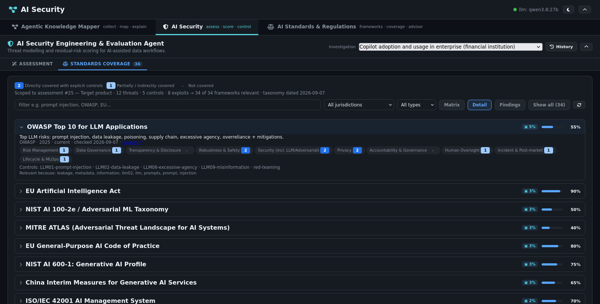
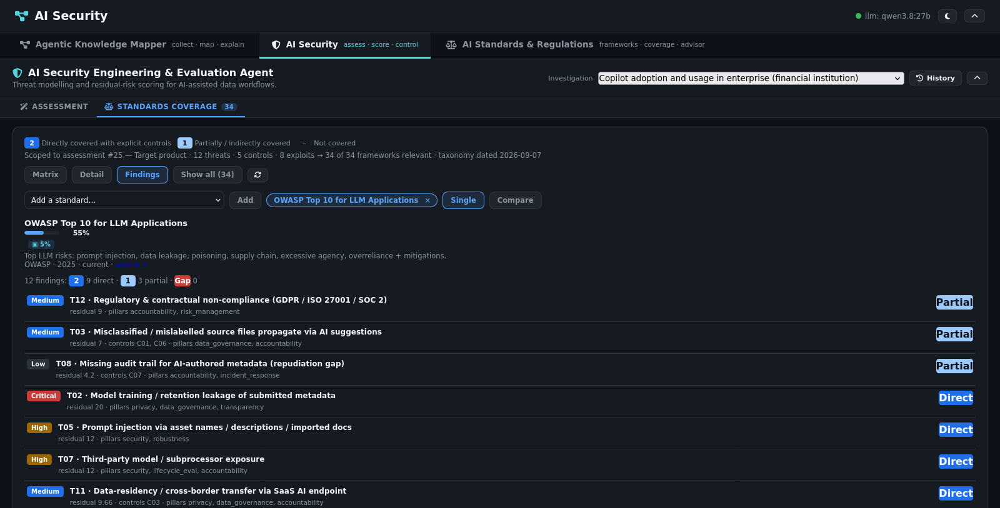
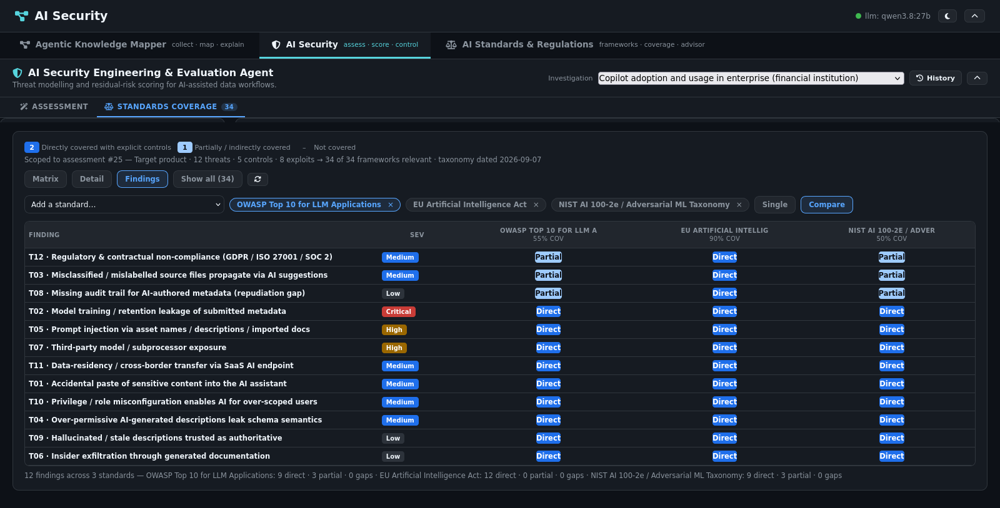

# Standards coverage sub-tab

The AI Security Engineering & Evaluation Agent pane has a second tab beside
Assessment: **Standards coverage**. It answers "which standards cover what
this run found" from the same AI Standards & Regulations taxonomy the
dashboard ships -- 34 frameworks scored 0|1|2 on 10 control pillars -- scoped
to the assessment in view.

## Data source

`GET /api/standards/score-matrix` (`app/standards_matrix.py`) re-serves the
dashboard's `data.json` over the compose network (`STANDARDS_BASE_URL`,
cached `STANDARDS_CACHE_TTL_S`), so the tab and the dashboard can never
disagree. Dimension labels come from a vendored copy of the taxonomy
(`app/standards_taxonomy.json`), pinned by test to match
`standards-dashboard/data/taxonomy.json`. The response is marked `no-store`:
it is dynamic per assessment. Unknown assessment → 404, unreachable
dashboard → 503 with the reason.

## Matrix

The dense view: one row per framework, one heat cell per pillar, coverage bar
at the right. `2` directly covered, `1` partial, `–` not covered; heat fills
are fixed verified-contrast colours so the scale reads in both app themes.
Search, jurisdiction and type filters narrow the rows; the footer averages
each pillar over the visible rows.

## Relevance

With an assessment open, each framework carries a deterministic relevance
score: token overlap of the run's threat ids/titles/STRIDE/OWASP mappings,
active-control names and cited standards (`ISO 27001`, `OWASP LLM02`), and
known-exploit attack classes, against the framework text. Same matching
semantics as the dashboard search (exact token 2, substring 1), tightened
for ranking: substrings need 4+ characters, stopwords are dropped. No model
is involved, so the ranking is stable and the matched tokens -- shown on
every badge and row -- explain it. Rows sort relevance-first; zero-relevance
frameworks dim behind a Show-all toggle. With no assessment open the tab
shows the full taxonomy sorted by coverage.

## Detail

Expandable rows: summary, issuer/version/status/provenance with source link,
the pillar grid, the framework's control list, and the matched tokens.

## Findings

How the run's findings stand up against selectable standards. Each threat
maps to control pillars (`THREAT_PILLARS` in `app/standards_matrix.py`,
curated from the STRIDE/OWASP mapping of every catalogue entry and pinned to
cover all twelve), and its standing against a framework is the best-covered
of its pillars: **Direct** (2), **Partial** (1), **Gap** (0, red), with the
deciding pillars in the tooltip. Pick up to three standards; **Single** shows
one in depth, **Compare** puts them side by side:

Rows sort gaps-first, worst residual first; the header counts direct /
partial / gaps. Unmapped threats (no pillar mapping) show `–`, never a gap.

## Verification

- `tests/test_standards_matrix.py`: taxonomy parity, coverage math,
  relevance ranking, pillar coverage of the whole threat catalogue,
  standings, and the route's 200/404/503 shapes.
- The shipped tab logic is exercised headlessly (matrix/detail/findings,
  picker add/remove/max-3/primary, filters, error + retry) and captured
  above from a real browser session against assessment #25.
