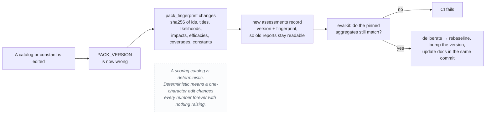
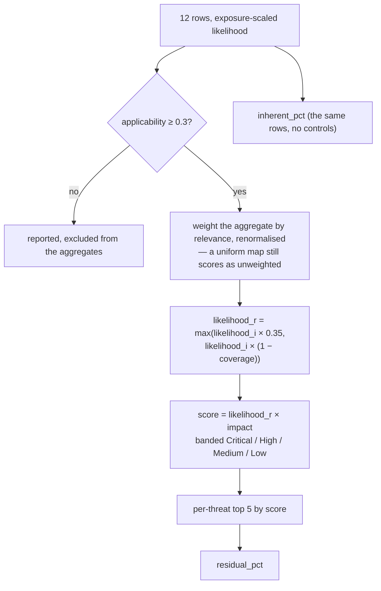

# The threat pack

`akm-threat-pack` **2.1.0** — the versioned catalog the security agent scores
against: 12 threats, 15 controls, 4 exposure tiers, and the constants that turn
them into a number.

Code: [`app/security.py`](../app/security.py) (catalog, scoring),
[`app/threatpack.py`](../app/threatpack.py) (version, fingerprint, CVSS),
[`app/evalkit.py`](../app/evalkit.py) (did the numbers move),
[`app/agents.py`](../app/agents.py) (the five A2A agents and the known-exploit
list).

## Why the pack is versioned at all

The catalog is deterministic and repeatable, which is exactly what makes the
arithmetic trustworthy — and also exactly what makes it easy to change by
accident. A likelihood nudged from 4 to 5, a control's efficacy trimmed, a
threat dropped: nothing raises, no test fails, and every assessment already in
the database silently becomes a different number from the same input.

Three independent mechanisms close that hole:



`pack_fingerprint()` is a 12-hex-digit prefix of a `sha256` over the threats,
controls, exposure weights and the scoring constants — enough to spot a change
in a log line, short enough to read in a column.

## Exposure tiers

Likelihoods in the catalog are written at the **Confidential** baseline and
scaled by the exposure weight.

| Tier | Weight | Meaning |
|---|---|---|
| `restricted_data` | 1.00 | Restricted data |
| `confidential_data` | 0.80 | Confidential data |
| `internal` | 0.55 | Internal |
| `public` | 0.30 | Public — residual risk is prompt injection and hallucinated metadata, not confidentiality loss |

## The 12 threats

Likelihood 1–5 at the Confidential baseline, impact 1–5, severity banded
20–25 Critical / 12–19 High / 6–11 Medium / 1–5 Low (NIST/OWASP style).

| ID | Title | STRIDE | OWASP LLM | L | I |
|---|---|---|---|---|---|
| T01 | Accidental paste of sensitive content into the AI assistant | Information Disclosure | LLM02 | 5 | 5 |
| T02 | Model training / retention leakage of submitted metadata | Information Disclosure | LLM02 | 4 | 5 |
| T03 | Misclassified / mislabelled source files propagate via AI suggestions | Tampering / Repudiation | LLM08 | 5 | 4 |
| T04 | Over-permissive AI-generated descriptions leak schema semantics | Information Disclosure | LLM07 | 4 | 4 |
| T05 | Prompt injection via asset names / descriptions / imported docs | Spoofing / Elevation | LLM01 | 3 | 4 |
| T06 | Insider exfiltration through generated documentation | Information Disclosure | LLM06 | 3 | 5 |
| T07 | Third-party model / subprocessor exposure | Information Disclosure | LLM10 | 3 | 4 |
| T08 | Missing audit trail for AI-authored metadata (repudiation gap) | Repudiation | LLM09 | 4 | 3 |
| T09 | Hallucinated / stale descriptions trusted as authoritative | Tampering | LLM09 | 4 | 3 |
| T10 | Privilege / role misconfiguration enables AI for over-scoped users | Elevation of Privilege | LLM08 | 3 | 4 |
| T11 | Data-residency / cross-border transfer via SaaS AI endpoint | Information Disclosure | LLM02 / Compliance | 3 | 4 |
| T12 | Regulatory & contractual non-compliance (GDPR / ISO 27001 / SOC 2) | Compliance | Governance | 3 | 3 |

Each row also carries a description and three mitigations, which is what the
report's Investigation sub-tab and the `threat-intel` agent read.

## The 15 controls

Efficacy is the fraction of a threat's likelihood a control removes. Coverage
compounds as `1 − Π(1 − efficacy)`, so stacking helps but never reaches
certainty.

| ID | Control | Efficacy | Standard | Mitigates |
|---|---|---|---|---|
| C01 | Classification gate before AI | 0.70 | ISO 27001 A.5.12 / A.8.12 | T03, T06, T10 |
| C02 | Schema-only prompt (no raw values) | 0.70 | OWASP LLM02 | T01, T04, T06 |
| C03 | Client-side DLP redaction | 0.65 | ISO 27001 A.8.12 | T01, T04, T11 |
| C04 | Zero-retention / no-train agreement | 0.85 | GDPR Art. 28 / vendor DPA | T02, T07 |
| C05 | Prompt-injection defenses | 0.60 | OWASP LLM01 | T05, T09 |
| C06 | Human steward review before publish | 0.55 | Human-in-the-loop | T03, T04, T09, T06 |
| C07 | AI provenance stamping | 0.70 | EU AI Act Art. 12 / ISO A.8.32 | T08, T09 |
| C08 | Immutable audit + anomaly detection | 0.60 | ISO A.8.15 / A.8.16 | T06, T08, T10 |
| C09 | Region pinning + private endpoint | 0.75 | GDPR Chapter V | T11, T07 |
| C10 | Least-privilege role mapping | 0.65 | ISO A.5.15 / A.5.18 | T10, T01, T04 |
| C11 | DPIA + control mapping on record | 0.55 | GDPR Art. 35 | T12, T11, T02 |
| C12 | Output review + downstream ACL sync | 0.50 | ISO A.5.18 | T04, T09 |
| C13 | OpenShell sandbox for tool calls | 0.70 | OpenShell policy | T05, T06, T10 |
| C14 | Declarative egress allowlist | 0.75 | OpenShell network policy | T06, T07, T01, T02 |
| C15 | Credential brokering | 0.70 | OpenShell providers | T07, T06 |

**C01–C12 are assessed data, not code this app implements.** The app does not
have a DLP, a DPIA, or a role mapper; it *weighs* them when scoring a product.
C13–C15 correspond to the OpenShell integration, which this app does drive.
The app's own controls are catalogued separately in
[../design/controls.md](../design/controls.md).

## Scoring



| Constant | Value | Why |
|---|---|---|
| `_WORST_WEIGHT` | 0.55 | A single critical threat should not be diluted to nothing by a wide list |
| `_BREADTH_WEIGHT` | 0.45 | …but breadth matters too |
| `_TOP_N` | 5 | the worst five carry the aggregate |
| `_MIN_RESIDUAL_LIKELIHOOD` | 0.35 | a control can never take a threat below 35% of its inherent likelihood. Perfect controls are not a thing, and a pack claiming otherwise would be claiming certainty |
| `_MIN_APPLICABILITY` | 0.3 | below this a threat is reported but not scored |

`score_assessment()` is a pure function of `(exposure, threats, controls,
applicability)`. The report-writer model contributes prose; it never
contributes a number.

### CVSS mapping

Likelihood and impact were already a 1..5 × 1..5 matrix, so they were nearly a
CVSS base score all along. `cvss_for()` makes the mapping explicit and derives a
vector string so a threat's severity can be compared to an external scanner.

The engine scores *likelihood of the threat event*, which is not a single CVSS
metric, so the AV/AC vector is applied **uniformly per likelihood** and is
illustrative. Documented in `app/threatpack.py` so nobody reads the vector
string as a claim of CVSS conformance. Impact of 0 scores 0 — clamping it up to
1 would report a threat with no impact as a real 1/10 risk.

## The known-exploit reference (KE-01 … KE-08)

`app/agents.py` carries a second, smaller catalog: the published attacks the
`threat-intel` agent maps onto the assessed threats.

| ID | Title |
|---|---|
| KE-01 | Indirect prompt injection (Greshake et al., 2024) |
| KE-02 | Training-data extraction (Carlini et al., 2021/2023) |
| KE-03 | Jailbreaks & refusal bypass (many-shot / persona attacks) |
| KE-04 | Sleeper agents / deceptive alignment (Hubinger et al., 2024) |
| KE-05 | WMDP dual-use capability benchmark (Li et al., 2024) |
| KE-06 | System-prompt & RAG-context leakage |
| KE-07 | RAG / catalog poisoning |
| KE-08 | Paraphrase / DLP-bypass exfiltration |

## The evalkit

Eight pinned cases plus a set of invariants that must hold whatever the catalog
contains — and six pinned model cases with four model invariants for the
W1/W2/W3 methods (see the model-catalogs section below). The cases catch a *moved number*; the invariants catch a class of bug
a pinned number cannot — a broken edit to the control-combination maths shows
up there even if every expected value happened to be updated in the same commit.

| Case | Asserts |
|---|---|
| `no-controls-baseline` | inherent 68.8, residual 68.8, delta 0, posture contains `ELEVATED` |
| `all-controls` | residual 24.2, posture contains `LOW` — the floor, not zero |
| `best-single-control` | C02 alone → 55.3 (the highest single-control leverage in the pack) |
| `every-exposure-tier` | aggregate over each weight |
| `irrelevant-threats-excluded` | below-threshold threats are reported but not aggregated |
| `all-threats-irrelevant-falls-back` | an empty scope falls back to all rows rather than scoring 0 |
| `unknown-control-ids-ignored` | an id outside the pack is dropped, not trusted |
| `empty-threat-set` | no threats means no risk, and must not divide by zero |

The gate also covers the model methods in `app/model_eval.py`: 4 W1 cases
(open-weights diffusion with extraction literature → 46.6/25.0%; API-only
model with no attacks → no score), 2 W2 cases (sensitive tabular with high
memorization → 60.0/50.0% uncertainty; fully-rated low → 25.0/0.0%), 2
mitigation-ranking cases (tabular+open weights prioritises DP/canaries and
defers watermarking; API-only generative excludes weight-level controls),
plus invariants (unknown never lowers risk, model-specific outranks family,
empty means no score).

Run it:

```bash
python -c "from app import evalkit; print(evalkit.render(evalkit.run_eval()))"
```

`evalkit.rebaseline()` rewrites the expected values. It is a deliberate act,
not a fix for a red build.

## External references

```python
PACK_FRAMEWORKS = {
    "owasp_llm_top10": "2025",
    "stride": "1.0",
    "cvss": "3.1",
}
```

Recorded so an assessment can be read against the revision it was scored with,
and so re-basing the catalog on a new OWASP release is a deliberate act with a
diff.

## Model catalogs (not the threat pack)

Product threats live above. Model assessments score against three separate
versioned catalogs in `app/model_eval.py` — never the T01–T12 rows:

| Catalog | Id / version | Contents |
|---|---|---|
| Attack taxonomy | `akm-model-adversarial 1.0.0` | 9 classes (membership inference, extraction, inversion, evasion, poisoning, injection, theft, cascade, other) with severities; scope weights model_specific 1.0 / family 0.6 / modality 0.4 |
| Adoption dimensions | `akm-adoption-risk 1.0.0` | 8 dimensions with weights (memorization 0.20 …); `unknown` raises uncertainty, never lowers risk |
| Mitigation catalog | `akm-model-mitigations 1.0.0` | MM01–MM15 with attack/dimension links, family fit, access requirements, efficacy hints, burden, limitations |

Each has a fingerprint function (`model_adv_fingerprint`,
`adoption_fingerprint`, `mitigation_fingerprint`); the evalkit pins above
fail CI on silent edits, same rule as the pack.

## Changing the pack

1. Edit the catalog or a constant in `app/security.py`.
2. Run the evalkit. If a case fails, decide whether the change was **intended**.
3. Intended → `evalkit.rebaseline()`, bump `PACK_VERSION` in `app/threatpack.py`
   (major: add/remove a threat or control; minor: re-weighting; patch: wording),
   and update the tables above **in the same commit**.
4. Unintended → revert the edit. The evalkit is the thing that tells you which
   it was.

`tests/test_versioning.py` pins every fingerprint, so a catalog edit without
a version bump is a red build, not a quiet drift. Rows scored on older packs
are badged **superseded pack** in the dossier, history and preview — and
persisting a what-if re-score writes a **new** row linked by `supersedes_id`,
never edits the old one. The policy constants live in code (`CHANGE_POLICY`
in `threatpack.py` / `model_eval.py`), not just here.

## Related

- [security-agent.md](security-agent.md) — the A2A workflow that consumes the pack
- [../design/controls.md](../design/controls.md) — assessed vs enforced controls
- [../design/activity.md](../design/activity.md) — the assessment decision flow
